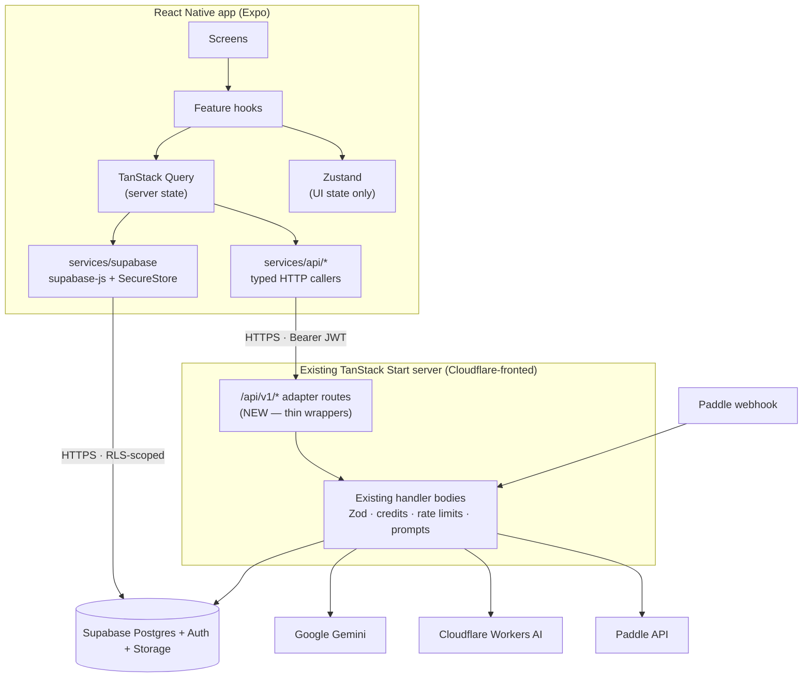
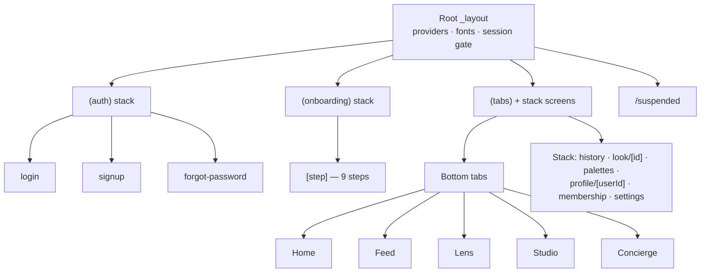
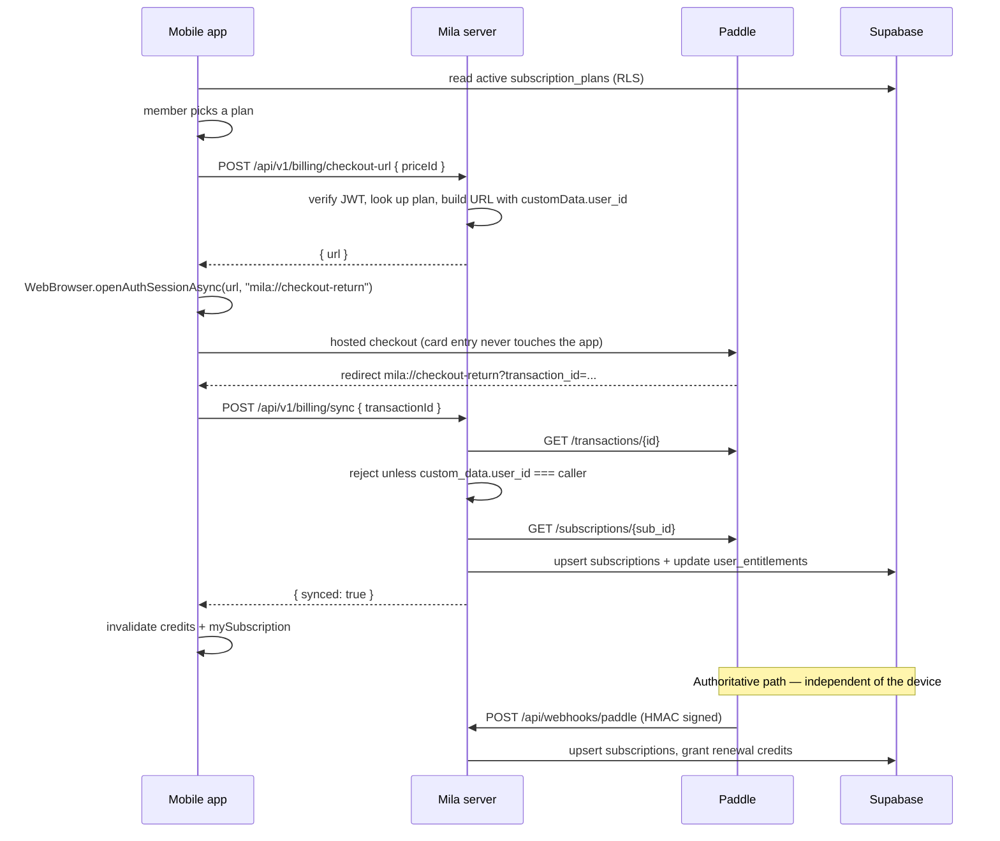
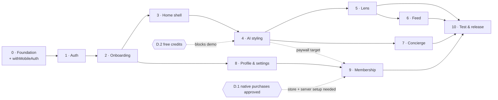

# Mila Mobile — React Native Architecture

**Status:** implementation specification.
**Source of truth:** [`docs/website-architecture-reference.md`](./website-architecture-reference.md).
**Scope:** end users only. No admin, moderator, or staff surfaces.
**Target:** Android first, iOS-ready.

This document is written so a developer can build the app without opening the website codebase.
Where a rule exists because the web already enforces it, the web module is named so you can copy it
verbatim rather than reimplement it.

---

## Table of Contents

1. [Mobile Architecture Overview](#1-mobile-architecture-overview)
2. [Folder Structure](#2-folder-structure)
3. [Screen Inventory](#3-screen-inventory)
4. [Navigation Architecture](#4-navigation-architecture)
5. [Supabase Integration](#5-supabase-integration)
6. [API / Service Layer](#6-api--service-layer)
7. [Database Dependencies](#7-database-dependencies)
8. [AI Integration](#8-ai-integration)
9. [Payment Integration](#9-payment-integration)
10. [Security Rules](#10-security-rules)
11. [UI Design System](#11-ui-design-system)
12. [Platform Architecture Strategy (Android First, iOS Ready)](#12-platform-architecture-strategy-android-first-ios-ready)

**Execution:**

13. [Architecture Audit](#13-architecture-audit)
14. [Development Workflow](#14-development-workflow)
15. [Mila Mobile Implementation Phases](#15-mila-mobile-implementation-phases)
16. [Feature Implementation Template](#16-feature-implementation-template)
17. [Definition of Done Rules](#17-definition-of-done-rules)

**Appendices:** [A — Verbatim copy manifest](#appendix-a--verbatim-copy-manifest) ·
[B — Backend adapter routes to add](#appendix-b--backend-adapter-routes-to-add) ·
[C — Build order](#appendix-c--build-order) · [D — Open decisions](#appendix-d--open-decisions)

**Sections 1–12 specify what to build.** Sections 13–17 specify how it gets built: the workflow, the
phase sequence with acceptance criteria, the feature request format, and the merge gate. A developer
starting today reads [§14](#14-development-workflow), then
[Phase 0](#phase-0--foundation-setup), and returns to §1–12 as reference.

---

## 1. Mobile Architecture Overview

### Product framing

Mila mobile is a **personal AI stylist**, not a dashboard. The design target is a distracted person
holding a phone one-handed at 7:40am deciding what to wear. Every architectural choice below serves
that: one decision per screen, thumb-reachable actions, no tables, no dense grids, no horizontal
scrolling.

The emotional goal, unchanged from web: **quiet confidence**. She closes the app feeling that
someone who knows what they're doing already handled this. No gamification, no streaks, no
confetti, no emoji.

### System shape

The mobile app is a **second client against the existing backend**. It is not a fork. Nothing about
the database, RLS policies, credit accounting, AI prompts, or Paddle wiring changes.



### The one piece of new server work

The web calls its business logic through TanStack Start **server functions** — an RPC transport
that is an internal implementation detail, not a stable API. React Native must not depend on it.

**Decision: add a thin REST adapter layer to the existing server.** Each adapter route is ~8 lines:
verify the JWT, parse with the _existing_ Zod schema, call the _existing_ handler body, return JSON.
The app already contains one route of exactly this shape (`src/routes/api/webhooks/paddle.ts`), so
the pattern is proven in-repo.

**Why this and not the alternatives:**

| Option                                       | Verdict                                                                                                                                                                                    |
| -------------------------------------------- | ------------------------------------------------------------------------------------------------------------------------------------------------------------------------------------------ |
| **REST adapter over existing handlers**      | **Chosen.** ~250 lines of new server code. Zero duplication of business logic. Versionable contract (`/api/v1/`). Mobile and web stay in lockstep by construction.                         |
| Call server-function endpoints directly      | Zero new code, but couples the app binary to an internal transport format. A framework upgrade breaks shipped apps that cannot be hot-fixed. Rejected.                                     |
| Rebuild the logic in Supabase Edge Functions | Duplicates credit accounting, rate limiting, and six AI prompt templates in a second language runtime. Two implementations of `withAiCredit` is how a member gets charged twice. Rejected. |

Route inventory in [Appendix B](#appendix-b--backend-adapter-routes-to-add).

### Layering rules

| Layer                                 | Owns                                                     | Must never                                                                        |
| ------------------------------------- | -------------------------------------------------------- | --------------------------------------------------------------------------------- |
| **Screens** (`app/`)                  | Route definition, layout, composition                    | Contain fetch logic, Zod schemas, or business rules                               |
| **Features** (`features/*`)           | Feature-scoped components, hooks, and screen bodies      | Import from another feature's internals (go through `components/` or `services/`) |
| **Services** (`services/`)            | All I/O — HTTP, Supabase, storage, camera, notifications | Hold React state or import from `features/`                                       |
| **Stores** (`stores/`)                | Ephemeral UI state                                       | Hold anything the server owns                                                     |
| **Hooks** (`hooks/`)                  | Cross-feature reusable hooks                             | Do I/O directly — call `services/`                                                |
| **Theme / constants / utils / types** | Pure values and pure functions                           | Import from any layer above                                                       |

**Import direction is strictly downward.** `app` → `features` → `components` → `hooks` → `services`
→ `stores`/`theme`/`constants`/`utils`/`types`. A lint rule should enforce it
(`eslint-plugin-import` `no-restricted-paths`).

### State management split

Four stores, deliberately separate — the same split the web uses, with Context swapped for Zustand.

| Concern                                                                                                 | Owner                                              | Persistence                                                    |
| ------------------------------------------------------------------------------------------------------- | -------------------------------------------------- | -------------------------------------------------------------- |
| **Server state** — profile, credits, feed, history, palettes, subscription, conversations               | TanStack Query, keyed by `constants/query-keys.ts` | In-memory; optional `AsyncStorage` persister for offline reads |
| **Auth session**                                                                                        | `supabase-js` + a thin `useAuthStore` mirror       | `expo-secure-store` (Keychain / Android Keystore)              |
| **UI state** — theme choice, concierge look anchor, onboarding draft, capture session, sheet visibility | Zustand                                            | `AsyncStorage` for theme and onboarding draft only             |
| **Local component state**                                                                               | `useState`                                         | none                                                           |

**Zustand holds UI state only.** If a value can be re-derived from the server, it belongs in
TanStack Query. There is no "user slice" duplicating the profile.

### Non-negotiable invariants carried from web

1. **The server is the trust boundary.** The mobile client is no more trusted than a browser.
2. **AI is never called from the device.** No Gemini or Cloudflare key ever ships in a bundle.
3. **Credits are metered server-side** by `consume_ai_credit`. The app displays a balance; it never
   computes one.
4. **Payment status is never trusted from the device.** Entitlement comes from Supabase, written by
   the Paddle webhook.
5. **Every image analysed must already live in Mila storage.** `assertTrustedStorageImageUrl` stays.
6. **RLS is the floor, not the ceiling.** Ownership re-checks in server handlers stay.

### Platform principles

Android is the first release target. It is not the only one. These five principles govern every
architectural decision in this document; [§12](#12-platform-architecture-strategy-android-first-ios-ready)
is their implementation.

1. **Android-first does not mean Android-only.** Ship Android first, but no decision may assume
   Android is the only platform. A choice that would need unpicking to add iOS is the wrong choice
   today, not a problem for later.
2. **Business logic must never depend on the operating system.** Screens, features, validation,
   workflows, and backend integration are OS-agnostic by construction. If a rule changes with the
   platform, it is not a business rule.
3. **Platform differences belong in adapters.** Native divergence is isolated behind a typed
   contract in `services/`. Nothing above the service layer knows which OS it is running on.
4. **One codebase, multiple native experiences.** A single tree, a single backend, a single set of
   business rules. Two native experiences are an output of that tree, never two trees.
5. **Future iOS development extends the architecture; it does not rewrite it.** Adding iOS should be
   a platform expansion — new adapter implementations and native configuration — not a second
   project.

**The operative rule:** _shared code by default, platform-specific code only when native behaviour
genuinely differs._

---

## 2. Folder Structure

```text
mila-mobile/
├── app.config.ts                  Expo config (env-driven, per-profile)
├── eas.json                       EAS Build / Submit / Update profiles
├── babel.config.js                NativeWind babel preset
├── metro.config.js                withNativeWind({ input: "./src/theme/global.css" })
├── tailwind.config.js             Mila design tokens — the styling source of truth
├── nativewind-env.d.ts            className prop types
├── tsconfig.json                  strict: true, paths: { "@/*": ["./src/*"] }
├── .env.example
└── src/
    ├── app/                       ← expo-router: files are routes, nothing else
    │   ├── _layout.tsx            Root: providers, fonts, splash, session gate
    │   ├── +not-found.tsx
    │   ├── (auth)/
    │   │   ├── _layout.tsx        Redirects to /(tabs) when a session exists
    │   │   ├── login.tsx
    │   │   ├── signup.tsx
    │   │   └── forgot-password.tsx
    │   ├── (onboarding)/
    │   │   ├── _layout.tsx        Guards: session required, profile incomplete
    │   │   └── [step].tsx         One route, nine steps (see §3)
    │   ├── (tabs)/
    │   │   ├── _layout.tsx        Bottom tab navigator
    │   │   ├── index.tsx          Home
    │   │   ├── feed.tsx
    │   │   ├── lens.tsx
    │   │   ├── studio.tsx
    │   │   └── concierge.tsx
    │   ├── look/[id].tsx          Saved look detail (deep-linkable)
    │   ├── history/index.tsx
    │   ├── palettes/index.tsx
    │   ├── profile/[userId].tsx
    │   ├── membership/
    │   │   ├── index.tsx          Plans + checkout
    │   │   └── manage.tsx         Current plan, cancel, resume
    │   ├── settings/
    │   │   ├── index.tsx
    │   │   ├── account.tsx        Email / password
    │   │   ├── location.tsx       Default weather hub
    │   │   ├── privacy.tsx        Data export, delete account
    │   │   └── support.tsx
    │   └── suspended.tsx          Full-screen block
    │
    ├── features/                  ← screen bodies + feature-scoped logic
    │   ├── auth/
    │   │   ├── components/        AuthCard, LoginForm, SignupForm, GoogleButton, CaptchaGate
    │   │   ├── hooks/             useSignIn, useSignUp, useGoogleSignIn, useSignOut
    │   │   └── schemas.ts         ← re-export from constants/shared (do not redefine)
    │   ├── onboarding/
    │   │   ├── components/        StepShell, ProgressBar, SaveStatus, OptionTile
    │   │   ├── steps/             Welcome, ColorPath, ColorResult, BodyType, FaceShape,
    │   │   │                      HairType, BeautyPreferences, Location, Review
    │   │   ├── hooks/             useOnboardingMachine, useAutoSaveProfile
    │   │   └── machine.ts         Step order, reachability, resume point
    │   ├── style-profile/         Studio dossier, colour quiz, body quiz, viewfinder
    │   ├── dashboard/             Greeting, ClimateWidget, VibePicker, GenerateButton,
    │   │                          OutfitVisual, LookDetail, CreditsPill
    │   ├── outfits/               History list, look detail, save/delete
    │   ├── studio-lens/           Capture → analyse → result
    │   ├── concierge/             Conversation list, chat thread, anchored look card
    │   ├── feed/                  Feed list, dual capture, publish, garment tagging, hotspots
    │   ├── palettes/              Daily palette generator, saved palettes
    │   ├── profile/               Member profile (own + others)
    │   └── membership/            Plan cards, checkout, cancel/resume, credits meter
    │
    ├── components/                ← cross-feature, presentation only
    │   ├── ui/                    Button, Icon, Input, Textarea, Card, Badge, Chip, Switch,
    │   │                          Select, Tabs, Sheet, Dialog, Skeleton, Divider,
    │   │                          EmptyState, ErrorState, LoadingState, ProgressBar
    │   │                          ← each owns its NativeWind classes; features never restyle
    │   ├── layout/                Screen, SafeAreaScreen, KeyboardAvoider, HeaderBar
    │   ├── media/                 RemoteImage, ImageWithFallback, AvatarInitial
    │   └── feedback/              Toast host, PaywallSheet, ConfirmSheet
    │
    ├── services/                  ← ALL I/O lives here
    │   ├── api/
    │   │   ├── client.ts          fetch wrapper: base URL, JWT, timeout, retry, error mapping
    │   │   ├── auth.ts            signIn, signUp
    │   │   ├── look.ts            generateDailyLook, regenerateOutfitImage, saveOutfitToHistory
    │   │   ├── analysis.ts        analyzeOutfit, analyzePersonalColor
    │   │   ├── items.ts           analyzeOutfitItems, updatePostItems, findDupes, findSimilarItems
    │   │   ├── concierge.ts       conciergeChat
    │   │   ├── posts.ts           createPost, updatePostCaption, deletePost, getFeed,
    │   │   │                      getMemberProfile
    │   │   ├── billing.ts         syncPaddlePurchase, cancelMySubscription, resumeMySubscription
    │   │   ├── account.ts         deleteMyAccount
    │   │   └── support.ts         submitSupportMessage
    │   ├── supabase/
    │   │   ├── client.ts          createClient + SecureStore adapter
    │   │   ├── storage.ts         uploadOutfitImage, uploadPostImages, purgeUserFolder
    │   │   └── types.ts           ← generated DB types, copied verbatim
    │   │
    │   │   ── platform adapters: one folder per native capability ──
    │   ├── camera/
    │   │   ├── index.ts                  Public API — the only import site
    │   │   ├── types.ts                  The contract both platforms satisfy
    │   │   ├── camera.android.ts         Android implementation
    │   │   └── camera.ios.ts             iOS implementation
    │   ├── notifications/
    │   │   ├── index.ts
    │   │   ├── types.ts
    │   │   ├── notifications.android.ts  Channels, POST_NOTIFICATIONS permission
    │   │   └── notifications.ios.ts      APNs registration, UN permissions
    │   ├── biometrics/
    │   │   ├── index.ts
    │   │   ├── types.ts
    │   │   ├── biometrics.android.ts     Fingerprint, Android face unlock
    │   │   └── biometrics.ios.ts         Face ID, Touch ID
    │   ├── files/
    │   │   ├── index.ts
    │   │   ├── types.ts
    │   │   ├── files.android.ts          Scoped storage, SAF, Downloads
    │   │   └── files.ios.ts              Document picker, share sheet
    │   │
    │   │   ── shared services: no platform variants needed ──
    │   ├── location.ts                   expo-location → nearest HUB
    │   ├── weather.ts                    Open-Meteo fetch + climateForWeatherCode
    │   ├── checkout.ts                   Paddle hosted checkout via expo-web-browser
    │   └── captcha.ts                    hCaptcha token acquisition
    │
    ├── hooks/                     useAuth, useProfile, useCredits, useSubscription,
    │                              useTheme, useAppState, useNetworkStatus, useHaptics,
    │                              useSafeAreaPadding
    │
    ├── stores/                    ← Zustand, UI state only
    │   ├── auth-store.ts          session mirror + signingOut flag
    │   ├── theme-store.ts         "light" | "dark" | "system"  (persisted)
    │   ├── onboarding-store.ts    in-flight step draft            (persisted)
    │   ├── concierge-store.ts     anchored look
    │   └── capture-store.ts       dual-capture session (back/front/caption)
    │
    ├── theme/
    │   ├── tokens.ts              colors (light + dark), spacing, radii, shadows
    │   ├── typography.ts          font families, sizes, weights, letter-spacing
    │   ├── icons.ts               icon size scale + stroke defaults
    │   ├── theme.ts               theme resolution, light/dark switching, provider
    │   ├── tailwind.ts            NativeWind integration + Tailwind helpers
    │   └── global.css             CSS variables consumed by tailwind.config.js
    │
    ├── utils/                     ← pure functions only
    │   ├── cn.ts                  clsx + tailwind-merge (same helper as web)
    │   ├── error-message.ts       ← copied verbatim from web utils.ts
    │   ├── relative-time.ts       ← copied verbatim
    │   ├── format-price.ts        ← copied verbatim
    │   └── image.ts               resize/compress before upload
    │
    ├── constants/                 ← COPIED VERBATIM from web (see Appendix A)
    │   ├── app.ts, climate.ts, password.ts, query-keys.ts, steps.ts,
    │   ├── subscriptions.ts, wardrobe.ts, vibes.ts
    │   └── style-profile/         data, defaults, palettes, questions, recommendations, types
    │
    ├── lib/                       ← COPIED VERBATIM, pure domain logic
    │   ├── credits.ts, credits-countdown.ts, outfit-items.ts, subscription-plans.ts,
    │   ├── beauty-preferences.ts, profile-color.ts, auth-input.ts
    │   ├── color-analysis/        paletteGenerator, schemaMigration, seasonsData, types
    │   └── style-profile/         completion.ts, studio-dossier.ts
    │
    ├── platform/                  ← NATIVE CONFIG DOCUMENTATION ONLY — no app code
    │   ├── android/
    │   │   └── README.md          Manifest, permissions, Gradle, channels, native modules
    │   └── ios/
    │       └── README.md          Info.plist, entitlements, capabilities, native modules
    │
    └── types/                     api.ts, models.ts, navigation.ts
```

### Notes on structure

- **`app/` contains routes and nothing else.** Each route file imports one screen component from
  `features/` and renders it. This keeps expo-router's file conventions from leaking into feature
  code and makes screens unit-testable without a router.
- **`lib/` and `constants/` are copied, not rewritten.** They are pure TypeScript with zero platform
  dependencies. Copying them is what guarantees the 16-season colour engine, credit semantics, and
  onboarding state machine behave identically on both clients. See
  [Appendix A](#appendix-a--verbatim-copy-manifest). If the team is willing to run a monorepo, make
  them a shared workspace package instead — but copy first, extract later.
- **`services/api/` mirrors the web's `src/lib/*.functions.ts` one-to-one.** Same grouping, same
  function names. A developer who knows one codebase can navigate the other.
- **Platform adapters get a folder, not a suffix on a flat file.** Each native capability is a
  directory with `index.ts` (public API), `types.ts` (the contract), and one implementation per
  platform. Metro resolves `.android.ts` / `.ios.ts` automatically; callers import the folder.
  See [§12](#12-platform-architecture-strategy-android-first-ios-ready).
- **`platform/` holds documentation and native configuration notes — never application code.** No
  screens, no components, no features. It exists so native requirements are tracked in one place
  instead of being rediscovered from build errors.
- **There is no `src/android/` or `src/ios/`.** A platform-split application tree is forbidden; see
  [§12](#12-platform-architecture-strategy-android-first-ios-ready).
- **No `features/admin`, `features/moderation`, or `features/staff`.** Those directories must not
  exist. See [§10](#10-security-rules).

---

## 3. Screen Inventory

**22 screens.** Every one is single-column, safe-area aware, and reachable one-handed.

### Authentication (4)

| #   | Screen          | Route                     | Purpose                                                           | Key components                                         | Data                                  |
| --- | --------------- | ------------------------- | ----------------------------------------------------------------- | ------------------------------------------------------ | ------------------------------------- |
| 1   | Login           | `/(auth)/login`           | Email + password, Google, captcha                                 | `AuthCard`, `LoginForm`, `GoogleButton`, `CaptchaGate` | `POST /api/v1/auth/sign-in`           |
| 2   | Signup          | `/(auth)/signup`          | Email, username, password + strength hints, captcha               | `SignupForm`, `PasswordChecklist`                      | `POST /api/v1/auth/sign-up`           |
| 3   | Forgot password | `/(auth)/forgot-password` | **New on mobile** — see [Appendix D](#appendix-d--open-decisions) | `Input`, `Button`                                      | `supabase.auth.resetPasswordForEmail` |
| 4   | Suspended       | `/suspended`              | Full-screen block for a suspended account                         | `ErrorState`                                           | `profiles.suspended`                  |

**Login rules:** submit disabled until a captcha token exists; token reset after every attempt;
failure message is always `"Email, password, or verification challenge is invalid."` — never
distinguish bad email from bad password. Google OAuth completes via `expo-auth-session`, then
`supabase.auth.setSession()`.

### Onboarding (1 route, 9 steps)

Route: `/(onboarding)/[step]`. One screen driven by a step machine — nine separate route files would
duplicate the shell, progress bar, and autosave nine times.

| Step | `id`                 | Title                      | Optional | Interaction                                                           |
| ---- | -------------------- | -------------------------- | -------- | --------------------------------------------------------------------- |
| —    | `welcome`            | Welcome to Mila            | —        | Full-bleed intro, single CTA. Not counted in progress.                |
| 1    | `color-path`         | Your coloring              |          | Two large tiles: "Analyze my coloring" (live camera read) / "I know my season" |
| 2    | `color-result`       | Confirm your color profile |          | Season card + palette swatches + confirm                              |
| 3    | `body-type`          | Body silhouette            |          | 5 `OptionTile`s: Hourglass, Rectangle, Pear, Inverted Triangle, Apple |
| 4    | `face-shape`         | Face shape                 |          | `OptionTile` grid                                                     |
| 5    | `hair-type`          | Hair type                  |          | `OptionTile` grid                                                     |
| 6    | `beauty-preferences` | Beauty preferences         | ✔        | Multi-select chips                                                    |
| 7    | `location`           | Location & weather         | ✔        | 10 `HUBS` list + "use my location"                                    |
| 8    | `review`             | Your Mila profile is ready |          | Dossier summary + "Enter Mila"                                        |

**Rules (all carried from `constants/steps.ts`):**

- `COUNTED_STEPS` excludes `welcome`; the progress bar reads "Step _n_ of 8".
- `isOnboardingStepReachable(step, profile)` blocks jumping past an incomplete non-optional step.
- `getFirstIncompleteOnboardingStep(profile)` resumes where she left off — on app relaunch, mid-flow.
- **Autosave after every step**, not at the end: `PATCH profiles` on each answer, with a
  `SaveStatus` indicator ("Saving…" → "Saved"). A dropped connection must never cost her progress.
- Touch targets ≥ 56px on `OptionTile` (above the 44px floor — these are the primary interaction).
- Exit condition is `isStyleProfileComplete()`: valid `skin_undertone`, `color_season`, `body_type`,
  `face_shape`, `hair_type` **and** a non-empty `color_profile`.
- Manual palette selection does not answer face/body questions. Ignore the library's default face
  when `calibrationSource` is `Studio Calibrated` or lighting marks manual calibration. Explicit
  member answers and legacy AI face readings remain supported; a fresh member must choose a face.

### Main tabs (6)

| #   | Screen        | Route               | Purpose                             |
| --- | ------------- | ------------------- | ----------------------------------- |
| 5   | **Home**      | `/(tabs)/`          | The daily look — the primary screen |
| 6   | **Feed**      | `/(tabs)/feed`      | Community OOTDs, publish, tagging   |
| 7   | **Lens**      | `/(tabs)/lens`      | Camera outfit analysis              |
| 8   | **Studio**    | `/(tabs)/studio`    | Try-on workspace                    |
| 9   | **Profile**   | `/(tabs)/profile`   | Style dossier + saved palettes      |
| 10  | **Concierge** | `/(tabs)/concierge` | AI stylist chat                     |

Studio and Profile are the same split the web makes: Studio (`/style-profile`) is the
try-it-on workspace, Profile (`/profile`) is the dossier. Each cross-links to the other.

#### 5. Home — detail

The screen the product is judged on. Vertical scroll, single column.

```
┌─────────────────────────────────┐
│ Mila                  ⬡12  ☾ ◉ │  header: wordmark, credits pill, theme, avatar
├─────────────────────────────────┤
│                                 │
│  Good morning, Ana              │  greeting (time-aware + first name)
│                                 │
│  ☁  22°C · Partly Cloudy        │  ClimateWidget — tap to change hub
│     Manila                      │
│                                 │
│  ┌───────────────────────────┐  │
│  │ Everyday Casual        ▾  │  │  VibePicker → bottom sheet, 11 options
│  └───────────────────────────┘  │
│                                 │
│  ┌───────────────────────────┐  │
│  │   Compose today's look    │  │  primary CTA, h=48, full width
│  └───────────────────────────┘  │
│                                 │
│  ┌───────────────────────────┐  │
│  │                           │  │
│  │      generated visual     │  │  OutfitVisual — 3:4, rounded-card
│  │                           │  │  skeleton → image → retry on failure
│  └───────────────────────────┘  │
│                                 │
│  The Architectural Linen        │  serif headline
│  Silhouette                     │
│                                 │
│  ▸ Outfit                       │  LookDetail — 3 collapsible sections
│  ▸ Hair                         │
│  ▸ Makeup                       │
│                                 │
│  [ Save ]  [ ↻ ]  [ Ask Mila ]  │  actions, ≥44px, thumb-reachable
│                                 │
│  ── Today's palette ──          │  DailyPaletteGenerator
│  ▉▉▉  ▉▉▉  ▉▉▉      [ Pin ]     │
└─────────────────────────────────┘
```

**Vibes (11, verbatim):** Everyday Casual · Work or School · Business Casual · Business Attire ·
Brunch · Date Night · Dinner · Party · Formal Event · Travel · Active Day.

**Greeting thresholds:** `<5h` "Still up" · `<12h` "Good morning" · `<18h` "Good afternoon" ·
else "Good evening". Suffix is the first word of `full_name`, or nothing.

**Blocked states:** profile incomplete → "Complete your Style Profile first." · no weather →
"Still finding today's weather. Choose a city in the weather panel to continue." · look has no
visual → save disabled with "Your look needs its visual before it can be saved."

**Insufficient credits** opens `PaywallSheet`, never a toast.

#### 6. Feed — detail

Vertically paged `FlashList`, one post per viewport. Pull-to-refresh.

Each card: dual images (back = the fit, front = the face), author + `VerifiedBadge`, caption,
relative time, and **garment hotspots** on the back image. Tapping a hotspot opens a bottom sheet
with the garment's attributes, its source link if the poster added one, and "Find similar" →
`findSimilarItems` (free, no AI call).

**Publish flow:** FAB → `DualCapture` → step 1 rear camera "Mirror selfie, full body" → step 2 front
camera "Front camera portrait" → review + caption (≤500) → publish → tagging sheet opens
automatically if garments were detected.

Own posts get a long-press context menu: Edit caption / Delete. No inline controls.

#### 7. Lens — detail

Tab opens straight to a live camera preview — no intermediate screen. See [§8](#8-ai-integration)
for the analysis pipeline and [§12](#12-platform-architecture-strategy-android-first-ios-ready) for the platform
abstraction.

States: permission request → live preview (shutter + gallery + flip) → captured preview
(retake / analyse) → analysing (skeleton) → result card (score 0–100, colour match, silhouette,
verdict) → saved to history with a "View in History" action.

#### 8. Studio — detail

Sections, in order: dossier hero (season name + palette swatches + season tag), Silhouette,
Face shape, Hair, Beauty preferences, Saved palettes (horizontal strip → full list), and
"Retake analysis" at the bottom.

Every row is tappable and re-enters the corresponding onboarding step in edit mode.

#### 8b. Try it on — detail

Reached from Studio, never from the tab bar. Preview tile (camera or chosen photo) with the
selected shade laid over it, then the controls: Makeup / Colours, the makeup categories, and the
season's named swatches.

**The photo never leaves the device.** It is a local capture URI held in component state, dropped
on unmount. Nothing is uploaded, nothing is analysed, no credit is charged, and no endpoint is
called — this is a preview, not a render. React Native has no `mix-blend-mode`, so the web's
soft-light wash is approximated with a low-opacity `react-native-svg` gradient.

States: loading → no season (empty, routes to the colour reading) → camera permission (blocked) →
no photo → photo + shade selected.

#### 9. Concierge — detail

Chat thread. Composer pinned above the keyboard with
`useSafeAreaInsets().bottom` padding. Conversation list opens as a bottom sheet from the header,
not a side drawer. An anchored look renders as a card above the first message.

Client persists messages to `concierge_messages` after each turn (the server function returns a
reply; it does not write history — same as web).

### Stack screens (8)

| #   | Screen            | Route                | Notes                                               |
| --- | ----------------- | -------------------- | --------------------------------------------------- |
| 10  | History           | `/history`           | Grid of saved looks + Lens analyses, newest first   |
| 11  | Look detail       | `/look/[id]`         | Deep-linkable. Delete, Ask Concierge                |
| 12  | Saved palettes    | `/palettes`          | Swatches + names + vibe + delete                    |
| 13  | Try it on         | `/try-on`            | Local selfie + makeup / colour preview. No upload   |
| 14  | Member profile    | `/profile/[userId]`  | Own profile shows a "Hidden" tab; others do not     |
| 15  | Membership plans  | `/membership`        | Plan cards + checkout                               |
| 16  | Manage membership | `/membership/manage` | Current plan, renewal date, cancel, resume          |
| 17  | Settings          | `/settings`          | Menu list                                           |
| 18  | Account           | `/settings/account`  | Change email, change password (re-auth required)    |
| 19  | Default location  | `/settings/location` | 10 `HUBS` + device location                         |
| 20  | Privacy & data    | `/settings/privacy`  | Export JSON, delete account (type email to confirm) |
| 21  | Support           | `/settings/support`  | Help / feedback + captcha                           |
| 22  | Not found         | `/+not-found`        |                                                     |
| 23  | Splash / boot     | root `_layout`       | Session resolution, fonts, profile check            |

### Explicitly out of scope

Admin dashboard · Members management · Subscription-plan administration · Moderation queue ·
Support ticket triage · Staff login · Role management · Staff audit log. **These screens must not
exist in the mobile codebase in any form**, including behind a feature flag.

---

## 4. Navigation Architecture

### Navigator tree



### The session gate

One decision function, mirroring the web's `resolveAuthenticatedDestination()` — minus roles,
because mobile has none.

```ts
// features/auth/hooks/use-app-destination.ts
type Destination = "/(auth)/login" | "/suspended" | "/(onboarding)/welcome" | "/(tabs)";

export function resolveDestination(input: {
  hasSession: boolean;
  suspended: boolean;
  profileComplete: boolean;
}): Destination {
  if (!input.hasSession) return "/(auth)/login";
  if (input.suspended) return "/suspended";
  if (!input.profileComplete) return "/(onboarding)/welcome";
  return "/(tabs)";
}
```

**Roles are not consulted.** A staff account signing into mobile is treated as an ordinary member —
seeded staff accounts also hold the `user` role, and every mobile surface is member-scoped anyway.
The mobile app must never call the staff-authorization endpoint; it should not exist in
`services/api/`.

While the session and profile are resolving, the root layout keeps the native splash visible
(`SplashScreen.preventAutoHideAsync()`) rather than flashing an empty shell.

### Route guards

| Group             | Guard                              | On failure                                                          |
| ----------------- | ---------------------------------- | ------------------------------------------------------------------- |
| `(auth)`          | no session                         | `router.replace("/(tabs)")`                                         |
| `(onboarding)`    | session **and** profile incomplete | complete → `/(tabs)`; no session → `/(auth)/login`                  |
| `(tabs)` + stack  | session **and** profile complete   | incomplete → `/(onboarding)/[resume]`; no session → `/(auth)/login` |
| all authenticated | not suspended                      | `/suspended`                                                        |

Guards live in each group's `_layout.tsx` using `<Redirect />`. As on web, guards are a UX
convenience — **the server re-verifies the JWT and suspension on every call regardless**.

### Bottom tabs

| Tab       | Icon (`lucide-react-native`) | Label     | Badge                              |
| --------- | ---------------------------- | --------- | ---------------------------------- |
| Home      | `LayoutGrid`                 | Home      | —                                  |
| Feed      | `Images`                     | Feed      | —                                  |
| Lens      | `Camera`                     | Lens      | —                                  |
| Studio    | `Palette`                    | Studio    | —                                  |
| Profile   | `UserRound`                  | Profile   | dot when the dossier is incomplete |
| Concierge | `MessageCircle`              | Concierge | —                                  |

**Styling** (mirrors the web's floating pill, adapted to a native bar):
background `ink` at 90% opacity + blur · active tint `accent` · inactive `surface` at 50% ·
icons 22px `strokeWidth={1.75}` · labels 10px uppercase, letter-spacing 0.2em ·
height `56 + insets.bottom` · top hairline border `#ffffff1a`.

Lens keeps its tab position but presents as a **full-screen modal** so the camera is not
letterboxed by the tab bar:

```tsx
<Tabs.Screen
  name="lens"
  options={{ title: "Lens" }}
  listeners={{
    tabPress: (e) => {
      e.preventDefault();
      router.push("/lens-capture");
    },
  }}
/>
```

### Presentation modes

| Content                                                                         | Mode                                 | Replaces (web)     |
| ------------------------------------------------------------------------------- | ------------------------------------ | ------------------ |
| Vibe picker, conversation list, garment details, plan comparison, confirmations | `@gorhom/bottom-sheet`               | `Sheet` / `Dialog` |
| Lens capture, dual capture, look detail                                         | `presentation: "fullScreenModal"`    | full-page route    |
| Paddle checkout                                                                 | `expo-web-browser` in-app browser    | overlay iframe     |
| Destructive confirms (delete account, delete post)                              | `ConfirmSheet` — never `Alert.alert` | `window.confirm`   |

Every dialog becomes a bottom sheet. Nothing on mobile presents as a centred desktop-style modal.

### Deep links

Scheme `mila://`, plus Universal Links / App Links on `https://<production-domain>`.

| Path               | Screen         |
| ------------------ | -------------- |
| `/look/:id`        | Look detail    |
| `/profile/:userId` | Member profile |
| `/feed`            | Feed tab       |
| `/membership`      | Plans          |
| `/auth/callback`   | OAuth / signup email return |

Installed builds request `mila://auth/callback` explicitly (`makeRedirectUri`'s `native` option).
Signup supplies the same URL as `emailRedirectTo`. Supabase Auth's redirect allowlist must include
the exact URLs `mila://auth/callback` and `mila://reset-password`; otherwise it falls back to the
website Site URL. Keep the web Site URL for the existing web client.

`/auth/callback` remains reachable regardless of session state. Its native screen verifies the
returned session through `services/api/auth.ts`, then follows the existing session/profile gate:
incomplete profile to onboarding, complete profile to Home, suspended member to the block screen.
The navigator stays mounted on this route while the new profile loads, avoiding a second callback
exchange. Invalid or expired links remain in the app with retry and sign-in actions. Google uses
the system browser only for provider authentication; Mila screens and onboarding remain native.

SDK 57 references: [AuthSession](https://docs.expo.dev/versions/v57.0.0/sdk/auth-session/),
[WebBrowser](https://docs.expo.dev/versions/v57.0.0/sdk/webbrowser/),
[Linking](https://docs.expo.dev/versions/v57.0.0/sdk/linking/).

Deep links to a protected route while signed out store the intent, route to login, and resume
after authentication. As on web, any redirect target is validated as a same-origin absolute path
before use.

### Gestures and hardware

| Gesture               | Behaviour                                                                                                                        |
| --------------------- | -------------------------------------------------------------------------------------------------------------------------------- |
| Android hardware back | Pops the stack; on a tab root, exits (double-tap to confirm on Home only)                                                        |
| iOS swipe-back        | Enabled everywhere except capture and checkout                                                                                   |
| Pull-to-refresh       | Feed, History, Palettes, Studio                                                                                                  |
| Swipe-down            | Dismisses sheets and full-screen modals                                                                                          |
| Long-press            | Post context menu; palette swatch → copy hex                                                                                     |
| Haptics               | `Light` on tab change and selection; `Success` on look generated / saved / published. Nothing celebratory — the brand forbids it |

---

## 5. Supabase Integration

### Client construction

```ts
// services/supabase/client.ts
import "react-native-url-polyfill/auto";
import { createClient } from "@supabase/supabase-js";
import * as SecureStore from "expo-secure-store";
import { AppState } from "react-native";
import type { Database } from "./types";

// Expo enforces no size limit, but the platform can reject large values —
// historically iOS refused anything above ~2048 bytes. A Supabase session with
// a large JWT exceeds that, so chunk it rather than trust the platform.
const SecureStoreAdapter = {
  getItem: async (key: string) => {
    const head = await SecureStore.getItemAsync(key);
    if (head === null || !head.startsWith("__chunks__:")) return head;
    const count = Number(head.slice("__chunks__:".length));
    const parts = await Promise.all(
      Array.from({ length: count }, (_, i) => SecureStore.getItemAsync(`${key}.${i}`)),
    );
    return parts.every((p) => p !== null) ? parts.join("") : null;
  },
  setItem: async (key: string, value: string) => {
    const SIZE = 1800;
    if (value.length <= SIZE) return SecureStore.setItemAsync(key, value);
    const chunks = value.match(new RegExp(`.{1,${SIZE}}`, "g")) ?? [];
    await Promise.all(chunks.map((c, i) => SecureStore.setItemAsync(`${key}.${i}`, c)));
    await SecureStore.setItemAsync(key, `__chunks__:${chunks.length}`);
  },
  removeItem: async (key: string) => {
    const head = await SecureStore.getItemAsync(key);
    if (head?.startsWith("__chunks__:")) {
      const count = Number(head.slice("__chunks__:".length));
      await Promise.all(
        Array.from({ length: count }, (_, i) => SecureStore.deleteItemAsync(`${key}.${i}`)),
      );
    }
    await SecureStore.deleteItemAsync(key);
  },
};

export const supabase = createClient<Database>(
  process.env.EXPO_PUBLIC_SUPABASE_URL!,
  process.env.EXPO_PUBLIC_SUPABASE_PUBLISHABLE_KEY!,
  {
    auth: {
      storage: SecureStoreAdapter,
      persistSession: true,
      autoRefreshToken: true,
      detectSessionInUrl: false, // no browser URL to parse
    },
  },
);

// Refresh only while the app is foregrounded — a background timer drains battery
// and Android will kill it anyway.
AppState.addEventListener("change", (state) => {
  state === "active" ? supabase.auth.startAutoRefresh() : supabase.auth.stopAutoRefresh();
});
```

**Two keys ship in the binary, both publishable:** `EXPO_PUBLIC_SUPABASE_URL` and
`EXPO_PUBLIC_SUPABASE_PUBLISHABLE_KEY`. **The service-role key must never appear in the mobile
project** — not in `.env`, not in `app.config.ts`, not in EAS secrets scoped to the app. It exists
only on the server.

### Auth

| Operation          | Implementation                                                                                                                      |
| ------------------ | ----------------------------------------------------------------------------------------------------------------------------------- |
| Sign in (password) | `POST /api/v1/auth/sign-in` → returns a session → `supabase.auth.setSession(session)`                                               |
| Sign up            | `POST /api/v1/auth/sign-up` → same                                                                                                  |
| Google OAuth       | `services/api/auth.ts`: `signInWithOAuth` with app `redirectTo` and `skipBrowserRedirect`, then `openAuthSessionAsync`; callback verifies tokens with `setSession` (or a PKCE code with `exchangeCodeForSession`) |
| Session restore    | `supabase.auth.getSession()` at boot                                                                                                |
| Session changes    | `supabase.auth.onAuthStateChange` → updates `useAuthStore` and calls `queryClient.clear()` on `SIGNED_OUT`                          |
| Change email       | `supabase.auth.updateUser({ email })`                                                                                               |
| Change password    | Re-auth with `signInWithPassword`, then `updateUser({ password })` — same two-step as web                                           |
| Password reset     | `supabase.auth.resetPasswordForEmail(email, { redirectTo: "mila://reset-password" })`                                               |
| Sign out           | `supabase.auth.signOut()` → `queryClient.clear()` → `router.replace("/(auth)/login")`                                               |

Password sign-in goes through the server (not `supabase.auth.signInWithPassword` directly) for the
same reasons it does on web: uniform failure messaging, a server-side captcha path, and structured
auth-failure logging without PII.

### Direct Supabase access vs. the API layer

| Goes direct (RLS protects it)                         | Goes through `/api/v1/*`                 |
| ----------------------------------------------------- | ---------------------------------------- |
| `profiles` read + own-row update                      | Anything calling Gemini or Cloudflare    |
| `user_entitlements` read (credits)                    | Anything charging a credit               |
| `outfits` list / insert / delete                      | Anything rate-limited                    |
| `saved_palettes` list / insert / delete               | Anything touching Paddle                 |
| `subscriptions` read                                  | Anything needing signed URLs for `posts` |
| `subscription_plans` read (active only)               | Any post read (feed, member profile)     |
| `concierge_conversations` + `concierge_messages` CRUD | Account deletion                         |
| Storage uploads to `outfits/` and `posts/`            | Support submission                       |

The rule: **if the operation needs a secret, a credit, or a permission the database cannot express,
it goes through the API.** Everything else goes direct — it is fewer moving parts and RLS is already
the authority.

### Storage

| Bucket    | Visibility | Limit                          | Path convention                                         |
| --------- | ---------- | ------------------------------ | ------------------------------------------------------- |
| `outfits` | public     | 10 MB, `image/jpeg\|png\|webp` | `${userId}/${uuid}.jpg`                                 |
| `posts`   | private    | 10 MB, same MIME list          | `${userId}/back-${ts}.jpg`, `${userId}/front-${ts}.jpg` |
| `generations` | private, read-only for members | 10 MB, same MIME list | `${userId}/${jobId}.jpg`, written by the server only |

Storage RLS requires the first path segment to equal `auth.uid()`. Uploads use the standard
`supabase.storage.from(bucket).upload(path, blob)`.

**Always compress before upload.** The web ships full-resolution captures; on mobile that is a
user-visible cost on cellular data.

```ts
// utils/image.ts
import { ImageManipulator, SaveFormat } from "expo-image-manipulator";

// SDK 57: manipulateAsync is deprecated. The contextual API schedules the
// transforms on a background thread; renderAsync awaits them.
export async function prepareUpload(uri: string, maxEdge = 1440) {
  const context = ImageManipulator.manipulate(uri).resize({ width: maxEdge, height: null });
  const image = await context.renderAsync();
  const result = await image.saveAsync({ compress: 0.85, format: SaveFormat.JPEG });
  return result.uri; // ~200–500 KB instead of 3–6 MB
}
```

`generations` holds the images of finished generation jobs (R7). The client reads one only for a
**succeeded** `generation_jobs` row's own `image_path`, through a 60-second signed URL
(`services/supabase/generation-jobs.ts`), and never lists the folder: an object can be left there by a
job that was later failed and refunded.

Private `posts` images are never addressed by path from the client — the server returns 1-hour
signed URLs with the feed payload. Treat them as expiring: `RemoteImage` refetches the parent query
on a 403 rather than showing a broken image.

### Realtime

**Not used.** The web does not use it and the mobile flows do not need it — the feed is a
pull-to-refresh surface and credits refresh on focus. Adding a websocket would cost battery for no
product gain. Revisit only if live feed updates become a requirement.

### Offline behaviour

- Persist the TanStack Query cache with `@tanstack/query-async-storage-persister` for
  `profile`, `credits`, `savedPalettes`, and the most recent `history` page. She can open her
  dossier on the underground.
- `useNetworkStatus()` (from `@react-native-community/netinfo`) disables every AI action when
  offline, with the copy "Mila needs a connection to compose your look." — disabled, not hidden.
- Mutations are **not** queued for later. Replaying a credit-charging AI call after a reconnect is
  a way to bill someone twice for a look they no longer want.

---

## 6. API / Service Layer

### Transport contract

- **Base URL:** `EXPO_PUBLIC_API_BASE_URL` → `https://<production-domain>/api/v1`
- **Auth:** `Authorization: Bearer <supabase access_token>` on every authenticated call
- **Content type:** `application/json` both ways
- **Errors:** `{ "error": { "code": string, "message": string, "retryAfter"?: number } }`
- **Versioning:** the `/v1` prefix is frozen once the first build ships. A shipped binary cannot be
  hot-fixed; breaking a route breaks every installed app.

### Error codes

| HTTP | `code`                          | Client behaviour                                            |
| ---- | ------------------------------- | ----------------------------------------------------------- |
| 400  | `VALIDATION_FAILED`             | Inline field error                                          |
| 401  | `UNAUTHENTICATED`               | Refresh once; if it fails, sign out and route to login      |
| 403  | `ACCOUNT_SUSPENDED`             | Route to `/suspended`                                       |
| 403  | `FORBIDDEN`                     | Generic error state                                         |
| 402  | `INSUFFICIENT_CREDITS`          | **Open `PaywallSheet`** — never a toast                     |
| 429  | `RATE_LIMITED` (+ `retryAfter`) | Show wait time, disable the action until it elapses         |
| 502  | `AI_UNAVAILABLE`                | "Mila couldn't compose a look this time. Please try again." |
| 500  | `INTERNAL`                      | Generic error state; log to crash reporting                 |

`INSUFFICIENT_CREDITS` is the single most important code in the app — it is the paywall trigger and
the primary conversion moment. Map it explicitly, do not let it fall into a generic handler.

### The fetch client

```ts
// services/api/client.ts
import { supabase } from "@/services/supabase/client";

const BASE = process.env.EXPO_PUBLIC_API_BASE_URL!;

export class ApiError extends Error {
  constructor(
    readonly code: string,
    message: string,
    readonly status: number,
    readonly retryAfter?: number,
  ) {
    super(message);
    this.name = "ApiError";
  }
}

export const isInsufficientCredits = (e: unknown) =>
  e instanceof ApiError && e.code === "INSUFFICIENT_CREDITS";

async function request<T>(
  path: string,
  init: { method?: "GET" | "POST"; body?: unknown; timeoutMs?: number; retryOn401?: boolean } = {},
): Promise<T> {
  const { method = "POST", body, timeoutMs = 30_000, retryOn401 = true } = init;

  const { data } = await supabase.auth.getSession();
  const token = data.session?.access_token;

  const controller = new AbortController();
  const timer = setTimeout(() => controller.abort(), timeoutMs);

  let res: Response;
  try {
    res = await fetch(`${BASE}${path}`, {
      method,
      headers: {
        "Content-Type": "application/json",
        ...(token ? { Authorization: `Bearer ${token}` } : {}),
      },
      body: body === undefined ? undefined : JSON.stringify(body),
      signal: controller.signal,
    });
  } catch {
    throw new ApiError("NETWORK", "Mila couldn't reach the studio. Check your connection.", 0);
  } finally {
    clearTimeout(timer);
  }

  // One refresh attempt, then give up — a refresh loop on an expired refresh
  // token is how an app ends up hammering auth while showing a blank screen.
  if (res.status === 401 && retryOn401) {
    const { data: refreshed } = await supabase.auth.refreshSession();
    if (refreshed.session) return request<T>(path, { ...init, retryOn401: false });
  }

  if (!res.ok) {
    const payload = await res.json().catch(() => null);
    throw new ApiError(
      payload?.error?.code ?? "INTERNAL",
      payload?.error?.message ?? "Something went wrong.",
      res.status,
      payload?.error?.retryAfter,
    );
  }
  return res.json() as Promise<T>;
}

export const api = {
  get: <T>(p: string, o?: { timeoutMs?: number }) => request<T>(p, { ...o, method: "GET" }),
  post: <T>(p: string, body?: unknown, o?: { timeoutMs?: number }) =>
    request<T>(p, { ...o, method: "POST", body }),
};
```

**Timeout guidance:** default 30s · `generateDailyLook` 60s · `regenerateOutfitImage` **90s** (the
Cloudflare call alone budgets 75s) · `analyzeOutfit` / `findDupes` / `analyzeOutfitItems` 60s ·
`conciergeChat` 45s.

### Endpoint inventory

All routes are `/api/v1/...`. **Auth: yes** means Bearer JWT required, account not suspended.

#### Auth

| Endpoint        | Method | Auth | Request                                       | Response      |
| --------------- | ------ | ---- | --------------------------------------------- | ------------- |
| `/auth/sign-in` | POST   | no   | `{ email, password, captchaToken }`           | `{ session }` |
| `/auth/sign-up` | POST   | no   | `{ email, password, username, captchaToken }` | `{ session }` |

Schemas are the web's `Credentials` / `Signup` (`.strict()`): email ≤254, password 8–128,
username 3–30 matching `^[a-zA-Z0-9_-]+$`, captchaToken 1–4000.

#### Daily look

| Endpoint         | Method | Cost                     | Request                                                                                                                              | Response                                                                                                                             |
| ---------------- | ------ | ------------------------ | ------------------------------------------------------------------------------------------------------------------------------------ | ------------------------------------------------------------------------------------------------------------------------------------ |
| `/look/generate` | POST   | **1 credit**             | `{ bodyType, colorSeason, skinUndertone?, faceShape?, hairType?, weather, tempF?, tempC?, condition?, location?, lat?, lon?, vibe }` | `{ outfit: {headline, description, styling_notes}, hair: {style, execution_tip}, makeup: {palette, details}, vibe_alignment_score }` |
| `/look/image`    | POST   | free once, then 1 credit | the look object                                                                                                                      | `{ imageDataUri: string \| null, imageGenerationError? }`                                                                            |
| `/look/save`     | POST   | free                     | look + `{ imageDataUri, weather, vibe }`                                                                                             | `{ id, image_url, created_at }`                                                                                                      |

`condition` ∈ `Sunny \| Cloudy \| Overcast \| Rain \| Snow \| Windy`.

**The two-call sequence matters.** `/look/generate` charges one credit and sets
`look_image_pending`; `/look/image` claims that flag so the first visual is free. A failed image
re-sets the flag or refunds. Do not reorder or merge these calls — the billing depends on the order.

#### Analysis

| Endpoint                   | Method | Cost     | Rate limit | Request                               | Response                                                     |
| -------------------------- | ------ | -------- | ---------- | ------------------------------------- | ------------------------------------------------------------ |
| `/analysis/outfit`         | POST   | 1 credit | 15/hour    | `{ imageUrl, bodyType, colorSeason }` | `{ color_match, silhouette, overall_score: 0-100, verdict }` |
| `/analysis/personal-color` | POST   | 1 credit | yes        | `{ imageBase64, diagnostics?, clientRequestId? }` | `{ success: true, jobId?, ... } \| { success: false, error: CODE }`  |
| `/analysis/body-scan`      | POST   | free once, then 1 credit | 10/hour | `{ bodyImageBase64, clientRequestId? }` | `{ success: true, silhouette, jobId? } \| { success: false, error: CODE }` |
| `/check-in`                | POST   | first each UTC day free, then 1 credit | 5/hour | `{ faceImageBase64, bodyImageBase64?, clientRequestId? }` | `{ success: true, read, jobId? } \| { success: false, error: CODE }` |
| `/check-in/status`         | GET    | none     | none       | none                                  | `{ available, freeToday, checkInCost, bodyScan: { available, free, cost } }` |

`imageUrl` **must** be a Mila public-storage URL — upload first, then analyse. The server rejects
anything else.

`imageBase64` accepts up to 15 MB, but **compress to ~1440px / q0.85 before sending** — a raw phone
capture is 3–6 MB of needless upload on cellular.

Wave D: `clientRequestId` is a fresh `newClientRequestId()` per press (a double press and a
retry after a lost answer reuse it; a retry after a reported, refunded failure mints a new one).
`jobId` names the generation job that recorded the read. The colour read, check-in and body scan
return failures on the 200, like the rest of this group.

Personal-colour error codes: `CONFIG_MISSING_API_KEY`, `ANALYSIS_RATE_LIMITED`,
`ANALYSIS_CREDITS_EXHAUSTED`, `ANALYSIS_PARSING_FAILED`, `ANALYSIS_GATEWAY_FAILURE`. Map each to
member-facing copy; never surface the code.

#### Garments & dupes

| Endpoint         | Method | Cost                                | Rate limit | Request                                           | Response                              |
| ---------------- | ------ | ----------------------------------- | ---------- | ------------------------------------------------- | ------------------------------------- |
| `/items/analyze` | POST   | 1 credit, refunded if nothing found | 10/hour    | `{ post_id }`                                     | `PostItem[]`                          |
| `/items/update`  | POST   | free                                | —          | `{ post_id, items: [{ id, label, source_url }] }` | `PostItem[]`                          |
| `/dupes/find`    | POST   | 1 credit                            | 15/hour    | `{ imageUrl, maxResults? }`                       | `{ inspiration, dupes: DupeMatch[] }` |
| `/dupes/similar` | POST   | **free**                            | —          | `{ attributes, maxResults? }`                     | `DupeMatch[]`                         |

`/items/update` deletes any item absent from the array. A non-https `source_url` is **rejected with
an error**, not silently dropped — surface it inline so a typo doesn't look like it saved.

#### Concierge

| Endpoint          | Method | Cost     | Rate limit | Request                                              | Response    |
| ----------------- | ------ | -------- | ---------- | ---------------------------------------------------- | ----------- |
| `/concierge/chat` | POST   | 1 credit | 20 / 5 min | `{ message ≤2000, history ≤12, lookId?, imageUrl? }` | `{ reply }` |

History is capped at 12 messages **and** 6000 characters server-side. Send the last 12; the server
trims further if needed.

#### Feed & profiles

| Endpoint          | Method | Request                                                               | Response                                                        |
| ----------------- | ------ | --------------------------------------------------------------------- | --------------------------------------------------------------- |
| `/posts/feed`     | GET    | —                                                                     | `{ has_posted_today, posts: FeedPost[] }` (≤80, 1h signed URLs) |
| `/posts/create`   | POST   | `{ image_path_back, image_path_front, caption?, generated_look_id? }` | `{ id }`                                                        |
| `/posts/caption`  | POST   | `{ post_id, caption }`                                                | `{ id }`                                                        |
| `/posts/delete`   | POST   | `{ post_id }`                                                         | `{ id }`                                                        |
| `/profile/member` | GET    | `?user_id=`                                                           | `{ profile, posts, can_view_hidden }`                           |

`can_view_hidden` is computed server-side. On mobile it is true only for one's own profile.

#### Billing & account

| Endpoint           | Method           | Request                                 | Response                             |
| ------------------ | ---------------- | --------------------------------------- | ------------------------------------ |
| `/billing/sync`    | POST             | `{ transactionId }`                     | `{ synced: boolean }`                |
| `/billing/cancel`  | POST             | —                                       | `{ success, endsAt } \| { error }`   |
| `/billing/resume`  | POST             | —                                       | `{ success, renewsAt } \| { error }` |
| `/account/delete`  | POST             | `{ email }`                             | `{ success } \| { error }`           |
| `/support/message` | POST _(no auth)_ | `{ kind, message ≤2000, captchaToken }` | `{ ok: true }`                       |

### TanStack Query configuration

```ts
// services/query-client.ts
export const queryClient = new QueryClient({
  defaultOptions: {
    queries: {
      staleTime: 30_000,
      gcTime: 30 * 60_000,
      retry: (count, error) =>
        error instanceof ApiError &&
        [
          "INSUFFICIENT_CREDITS",
          "RATE_LIMITED",
          "UNAUTHENTICATED",
          "ACCOUNT_SUSPENDED",
          "VALIDATION_FAILED",
        ].includes(error.code)
          ? false // retrying these is always wrong
          : count < 2,
      refetchOnWindowFocus: false, // web semantics; use useAppState instead
    },
    mutations: { retry: false }, // never auto-retry a credit-charging call
  },
});
```

**Query keys are copied verbatim from the web** (`constants/query-keys.ts`) minus the five
`admin*`/`staffGate` keys. Identical keys mean identical invalidation semantics.

| Query                            | `staleTime` | Refetch triggers                             |
| -------------------------------- | ----------- | -------------------------------------------- |
| `profile(userId)`                | 5 min       | app foreground, after profile mutation       |
| `credits(userId)`                | 0           | app foreground, after every AI call          |
| `feed(userId)`                   | 30 s        | pull-to-refresh, after publish               |
| `subscriptionPlans`              | 60 s        | screen focus                                 |
| `mySubscription(userId)`         | 0           | app foreground, after checkout/cancel/resume |
| `savedPalettes(userId)`          | 60 s        | after save/delete                            |
| `conciergeConversations(userId)` | 30 s        | after a new thread                           |

Invalidate explicitly by key after every mutation. Never call bare `invalidateQueries()`.

### Zustand stores

```ts
// stores/concierge-store.ts — the pattern for all of them: small, UI-only
import { create } from "zustand";

type ConciergeLook = { id: string; imageUrl: string | null; headline: string };

export const useConciergeStore = create<{
  anchoredLook: ConciergeLook | null;
  anchor: (look: ConciergeLook) => void;
  clear: () => void;
}>((set) => ({
  anchoredLook: null,
  anchor: (look) => set({ anchoredLook: look }),
  clear: () => set({ anchoredLook: null }),
}));
```

| Store              | Holds                                                                  | Persisted                         |
| ------------------ | ---------------------------------------------------------------------- | --------------------------------- |
| `auth-store`       | `session`, `loading`, `signingOut` — a mirror of the Supabase listener | no (SecureStore owns the session) |
| `theme-store`      | `"light" \| "dark" \| "system"`                                        | `AsyncStorage` key `mila-theme`   |
| `onboarding-store` | in-flight step answers not yet persisted                               | `AsyncStorage`                    |
| `concierge-store`  | anchored look                                                          | no                                |
| `capture-store`    | dual-capture session: back URI, front URI, caption, step               | no                                |

Nothing else. If a new store is proposed, the first question is whether TanStack Query already owns
that data.

---

## 7. Database Dependencies

**No schema changes. No new tables. No new policies. No new RPCs.** The mobile app is additive to a
running system; every table it touches is already governed by RLS that assumes an untrusted client.

### Tables the mobile app uses

| Table                     | Access                    | How                                                                |
| ------------------------- | ------------------------- | ------------------------------------------------------------------ |
| `profiles`                | read own, update own      | direct (RLS + column grants)                                       |
| `user_entitlements`       | **read only**             | direct — writes are service-role only, via RPC                     |
| `outfits`                 | full CRUD, own rows       | direct                                                             |
| `posts`                   | via API                   | server signs URLs and re-checks ownership                          |
| `post_items`              | via API                   | server-scoped to the post's owner                                  |
| `saved_palettes`          | insert / read / delete    | direct                                                             |
| `concierge_conversations` | full CRUD, own rows       | direct                                                             |
| `concierge_messages`      | insert / read / delete    | direct (the chat endpoint returns a reply; the client persists it) |
| `subscriptions`           | read own                  | direct                                                             |
| `subscription_plans`      | read active, non-archived | direct                                                             |
| `products` / `brands`     | read (dupe results)       | via API                                                            |
| `user_favorites`          | read (data export only)   | direct                                                             |
| `profiles` (Wave D)       | read own, update own      | `hair_color` and `last_check_in_at` writable; `founding_body_read_at` is service-role only. Read apart from the launch profile, through `profile-extras` |
| `user_entitlements` (Wave D) | read only              | `free_check_in_on` is service-role only and is read only by the server |
| `generation_jobs`         | read own (latest per kind) | direct; written only by the server's job functions. Home re-attaches to a look or visual she left mid-generation (R7). Missing table = today's behaviour |

### Tables the mobile app must never touch

`user_roles` · `staff_audit_log` · `rate_limit_buckets` · `support_messages` (write-only, via the
public API route) · `purchases` · `ad_events`.

`staff_audit_log` and `rate_limit_buckets` are revoked from `authenticated` at the Postgres grant
level, so an attempt fails regardless — but no mobile code should reference them.

### Column-level protection you must not work around

`profiles` grants `INSERT`/`UPDATE` on an explicit column list that **excludes `suspended` and
`paddle_customer_id`**. A member cannot clear their own suspension even with a valid session. Any
mobile profile update must send only the permitted columns:

```
full_name · username · skin_undertone · color_season · body_type ·
color_profile · face_shape · hair_type · beauty_preferences ·
default_location · style_goals · updated_at
```

`style_goals` is a `text[]` bounded to five entries by the
`profiles_style_goals_bounded` check constraint. The server reads it when
composing the daily look; the client only writes the member's selection and
displays it back.

Sending `suspended` will fail the grant, not silently no-op.

#### Wave D columns (additive migration, may not be applied yet)

| Column                               | Member access | Meaning                                                                                   |
| ------------------------------------ | ------------- | ----------------------------------------------------------------------------------------- |
| `profiles.hair_color`                | read + write  | Her hair colour as last confirmed. Max 40 characters, app-validated against `HAIR_COLORS` |
| `profiles.last_check_in_at`          | read + write  | When she last confirmed Today's check-in                                                  |
| `profiles.founding_body_read_at`     | read only     | Her once-ever free body scan has been used (server write)                                 |
| `user_entitlements.free_check_in_on`  | none          | The UTC day her free daily check-in was claimed (server write)                            |

None of these is in `PROFILE_READ_COLUMNS`: a missing column there would break every profile read
and the launch gate. They are read only through `services/supabase/profile-extras.ts`, which answers
`unavailable` when the column is missing (PGRST204, PGRST205, 42703 and the other codes in
`wave-d-availability`), and every Wave D surface hides itself on that answer.

### Credit model (read-only from mobile)

```
dailyAllowance = credits_included of the newest subscription whose status ∈
                 { active, trialing, past_due },  else DEFAULT_AI_CREDITS (= 0)

Spend order: ai_credits (daily bucket) first, then purchased_credits.
Daily reset is lazy — it happens on the next consume/grant after the date rolls.
Displayed balance = ai_credits + purchased_credits.
```

The app renders that sum and nothing more. It never predicts a reset, never decrements optimistically,
and never gates a feature on a locally computed balance — the server's `INSUFFICIENT_CREDITS` is the
only authority.

> **`DEFAULT_AI_CREDITS` is currently `0`.** An unsubscribed member has no free daily allowance, so a
> fresh install hits the paywall on the first "Compose today's look". That is a harsher first run on
> mobile than on web. Flagged in [Appendix D](#appendix-d--open-decisions).

### Profile completeness

`isStyleProfileComplete()` — copied verbatim — requires all six:

| Field            | Valid values                                            |
| ---------------- | ------------------------------------------------------- |
| `skin_undertone` | `UNDERTONES`                                            |
| `color_season`   | `SEASONS` (base family)                                 |
| `body_type`      | `BODIES`                                                |
| `face_shape`     | `FACE_SHAPES`                                           |
| `hair_type`      | `HAIR_TYPES`                                            |
| `color_profile`  | non-empty JSON containing `season` or `primarySwatches` |

This is the onboarding gate. Do not reimplement the check.

### Storage paths

| Purpose           | Bucket    | Path                                     |
| ----------------- | --------- | ---------------------------------------- |
| Lens capture      | `outfits` | `${userId}/${uuid}.jpg`                  |
| Saved look visual | `outfits` | `${userId}/${uuid}.jpg` (server-written) |
| OOTD back         | `posts`   | `${userId}/back-${timestamp}.jpg`        |
| OOTD front        | `posts`   | `${userId}/front-${timestamp}.jpg`       |

The `${userId}/` prefix is enforced by storage RLS **and** re-checked in `createPost` — storage RLS
governs uploads, not what a database row may reference.

### Weather hubs

10 fixed hubs in `constants/climate.ts` (Manila, Singapore, Dubai, Los Angeles, Seoul, Tokyo, Paris,
London, New York, Stockholm), each with `lat`/`lon`. `profiles.default_location` stores the hub id.

Mobile adds device location: `expo-location` (foreground only, `Balanced` accuracy) → nearest hub by
great-circle distance → confirm with the member before saving. **Never save a location without
confirmation**, and treat permission denial as normal, not an error.

---

## 8. AI Integration

### Hard rule

```
React Native  ──►  Mila backend  ──►  Gemini / Cloudflare
                        │
                        ▼
                 credit charge · rate limit · Zod validation
                        │
                        ▼
React Native  ◄──  validated, typed response
```

**No AI provider key is ever present in the mobile bundle.** Not in `EXPO_PUBLIC_*`, not in a
config plugin, not fetched at runtime. `EXPO_PUBLIC_*` values are compiled into the JavaScript
bundle and are trivially extractable from a shipped APK.

Every AI request passes through the same server pipeline, in this order:

1. `requireSupabaseAuth` — JWT verified, suspension re-checked
2. Rate limit (`check_rate_limit` RPC, fails **closed**)
3. `withAiCredit` — charge, with automatic refund on throw or on a `refundIf` predicate
4. Input validation — Zod, plus `assertTrustedStorageImageUrl` for any image
5. Provider call — Gemini with `responseJsonSchema`, or Cloudflare Workers AI
6. Output validation — Zod parse of the provider's JSON; a parse failure refunds the credit
7. Typed response

### The six AI operations

| Operation                 | Provider                               | Cost              | Rate limit | Refund condition        |
| ------------------------- | -------------------------------------- | ----------------- | ---------- | ----------------------- |
| Daily look composition    | Gemini                                 | 1                 | —          | throw / schema mismatch |
| Look image                | Cloudflare (`flux-1-schnell`, 4 steps) | free once, then 1 | —          | null image              |
| Outfit analysis (Lens)    | Gemini vision                          | 1                 | 15/hour    | throw / schema mismatch |
| Personal colour           | Gemini vision                          | 1                 | yes        | throw / parse failure   |
| Garment detection         | Gemini vision                          | 1                 | 10/hour    | **zero items detected** |
| Concierge reply           | Gemini                                 | 1                 | 20 / 5 min | throw / empty reply     |
| Dupe attribute extraction | Gemini vision                          | 1                 | 15/hour    | throw / schema mismatch |

Prompts, tool schemas, and refund predicates live server-side and are shared with web. **Do not
duplicate a prompt in the mobile repo.** If a prompt needs to change, it changes once, on the
server, and both clients get it — including already-installed app binaries.

### Image handling

| Path                 | Format                            | Constraint                                                                   |
| -------------------- | --------------------------------- | ---------------------------------------------------------------------------- |
| Lens / dupes         | upload → public storage URL       | server rejects any URL not under `${SUPABASE_URL}/storage/v1/object/public/` |
| Personal colour      | base64 in the request body        | ≤15 MB server-side; **compress to ~1440px / q0.85 first**                    |
| Garment detection    | server reads the path from the DB | no client URL involved at all                                                |
| Concierge attachment | upload → storage URL              | same trust check                                                             |
| Generated look       | returned as a `data:` URI         | uploaded to storage only when the member saves                               |

The "upload first, then reference" pattern is the SSRF defence. It is not negotiable: a
client-supplied arbitrary URL handed to a server-side fetch is a server-side request forgery
primitive.

### Client-side failure handling

Failure is normal — cellular networks, a busy image service, a model returning malformed JSON. The
app must degrade with the same calm voice as the rest of the product.

| Condition                    | Copy                                                                              | Recovery                                              |
| ---------------------------- | --------------------------------------------------------------------------------- | ----------------------------------------------------- |
| Offline                      | "Mila needs a connection to compose your look."                                   | Action disabled until connectivity returns            |
| Timeout                      | "That took longer than expected."                                                 | Retry button                                          |
| `INSUFFICIENT_CREDITS`       | Paywall sheet, not a toast                                                        | Membership plans                                      |
| `RATE_LIMITED`               | "Mila needs a moment. Try again in _n_ minutes."                                  | Countdown, action disabled                            |
| `AI_UNAVAILABLE`             | "Mila couldn't compose a look this time. Please try again."                       | Retry button                                          |
| Image failed, text succeeded | "The outfit was created, but its visual could not be generated."                  | **Keep the text look on screen** + retry-image button |
| Cloudflare 429               | "The visual service is temporarily busy. Your written outfit is still available." | Retry                                                 |
| Zero garments detected       | Silent — the post simply has no hotspots                                          | none needed (no credit charged)                       |

**Partial success is a first-class state.** The look text is the product; the image is an
enhancement. A failed image must never discard a successful composition.

### Latency and perceived performance

Look generation is 5–15s; image generation up to 75s. On a phone that is an eternity.

- Skeletons that mirror the final layout, never a bare spinner.
- Stream the text look in as soon as it lands, then fill the image slot when it arrives — do not
  block the whole screen on the slower call.
- `expo-keep-awake` while a generation is in flight.
- `Haptics.notificationAsync(Success)` on completion, so she can look away.
- Cancel in-flight requests on unmount via `AbortController` — but a cancelled AI call **has already
  been charged.** Warn before navigating away mid-generation, or simply let it finish in the
  background and surface the result.

---

## 9. Payment Integration

**Current decision — October 1, 2026:** the owner revoked permanent web-only billing and approved
native purchases plus native membership management. `expo-iap` 5.8.2 and its config plugin are
installed with approval. Real purchases are not enabled yet. This paragraph and the requirements
below override the historical read-only and Paddle-hosted mobile proposals retained afterward.

**Implemented:** existing Paddle memberships cancel/resume through native confirmation sheets and
the existing authenticated `/billing/cancel` and `/billing/resume` handlers. Mutations never
auto-retry or optimistically change entitlement; success refreshes `mySubscription`, `credits`,
and `profile`. States: loading, no membership (empty), error with retry, server-confirmed success,
and offline/rate-limited (blocked).

**Store-purchase activation requirements:**

- Configure real Google Play/App Store products and map them to Mila plan IDs. Store-localized
  prices replace informational Paddle prices during purchase. Product IDs must never be guessed.
- Ratify the package on a real Android device before adding native purchase calls. The installed
  build owns purchase/restore; Expo Go cannot run real purchases.
- Define and implement an authenticated server receipt-verification contract, ownership binding,
  idempotent transaction handling, restore, and store lifecycle notifications. None exists yet.
  Only server verification may grant access/credits; pending transactions remain pending.
- Review a provider-aware backend data model. Current `subscriptions` requires non-null unique
  `paddle_subscription_id` and non-null `paddle_customer_id`; store purchases cannot be stored as
  fake Paddle IDs. No database schema is changed in this mobile task. Credit accounting stays shared.
- Dispatch membership management by server-confirmed provider before store memberships are enabled:
  existing Paddle memberships use current endpoints, store subscriptions use store management.
- Keep native purchase APIs inside services and load them only in supported native builds.

References: [OpenIAP Expo setup](https://www.openiap.dev/docs/setup/expo),
[Expo purchases](https://docs.expo.dev/guides/in-app-purchases/).

**Historical proposal below — superseded by the October 1 decision above:**

> **Superseded — Appendix D.1 is decided, and the decision is "no."** Paddle stays web-only,
> permanently. Mobile does not implement checkout, does not open a Paddle-hosted session, and does
> not carry `custom_data.user_id` through a `mila://checkout-return` redirect — none of it. Mobile's
> only involvement with payment is **read-only entitlement display**: current plan, renewal or end
> date, and credit balance, sourced the normal way from `subscriptions` and `user_entitlements` (see
> [Appendix D](#appendix-d--open-decisions), item 1). `MembershipScreen` and `PlanCard` in the shipped
> app already reflect this — there is no purchase, cancel, or resume UI anywhere in the mobile client.
>
> Everything below in this section — the sequence diagram, the `POST /billing/checkout-url` endpoint,
> `services/checkout.ts`, and the membership screens' cancel/resume affordances — describes the mobile
> checkout implementation that was **planned before the decision**. It is kept as the historical
> record of what was considered and why (the store-policy rejection risk below is real and is
> precisely why the decision came out the way it did) but **none of it should be built**. The "If IAP
> becomes mandatory" table at the end of this section is, likewise, no longer a live migration path —
> native IAP was the alternative Paddle-web-only was decided against.

### Flow



### Rules

1. **Never trust payment status from the device.** `checkout.completed` on the phone is a _hint to
   refresh_, not a grant. Entitlement is whatever `subscriptions` and `user_entitlements` say.
2. **`custom_data.user_id` is the attribution key.** The server sets it when minting the checkout
   URL; it is never accepted from the client.
3. **The sync endpoint verifies ownership** — a transaction whose `custom_data.user_id` differs from
   the caller is rejected. Without this, anyone could claim another member's payment.
4. **The webhook is the system of record.** Renewals, dunning, refunds, and cancellations arrive
   only there. The sync call exists solely to make activation feel instant.
5. **The webhook already exists** at `POST /api/webhooks/paddle` and needs no change for mobile.
6. **Card data never enters the app.** The checkout runs in a system browser (SFSafariViewController
   / Chrome Custom Tabs), which keeps the app out of PCI scope.

### One new server endpoint

```
POST /api/v1/billing/checkout-url
  auth: required
  body: { priceId: string }
  → { url: string }
```

It verifies the caller, confirms the price belongs to an active non-archived plan, and returns a
Paddle-hosted checkout URL carrying `custom_data.user_id = <caller>` and a
`mila://checkout-return` success URL. `cancel/`, `resume/`, and `sync/` reuse the existing
handlers unchanged.

### Client implementation

```ts
// services/checkout.ts
import * as WebBrowser from "expo-web-browser";
import { api } from "@/services/api/client";

export async function startCheckout(priceId: string): Promise<"completed" | "dismissed"> {
  const { url } = await api.post<{ url: string }>("/billing/checkout-url", { priceId });
  const result = await WebBrowser.openAuthSessionAsync(url, "mila://checkout-return");
  if (result.type !== "success") return "dismissed";

  const txn = new URL(result.url).searchParams.get("transaction_id");
  // No transaction id is not a failure — the webhook still lands. Refresh and
  // let entitlement arrive on its own.
  if (txn) await api.post("/billing/sync", { transactionId: txn }).catch(() => {});
  return "completed";
}
```

After `startCheckout` resolves, invalidate `credits` and `mySubscription`, then re-check after 5
seconds to catch a webhook that lands a moment later. Optimistic copy: _"Payment received — your
plan will appear shortly."_

### Membership screens

**`/membership`** — plan cards from `subscription_plans` where `is_active AND archived_at IS NULL`,
ordered by `sort_order` then `created_at`. Single-column vertical list (not the web's 3-column
grid). The featured plan carries a subtle accent border — at most one plan is featured, enforced by
a partial unique index in the database.

Each card: title, price via `Intl.NumberFormat` from minor units, interval suffix
(`/ month`, `/ year`, `one-time`), daily credits, feature list, CTA.

**`/membership/manage`** — current plan, status, renewal or end date, credits meter,
Cancel (`effective_from: next_billing_period`, so access continues to period end) and
Resume (clears the scheduled change).

Cancel copy must state that access continues until the period ends — cancelling is not losing
access today.

### Statuses

`IN_FORCE_SUBSCRIPTION_STATUSES = ["active", "trialing", "past_due"]`. Copied verbatim. `past_due`
is deliberately in force — a failed payment retry should not lock a paying member out mid-dunning.

`cancel_at_period_end` drives "Renews on _date_" vs. "Ends on _date_".

### If IAP becomes mandatory

| Piece                                                      | Changes?                                                        |
| ---------------------------------------------------------- | --------------------------------------------------------------- |
| `subscription_plans`, `subscriptions`, `user_entitlements` | No                                                              |
| Credit grant logic                                         | No                                                              |
| Entitlement gating                                         | No                                                              |
| Checkout step                                              | Yes — `expo-in-app-purchases` / RevenueCat                      |
| Webhook source                                             | Add App Store Server Notifications / Play RTDN alongside Paddle |
| Plan mapping                                               | Add store product ids next to `paddle_price_id`                 |

The architecture already isolates the change to two places, which is why it is worth building this
way even if IAP arrives later.

---

## 10. Security Rules

### Threat model

A mobile binary is fully readable by anyone who installs it. Assume every string in the bundle is
public, every request can be replayed or forged, and the device may be rooted. **The mobile client
is exactly as trusted as an anonymous browser: not at all.**

### Secrets

| Value                                     | Ships in the app?               |
| ----------------------------------------- | ------------------------------- |
| `EXPO_PUBLIC_SUPABASE_URL`                | Yes — public by design          |
| `EXPO_PUBLIC_SUPABASE_PUBLISHABLE_KEY`    | Yes — anon key, RLS-constrained |
| `EXPO_PUBLIC_API_BASE_URL`                | Yes                             |
| `EXPO_PUBLIC_HCAPTCHA_SITEKEY`            | Yes — site keys are public      |
| `EXPO_PUBLIC_AUTH_TRANSPORT`              | Yes — migration switch, defaults to `supabase` |
| `EXPO_PUBLIC_SENTRY_DSN`                  | Yes — a DSN is a write-only ingest endpoint |
| `EXPO_PUBLIC_POSTHOG_KEY`                 | Yes — project keys are publishable |
| `EXPO_PUBLIC_POSTHOG_HOST`                | Yes — an ingest hostname        |
| `google-services.json`                    | Yes — the Firebase Android client config (committed; every value in it ships in any Firebase-enabled APK) |
| `SUPABASE_SERVICE_ROLE_KEY`               | **Never**                       |
| `AI_API_KEY` / Gemini                     | **Never**                       |
| `CLOUDFLARE_API_TOKEN`                    | **Never**                       |
| `PADDLE_SANDBOX_API_KEY` / webhook secret | **Never**                       |
| `HCAPTCHA_SECRET`                         | **Never**                       |

Add a CI check that fails the build if any non-`EXPO_PUBLIC_` secret name appears in the JS bundle —
the mobile equivalent of the web's `security-boundaries.test.ts`:

```bash
npx expo export --platform android
grep -rlE "SERVICE_ROLE|AI_API_KEY|CLOUDFLARE_API_TOKEN|PADDLE_.*_KEY|HCAPTCHA_SECRET" dist/ \
  && { echo "FAIL: secret leaked into the bundle"; exit 1; }
```

### Session storage

|          | Web              | Mobile                                                    |
| -------- | ---------------- | --------------------------------------------------------- |
| Store    | `localStorage`   | `expo-secure-store` — Keychain (iOS) / Keystore (Android) |
| Exposure | Any XSS reads it | Requires device compromise                                |

This is a genuine security improvement over the web client. Use `SecureStore` — never
`AsyncStorage` — for tokens, and never log a token or write one to a crash report.

### Transport

- HTTPS only. `usesCleartextTraffic: false` on Android; ATS enforced on iOS.
- **Certificate pinning: not recommended.** It breaks on certificate rotation and leaves shipped
  binaries unable to reach the API. Revisit only if a specific threat justifies the operational risk.
- Every request carries a short-lived Supabase access token; refresh tokens live only in SecureStore.

### Server-side enforcement (unchanged, and the only layer that matters)

| Control                                | Where                                               |
| -------------------------------------- | --------------------------------------------------- |
| JWT verification + suspension re-check | `requireSupabaseAuth` on every authenticated route  |
| Zod validation                         | Every route, at the boundary                        |
| Rate limits                            | 5 policies, fail closed                             |
| Credit metering                        | `consume_ai_credit` RPC, row-locked                 |
| Ownership re-checks                    | post paths, look ids, transaction attribution       |
| SSRF defence                           | `assertTrustedStorageImageUrl`                      |
| RLS                                    | Every table                                         |
| Column grants                          | `profiles.suspended` unreachable by `authenticated` |

Client-side guards in the mobile app are **UX only**. A patched binary that skips them still gets
nothing.

### Role security

The mobile app has no roles. Concretely:

1. No staff-authorization call. The endpoint is not in `services/api/`.
2. No permission map, no `hasPermission`, no `ROLE_PERMISSIONS` in the mobile bundle.
3. No route, component, or feature flag that could reveal a staff surface.
4. A staff account signing in gets the ordinary member experience.
5. Admin endpoints are **not exposed under `/api/v1/`** — the adapter layer only wraps member-facing
   handlers. This is defence in depth: even a forged mobile request cannot reach an admin handler
   through the mobile API surface.

### Input validation

| Boundary     | Mechanism                                                                  |
| ------------ | -------------------------------------------------------------------------- |
| Forms        | React Hook Form + Zod (schemas copied from web)                            |
| API requests | Zod, re-parsed server-side — client validation is UX only                  |
| Images       | client resize/compress; server MIME + size checks; bucket-level allow-list |
| URLs         | https-only for `source_url`; storage-origin check for analysed images      |
| Deep links   | validated same-origin absolute paths before navigation                     |

### Captcha

Required on login, signup, and the support form. `@hcaptcha/react-native-hcaptcha`, or a WebView
fallback pointing at a hosted challenge page.

- Login/signup: token forwarded to Supabase Auth via the server.
- Support form: verified by Mila against `hcaptcha.com/siteverify`, plus a 3-per-15-minutes IP rate
  limit.
- Reset the token after every submission attempt.

### Privacy and data handling

| Requirement         | Implementation                                                                                                                                                                    |
| ------------------- | --------------------------------------------------------------------------------------------------------------------------------------------------------------------------------- |
| Camera permission   | Requested at the point of use with a clear rationale — never at launch                                                                                                            |
| Location permission | Foreground only; denial is a normal path, not an error                                                                                                                            |
| Photo library       | Read-only, requested at use                                                                                                                                                       |
| Data export         | Assembled client-side from `profiles`, `outfits`, `posts`, `user_favorites` → `expo-file-system` → `expo-sharing`                                                                 |
| Account deletion    | **Must be reachable in the app** (an App Store requirement). Type-your-email confirmation; cancels billing immediately, purges storage, deletes the auth user, cascades every row |
| Analytics           | None today. If added, no PII, no image content, and a documented disclosure                                                                                                       |
| Crash reporting     | Two reporters, both scrubbed with `services/observability/scrub.ts` before anything leaves the device: Sentry (`EXPO_PUBLIC_SENTRY_DSN`, no-op without it) and Firebase Crashlytics (`services/observability/crashlytics.ts`, release builds only). Neither ever receives an email, a name, or image content — only the Supabase user id |

Wave D reads: the check-in and the body scan send their photos as base64 in memory, exactly like the
colour read. Nothing is uploaded to storage, no photo is stored in a job row, the temporary capture
file is deleted after it is encoded, and the consented-photo save is never offered in these flows.

Store listings must declare: camera, photo library, approximate location, email address, and
user-generated content. The Play data-safety form must also declare **crash logs / diagnostics**
(Crashlytics) and **device identifiers** — Crashlytics is off in debug builds but on in every
installed build, and an undeclared collection is a Play policy violation.

### Suspension

Three enforcement points, all preserved:

1. Server rejects every call with `ACCOUNT_SUSPENDED` (403).
2. App routes to `/suspended` on that code and on a `profiles.suspended` read.
3. Database refuses to leave the system without an active admin, and a member cannot clear their own
   flag.

The suspended screen offers exactly two actions: contact the steward (`Linking.openURL` mailto) and
sign out.

### Release hardening

- Obfuscation/minification via Hermes + `expo-build-properties` — raises the cost of casual
  inspection; it is not a security control.
- Disable remote debugging in release builds.
- EAS Update channels separated by build profile so a preview update can never reach production.
- Sign release builds with keys held in EAS, never committed.

---

## 11. UI Design System

The identity is **"The Atelier Dossier"** — a couturier's private client file. Ivory paper, warm
pencil-fine rules, a serif that knows what it's doing, and gold used exactly once per screen. Every
token below is the web's value; none of them are re-picked for mobile.

The interface must read as **quiet luxury, editorial fashion, premium AI stylist** — minimal,
elegant, calm. Never a dashboard.

### Styling architecture — NativeWind

**NativeWind is the single styling approach.** Tailwind utility classes over centralised design
tokens, with TypeScript.

> **Utility-first styling with centralised design tokens.**

```tsx
// ✓ Preferred — semantic tokens, no local stylesheet
<View className="flex-1 bg-canvas px-6">
  <Text className="font-display text-2xl text-ink">Good morning</Text>
</View>
```

```tsx
// ✗ Avoid — a per-component StyleSheet with hardcoded values
const styles = StyleSheet.create({
  container: { padding: 20, backgroundColor: "#ffffff" },
});
```

The second version fails twice: `#ffffff` is not a Mila colour (the Warm-Neutral Rule forbids it),
and `20` is not a spacing token. Utility classes make both violations impossible to write
accidentally, which is the point — the design system stops being a document people are asked to
remember and becomes the only vocabulary available.

**When `StyleSheet` is still allowed.** Three cases, all measured, never assumed:

| Case                                         | Why                                                                                                                    |
| -------------------------------------------- | ---------------------------------------------------------------------------------------------------------------------- |
| A style object required by a third-party API | `contentContainerStyle`, `@gorhom/bottom-sheet` props, navigator `screenOptions` — these take objects, not class names |
| `react-native-reanimated` animated styles    | `useAnimatedStyle` must return a style object; it runs on the UI thread                                                |
| A profiled hot path in a long list           | Only after `FlashList` render timings show the class resolution is the bottleneck. Record the measurement in the PR    |

Anything else uses `className`. A `StyleSheet` block with no comment naming which of the three cases
applies should be rejected in review.

**Never hardcode a value in a class.**

```tsx
<View className="bg-[#c9a96e]" />   // ✗ arbitrary value — bypasses the token system
<View className="bg-accent" />       // ✓ semantic token
```

Arbitrary-value syntax (`bg-[…]`, `p-[…]`, `text-[…]`) is banned outside `theme/`. Enforce it with
an ESLint `no-restricted-syntax` rule on JSX `className` literals matching `\[#`, so a hex in a class
name fails CI rather than shipping.

### Tailwind configuration

`tailwind.config.js` is the styling source of truth. It consumes CSS variables so a single class
(`bg-canvas`) resolves correctly in both themes with **no `dark:` prefix anywhere in feature code** —
exactly how the web works with `:root` / `.dark`.

```js
// tailwind.config.js
/** @type {import('tailwindcss').Config} */
module.exports = {
  content: ["./src/**/*.{ts,tsx}"],
  presets: [require("nativewind/preset")],
  darkMode: "class",
  theme: {
    extend: {
      colors: {
        canvas: "rgb(var(--color-canvas) / <alpha-value>)",
        surface: "rgb(var(--color-surface) / <alpha-value>)",
        "surface-alt": "rgb(var(--color-surface-alt) / <alpha-value>)",
        ink: "rgb(var(--color-ink) / <alpha-value>)",
        body: "rgb(var(--color-body) / <alpha-value>)",
        muted: "rgb(var(--color-muted) / <alpha-value>)",
        accent: "rgb(var(--color-accent) / <alpha-value>)",
        "accent-soft": "rgb(var(--color-accent-soft) / <alpha-value>)",
        rose: "rgb(var(--color-rose) / <alpha-value>)",
        border: "rgb(var(--color-border) / <alpha-value>)",
        success: "rgb(var(--color-success) / <alpha-value>)",
        warning: "rgb(var(--color-warning) / <alpha-value>)",
        destructive: "rgb(var(--color-destructive) / <alpha-value>)",
        "on-ink": "rgb(var(--color-on-ink) / <alpha-value>)",
        "on-destructive": "rgb(var(--color-on-destructive) / <alpha-value>)",
        "on-warning": "rgb(var(--color-on-warning) / <alpha-value>)",
      },
      fontFamily: {
        display: ["PlayfairDisplay_700Bold"],
        "display-bold": ["PlayfairDisplay_800ExtraBold"],
        body: ["Inter_400Regular"],
        "body-medium": ["Inter_500Medium"],
        "body-semibold": ["Inter_600SemiBold"],
      },
      fontSize: {
        micro: ["11px", "16px"],
        label: ["10px", "14px"],
        section: ["12px", "16px"],
        sm: ["13px", "20px"],
        base: ["15px", "24px"],
        lg: ["17px", "27px"],
        h3: ["22px", "28px"],
        h2: ["26px", "32px"],
        h1: ["32px", "34px"],
        display: ["40px", "40px"],
      },
      letterSpacing: {
        display: "-0.8px",
        heading: "-0.4px",
        label: "2.5px",
        section: "2.4px",
      },
      borderRadius: {
        control: "12px", // buttons, inputs, chips
        panel: "16px", // list containers
        card: "20px", // cards
        overlay: "24px", // sheets, modals
        pill: "999px",
      },
      spacing: {
        xs: "4px",
        sm: "8px",
        md: "12px",
        lg: "16px",
        xl: "24px",
        "2xl": "32px",
        "3xl": "56px",
      },
    },
  },
  plugins: [],
};
```

```css
/* src/theme/global.css — the only place a raw colour value appears */
@tailwind base;
@tailwind components;
@tailwind utilities;

@layer base {
  :root {
    --color-canvas: 245 240 232; /* #f5f0e8 */
    --color-surface: 250 248 245; /* #faf8f5 */
    --color-surface-alt: 242 238 233; /* #f2eee9 */
    --color-ink: 43 35 32; /* #2b2320 */
    --color-body: 107 98 89; /* #6b6259 */
    --color-muted: 107 98 89; /* #6b6259 — same by design */
    --color-accent: 201 169 110; /* #c9a96e */
    --color-accent-soft: 245 236 217; /* #f5ecd9 */
    --color-rose: 210 164 160; /* #d2a4a0 */
    --color-border: 232 213 176; /* #e8d5b0 */
    --color-success: 53 121 75; /* #35794b */
    --color-warning: 197 108 33; /* #c56c21 */
    --color-destructive: 204 40 39; /* #cc2827 */
    --color-on-ink: 250 248 245;
    --color-on-destructive: 250 248 245;
    --color-on-warning: 29 20 13;
  }

  .dark:root {
    --color-canvas: 17 12 9; /* #110c09 */
    --color-surface: 27 22 18; /* #1b1612 */
    --color-surface-alt: 41 35 30; /* #29231e */
    --color-ink: 235 231 226; /* #ebe7e2 */
    --color-body: 177 169 161; /* #b1a9a1 */
    --color-muted: 165 157 149; /* #a59d95 */
    --color-accent: 198 173 139; /* #c6ad8b */
    --color-accent-soft: 59 49 33; /* #3b3121 */
    --color-rose: 184 140 135; /* #b88c87 */
    --color-border: 242 238 234; /* used at /12 opacity */
    --color-success: 87 162 109; /* #57a26d */
    --color-warning: 223 143 72; /* #df8f48 */
    --color-destructive: 226 73 66; /* #e24942 */
    --color-on-ink: 26 21 17;
    --color-on-destructive: 250 248 245;
    --color-on-warning: 26 21 17;
  }
}
```

Dark-mode borders use `border-border/12` rather than a separate token, which is why the dark
`--color-border` is a light value.

**No `dark:` prefixes in feature code.** If you find yourself writing `bg-canvas dark:bg-canvas`,
the token is already theme-aware — delete the prefix. `dark:` is permitted only where a value
genuinely has no semantic token, such as an image overlay scrim.

### Theme folder responsibilities

| File                  | Contains                                                                                                      |
| --------------------- | ------------------------------------------------------------------------------------------------------------- |
| `theme/tokens.ts`     | Colours (light + dark), spacing, radii, shadows — as TypeScript, for the non-className consumers listed above |
| `theme/typography.ts` | Font families, sizes, weights, letter-spacing                                                                 |
| `theme/icons.ts`      | Icon size scale and stroke defaults                                                                           |
| `theme/theme.ts`      | Theme resolution, light/dark/system switching, `ThemeProvider`                                                |
| `theme/tailwind.ts`   | NativeWind integration and Tailwind helpers (`cn`, `useThemeColor`, variant types)                            |
| `theme/global.css`    | The CSS variables above — the only file with raw colour values                                                |

`tokens.ts` and `global.css` must not drift. Generate `global.css` from `tokens.ts` with a small
script, or add a unit test asserting every token in `tokens.ts` has a matching CSS variable. Two
hand-maintained copies of a palette diverge; that is not a prediction, it is an observation.

### Colour tokens

```ts
// theme/tokens.ts
export const colors = {
  light: {
    canvas: "#f5f0e8", // page background — "Paper Cream"
    surface: "#faf8f5", // cards, inputs, sheets — "Porcelain"
    surfaceAlt: "#f2eee9", // subtle fills
    ink: "#2b2320", // headings, primary fills — a warm brown-black
    body: "#6b6259", // body + secondary text — "Pencil"
    muted: "#6b6259", // same value by design
    accent: "#c9a96e", // Champagne Gold — accent ONLY
    accentSoft: "#f5ecd9", // hover / selected wash — "Champagne Veil"
    rose: "#d2a4a0", // contextual beauty warmth, NOT a second accent
    border: "#e8d5b0", // warm tan rule — never grey
    success: "#35794b",
    warning: "#c56c21",
    destructive: "#cc2827",
    onInk: "#faf8f5", // text on ink fills
    onDestructive: "#faf8f5",
    onWarning: "#1d140d",
  },
  dark: {
    canvas: "#110c09",
    surface: "#1b1612",
    surfaceAlt: "#29231e",
    ink: "#ebe7e2",
    body: "#b1a9a1",
    muted: "#a59d95",
    accent: "#c6ad8b",
    accentSoft: "#3b3121",
    rose: "#b88c87",
    border: "rgba(242,238,234,0.12)",
    success: "#57a26d",
    warning: "#df8f48",
    destructive: "#e24942",
    onInk: "#1a1511",
    onDestructive: "#faf8f5",
    onWarning: "#1a1511",
  },
} as const;
```

Hex values are the sRGB equivalents of the web's OKLCH tokens (React Native has no `oklch()`).
They match `docs/DESIGN.md` exactly.

### The four colour rules — normative

1. **The One Gold Rule.** Champagne Gold covers at most ~10% of a screen and carries at most one
   emphatic job per view. If a screen has a gold button _and_ a gold badge _and_ a gold border, two
   of them are wrong.
2. **The Gold-Is-Not-Ink Rule.** Gold is never a text colour on Paper Cream or Porcelain — 1.97:1,
   it fails AA badly. It may fill a surface behind Ink text, outline a focus ring, or wash a
   selected state. It may never _be_ the text.
3. **The Warm-Neutral Rule.** No pure grey, no pure black, no `#000`. Every neutral is tinted warm.
   Zero chroma is a bug.
4. **The Colour-Is-Content Rule.** Palette swatches, season chips, and garment colours are _data_.
   Chrome colour must never compete with them, and **no state is ever encoded in hue alone** — every
   coloured status carries a label, icon, or shape. This product is about colour; a member with a
   colour-vision difference must still be able to use it.

### Typography

Bundled with `expo-font` — never fetched at runtime.

```ts
// theme/typography.ts
export const fonts = {
  display: "PlayfairDisplay_700Bold", // also 500/600/800
  displayBold: "PlayfairDisplay_800ExtraBold",
  body: "Inter_400Regular", // also 300/500/600/700
  bodyMedium: "Inter_500Medium",
  bodySemibold: "Inter_600SemiBold",
} as const;

export const type = {
  display: { family: fonts.displayBold, size: 40, lineHeight: 40, letterSpacing: -0.8 },
  h1: { family: fonts.display, size: 32, lineHeight: 34, letterSpacing: -0.64 },
  h2: { family: fonts.display, size: 26, lineHeight: 32, letterSpacing: -0.39 },
  h3: { family: fonts.display, size: 22, lineHeight: 28, letterSpacing: -0.22 },
  bodyLg: { family: fonts.body, size: 17, lineHeight: 27 },
  body: { family: fonts.body, size: 15, lineHeight: 24 },
  bodySm: { family: fonts.body, size: 13, lineHeight: 20 },
  label: {
    family: fonts.bodySemibold,
    size: 10,
    lineHeight: 14,
    letterSpacing: 2.5,
    textTransform: "uppercase",
  },
  section: {
    family: fonts.bodySemibold,
    size: 12,
    lineHeight: 16,
    letterSpacing: 2.4,
    textTransform: "uppercase",
  },
  micro: { family: fonts.body, size: 11, lineHeight: 16 },
} as const;
```

Display sizes are scaled down from the web's `3.25rem` headline, which is desktop-scale and would
overflow a 360dp phone. The **hierarchy, weights, and negative tracking are preserved** — that is
what carries the identity, not the absolute size.

**In NativeWind:**

| Role       | Class                                                        | Used for                       |
| ---------- | ------------------------------------------------------------ | ------------------------------ |
| Display    | `font-display-bold text-display tracking-display`            | Hero text, the look headline   |
| H1         | `font-display text-h1 tracking-heading`                      | One per screen                 |
| H2         | `font-display text-h2 tracking-heading`                      | Section headings, outfit names |
| H3         | `font-display text-h3`                                       | Card and panel headings        |
| Body large | `font-body text-lg`                                          | Lead paragraphs                |
| Body       | `font-body text-base`                                        | Default — descriptions, chat   |
| Body small | `font-body text-sm`                                          | Secondary detail               |
| Label      | `font-body-semibold text-label tracking-label uppercase`     | Metadata, overlines            |
| Section    | `font-body-semibold text-section tracking-section uppercase` | Section labels                 |
| Micro      | `font-body text-micro`                                       | Timestamps, counters           |

**Rules:** Playfair (`font-display*`) sets headings, editorial headings, outfit names, and the
occasional pulled quote — **never** body copy, UI labels, buttons, forms, or navigation. Inter
(`font-body*`) sets everything else and never sets an `h1`. Display tracking never goes below
`-0.04em`. The typography must read fashion-editorial, premium, calm, modern.

**Dynamic Type / font scale:** honour `useWindowDimensions().fontScale` up to 1.3× for body text.
Clamp display type — an unbounded 200% scale turns a serif headline into a wall. Never set
`allowFontScaling={false}` on body copy.

### Spacing, radii, shadows

```ts
export const spacing = { xs: 4, sm: 8, md: 12, lg: 16, xl: 24, "2xl": 32, "3xl": 56 } as const;

export const radii = {
  control: 12, // buttons, inputs, chips
  panel: 16, // list containers
  card: 20, // cards
  overlay: 24, // sheets, modals
  pill: 999,
} as const;
```

The five-step radius hierarchy maps to control **size**, never to taste.

Shadows are the web's three roles, translated to native:

| Role     | iOS                                            | Android         | Use                     |
| -------- | ---------------------------------------------- | --------------- | ----------------------- |
| `paper`  | `shadowOpacity 0.07, radius 10, offset {0,4}`  | `elevation: 2`  | Resting cards           |
| `raised` | `shadowOpacity 0.10, radius 20, offset {0,8}`  | `elevation: 6`  | Lifted / dragged        |
| `nav`    | `shadowOpacity 0.20, radius 24, offset {0,-4}` | `elevation: 12` | Tab bar, sheets, toasts |

**Float-Only Rule:** if it does not overlap other content, it does not cast a shadow — use a 1px
border in `border`. **No-Nesting Rule:** a shadowed surface never contains another shadowed surface.

Shadows are the one token group that cannot be a single utility class — `elevation` and `shadow*`
are different native primitives. Expose them as three presets in `theme/tokens.ts` and apply via
`style={shadows.paper}`; this is case 1 of the `StyleSheet` exceptions above.

### Component styling rules

**Reusable components own their styling. Features compose components.**

```tsx
// ✗ BAD — the feature is restyling a primitive
<Button className="bg-accent px-5 rounded-xl">Generate Look</Button>
```

```tsx
// ✓ GOOD — the variant carries the design decision
<Button variant="primary">Generate Look</Button>
```

The bad version is how a design system dies. It puts a gold fill on a primary button (violating the
One Gold Rule), invents a radius outside the five-step hierarchy, and — because it works — gets
copied into the next four screens. By the time anyone notices, "primary button" means six different
things.

**The rules:**

1. A feature may pass `variant`, `size`, and semantic props. It may not pass visual `className`
   overrides to a `components/ui/*` primitive.
2. Layout classes on a primitive's _wrapper_ are fine (`className="mt-xl"` on the surrounding
   `View`). Repainting the primitive itself is not.
3. If a feature needs a look the variants do not offer, **add a variant** — do not override.
   Adding one is a deliberate edit to the design system with a reviewer.
4. Primitives accept `className` for composition escape hatches, merged through `cn()` so the
   variant still wins by default. Its existence is not permission to use it.

```ts
// utils/cn.ts — same helper as the web
import { clsx, type ClassValue } from "clsx";
import { twMerge } from "tailwind-merge";

export function cn(...inputs: ClassValue[]) {
  return twMerge(clsx(inputs));
}
```

> `tailwind-merge` does not know Mila's custom class groups. Register them with
> `extendTailwindMerge` (`rounded-control|panel|card|overlay|pill`, the custom `text-*` sizes,
> the custom `tracking-*` values) or `cn("rounded-card", "rounded-pill")` will keep both and the
> last one in the stylesheet wins arbitrarily.

### Component variants — CVA

Variants are declared with `class-variance-authority`, the same library the web uses, so a
developer moving between codebases meets the same API.

```ts
// components/ui/Button.tsx
import { cva, type VariantProps } from "class-variance-authority";

export const buttonVariants = cva("flex-row items-center justify-center gap-sm rounded-control", {
  variants: {
    variant: {
      primary: "bg-ink",
      secondary: "bg-surface border border-border",
      outline: "bg-canvas border border-border",
      ghost: "bg-transparent",
      destructive: "bg-destructive",
    },
    size: {
      sm: "h-10 px-lg",
      md: "h-12 px-xl", // 48px — the daily-flow default
      lg: "h-14 px-2xl",
      icon: "h-12 w-12 px-0",
      chip: "h-10 px-md rounded-pill",
    },
    disabled: { true: "opacity-50", false: "" },
  },
  defaultVariants: { variant: "primary", size: "md", disabled: false },
});

export const buttonLabelVariants = cva("font-body", {
  variants: {
    variant: {
      primary: "text-on-ink",
      secondary: "text-ink",
      outline: "text-ink",
      ghost: "text-ink",
      destructive: "text-on-destructive",
    },
    size: {
      sm: "text-sm",
      md: "text-base",
      lg: "text-lg",
      icon: "",
      chip: "text-label tracking-label uppercase",
    },
  },
  defaultVariants: { variant: "primary", size: "md" },
});

export type ButtonProps = VariantProps<typeof buttonVariants>;
```

Two `cva` definitions per component — one for the container, one for the text — because React
Native does not inherit text colour from a parent `View`. This is the standard NativeWind pattern
and it is why `<Button>` must render its own `<Text>` rather than accepting arbitrary children.

> **Note on the variant values.** `primary` is `bg-ink`, not `bg-accent`. Champagne Gold is an
> accent, and a full-width gold button would consume far more than the ~10% of screen the One Gold
> Rule permits — see [the four colour rules](#the-four-colour-rules--normative). Gold appears on
> focus rings, active navigation, and selected-state washes.

### Responsive rules

React Native has no browser breakpoints, and this app has no desktop. Layout responds through
flexbox, safe areas, and `Dimensions` — never through a width utility.

```tsx
<View className="w-[390px]" />        // ✗ breaks on every other device
<View className="flex-1 px-xl" />      // ✓ adapts
```

| Need                 | Approach                                                                     |
| -------------------- | ---------------------------------------------------------------------------- |
| Fill available space | `flex-1`, `flex-row`, `items-*`, `justify-*`                                 |
| Screen edges         | `useSafeAreaInsets()` — never a hardcoded inset                              |
| Adaptive sizing      | `useWindowDimensions()` in a hook, not a class                               |
| Images               | `aspect-[3/4]` + `w-full`, never fixed pixel dimensions                      |
| Tablets / foldables  | Cap content at 600dp and centre; **do not** reintroduce multi-column layouts |
| Text scaling         | Honour `fontScale` to 1.3× for body; clamp display type                      |

Fixed dimensions are legitimate for genuinely fixed things: icon sizes, the 36×4 sheet grab handle,
avatar diameters, hairline borders.

### Icon system — Lucide React Native

**`lucide-react-native` is the only icon library.** Every icon in the application comes from it.

Lucide's thin, geometric, open line-work is the reason: it reads editorial and lightweight next to
Playfair, where a filled or rounded set would read as a consumer app. Mila's icons should feel
**minimal, elegant, editorial, lightweight**.

```tsx
// ✗ Forbidden — mixed icon libraries destroy visual coherence
import { MaterialIcons } from "@expo/vector-icons";
import Ionicons from "react-native-vector-icons/Ionicons";
```

```tsx
// ✓ Correct
import { Camera } from "lucide-react-native";
```

Also forbidden: FontAwesome, custom one-off SVG icons, image-based icons (PNG/JPG), and emoji as
iconography. The single exception is the Mila wordmark/logo, which is brand artwork, not an icon.

**Never:** heavy filled icons · decorative icons that carry no meaning · multi-coloured icons ·
an icon where a word would be clearer.

#### Icon tokens

```ts
// theme/icons.ts
export const iconSizes = {
  xs: 14, // dense metadata, inline with micro text
  sm: 18, // inside inputs, chips, list rows
  md: 22, // default — buttons, tab bar
  lg: 28, // empty states, section headers
  xl: 36, // hero / permission screens
} as const;

export const iconDefaults = {
  strokeWidth: 1.75, // the editorial weight — do not raise it
} as const;

export type IconSize = keyof typeof iconSizes;
```

`strokeWidth: 1.75` is the identity. `2` reads as a generic app; `1` disappears at `xs`. It is
overridable only inside `components/ui/*`, never from a feature.

#### The central `Icon` component

```tsx
// components/ui/Icon.tsx
import { Camera, Images, LayoutGrid, MessageCircle, Palette /* … */ } from "lucide-react-native";
import { useThemeColor } from "@/theme/tailwind";
import { iconDefaults, iconSizes, type IconSize } from "@/theme/icons";

/**
 * The registry is the allow-list. Only icons named here exist in Mila, and
 * only these get bundled — a wildcard re-export would pull in ~1500 icons.
 * Adding one is a deliberate edit, which is also how the set stays coherent.
 */
export const icons = {
  camera: Camera,
  feed: Images,
  home: LayoutGrid,
  studio: Palette,
  concierge: MessageCircle,
  // …
} as const;

export type IconName = keyof typeof icons;

type ColorToken = "ink" | "body" | "muted" | "accent" | "destructive" | "on-ink" | "success";

export function Icon({
  name,
  size = "md",
  color = "ink",
  label,
}: {
  name: IconName;
  size?: IconSize;
  color?: ColorToken;
  /** Omit for decorative icons — they are hidden from assistive tech. */
  label?: string;
}) {
  const Glyph = icons[name];
  return (
    <Glyph
      size={iconSizes[size]}
      strokeWidth={iconDefaults.strokeWidth}
      color={useThemeColor(color)}
      accessibilityRole={label ? "image" : undefined}
      accessibilityLabel={label}
      accessibilityElementsHidden={!label}
      importantForAccessibility={label ? "yes" : "no-hide-descendants"}
    />
  );
}
```

Usage:

```tsx
<Icon name="camera" size="md" color="ink" />
```

The component standardises size, stroke width, theme colour resolution, and accessibility in one
place. Features import `Icon`; they do not import from `lucide-react-native` directly. Lint this
with a `no-restricted-imports` rule allowing `lucide-react-native` only inside
`src/components/ui/Icon.tsx`.

`useThemeColor` resolves a token to the current theme's value — icons take a `color` prop, not a
`className`, because `lucide-react-native` renders SVG primitives that NativeWind classes do not
reach.

#### Navigation icons

| Tab       | Lucide icon     | Registry name |
| --------- | --------------- | ------------- |
| Home      | `LayoutGrid`    | `home`        |
| Feed      | `Images`        | `feed`        |
| Lens      | `Camera`        | `camera`      |
| Studio    | `Palette`       | `studio`      |
| Profile   | `UserRound`     | `profile`     |
| Concierge | `MessageCircle` | `concierge`   |

Size `22` (`md`) · `strokeWidth` `1.75` · **active** `accent` · **inactive** `on-ink` at 50%
opacity against the ink tab bar. Tab-bar geometry is specified in
[§4](#4-navigation-architecture); this table is the icon contract.

#### Icon accessibility

**Interactive icons** — the icon is decorative, the _control_ carries the meaning:

```tsx
<Pressable accessibilityRole="button" accessibilityLabel="Open camera">
  <Icon name="camera" />
</Pressable>
```

**Decorative icons** — hidden from assistive tech, which `Icon` does by default when `label` is
omitted.

**Icons carrying meaning alone** — pass `label`. But prefer adding a word: per the
Colour-Is-Content Rule, a status must never be communicated by glyph and hue alone.

Icon-only controls still need a ≥44px touch target even at `size="sm"` — use `hitSlop` or wrap in a
`size="icon"` `Button`.

#### Icon platform rules

**Lucide icons are shared between Android and iOS.** They render identically from the same SVG
paths.

Do **not** create `icons.android.ts` / `icons.ios.ts`. There is no native difference to isolate, and
a platform split here would be exactly the duplication
[§12](#12-platform-architecture-strategy-android-first-ios-ready) forbids. The registry, the size
scale, the stroke width, and the `Icon` component are one implementation for both platforms.

The only legitimate platform variation would be a genuinely native glyph convention — a share icon,
say. Mila has no such case today. If one appears, it belongs in a platform adapter with a written
justification, not in the icon layer.

### Component specifications

#### Button

| Variant       | Background    | Text            | Border       |
| ------------- | ------------- | --------------- | ------------ |
| `primary`     | `ink`         | `onInk`         | none         |
| `secondary`   | `surface`     | `ink`           | 1px `border` |
| `outline`     | `canvas`      | `ink`           | 1px `border` |
| `ghost`       | transparent   | `ink`           | none         |
| `destructive` | `destructive` | `onDestructive` | none         |

| Size             | Height     | Horizontal padding | Type     |
| ---------------- | ---------- | ------------------ | -------- |
| `sm`             | 40         | 16                 | `bodySm` |
| `md` _(default)_ | **48**     | 20                 | `body`   |
| `lg`             | 56         | 28                 | `bodyLg` |
| `icon`           | 48 × 48    | —                  | —        |
| `chip`           | 40, `pill` | 14                 | `label`  |

**`md` is 48 on mobile, up from the web's 44.** 44px is the accessibility floor; 48 is the
comfortable one-handed target, and the daily flow is the whole product.

Pressed state: `opacity 0.9` + `scale 0.98` over 120ms (replaces the web's 1px hover lift — hover
does not exist). Loading: inline spinner, `accessibilityState={{ busy: true }}`, **label stays
visible**. Disabled: `opacity 0.5`, no press feedback.

#### Input

```
h-12 rounded-control bg-surface border border-border px-lg font-body text-base text-ink
```

Placeholder in `muted` — **never lighter**; it holds 5.63:1 and that is deliberate. Focus adds a
2px `accent` ring at 2px offset. Optional leading/trailing `<Icon size="sm" color="muted" />` with
`pl-2xl` / `pr-2xl` applied to make room; the icon is decorative and the label carries the meaning.

#### Card

```
rounded-card bg-surface border border-border p-xl
```

`paper` shadow only when it floats — inside a dense list the border alone carries it. The hero
variant uses the three-stop cream gradient (`#f0e6d3 → #faf8f5 → #f5f0e8`) via
`expo-linear-gradient`, **one per screen maximum**.

#### Bottom sheet

```
rounded-t-overlay bg-surface px-xl pt-lg
```

`nav` shadow · 36×4 grab handle in `bg-border` · backdrop `ink` at 40% · bottom padding is
`insets.bottom + spacing.lg`, applied as a style object because it is computed
(`@gorhom/bottom-sheet` props take objects — case 1 of the `StyleSheet` exceptions).

#### Season tag — the signature component

The one place a saturated non-brand colour is not only allowed but required: it renders a member's
16-season colour identity, and **its swatch colour is data**. It must always pair the swatch with
the season's name. The Colour-Is-Content Rule applies most strictly here, because a portion of the
audience cannot distinguish the swatches at all.

### Motion

Easing `cubic-bezier(0.22, 1, 0.36, 1)` → `Easing.bezier(0.22, 1, 0.36, 1)`, ~200ms. Animate
`transform`, `opacity`, and colour only — never layout. Use `react-native-reanimated` on the UI
thread; a JS-driven animation will drop frames during an AI call.

Honour `AccessibilityInfo.isReduceMotionEnabled()`: stagger → 0, offset → 0, duration → 120ms.
**Provide a crossfade or instant change — never remove the affordance.**

### Theming

Three states — `light`, `dark`, `system` — persisted in `AsyncStorage` under `mila-theme`,
identical to web.

```tsx
// theme/theme.ts
import { useColorScheme } from "nativewind";
import { useThemeStore } from "@/stores/theme-store";

export function ThemeProvider({ children }: { children: React.ReactNode }) {
  const preference = useThemeStore((s) => s.preference); // "light" | "dark" | "system"
  const { setColorScheme } = useColorScheme();

  useEffect(() => {
    // NativeWind toggles the `dark` class, which re-resolves every CSS variable.
    // No component re-styles itself and no `dark:` prefix is involved.
    setColorScheme(preference);
  }, [preference, setColorScheme]);

  return <>{children}</>;
}
```

`system` follows the OS via NativeWind's own `Appearance` subscription. Set the Android navigation
bar and status bar to match. The web's `theme-init.js` anti-flash trick becomes keeping the native
splash up until the stored preference has been read — a light-to-dark flash on launch is the one
thing that makes a premium app feel cheap.

### Mobile UI rules

| Rule                    | Detail                                                                                                      |
| ----------------------- | ----------------------------------------------------------------------------------------------------------- |
| Touch targets           | ≥44 always; 48 in the daily flow; ≥56 for onboarding tiles                                                  |
| Safe areas              | `useSafeAreaInsets()` on every screen; never hardcode inset values                                          |
| Thumb reach             | Primary actions in the bottom third; destructive actions never adjacent to primary                          |
| No tables               | `FlatList`/`FlashList` of cards. The web's admin `DataTable` has no mobile equivalent and no mobile purpose |
| No horizontal scroll    | Except deliberate carousels (palette swatches, season strip)                                                |
| One decision per screen | Especially in onboarding                                                                                    |
| Vertical flows          | Every two-column web layout becomes a single column                                                         |
| Dialogs → sheets        | Every one                                                                                                   |
| Loading                 | Skeletons matching final layout, not spinners                                                               |
| Empty states            | Icon + title + one-line description + one action                                                            |
| Errors                  | Plain language + a retry affordance. Never a raw error code                                                 |

### Accessibility

Target **WCAG 2.2 AA**, with explicit colour-vision care — the same bar the web sets.

- Body text ≥ 4.5:1; large text ≥ 3:1. Placeholders held to the same 4.5:1 as body text.
- **Never encode meaning in hue alone.** Season tags, status badges, and credit warnings all carry a
  label, icon, or shape.
- `accessibilityLabel` on every icon-only control; `accessibilityRole` on every interactive element.
- Decorative images: `accessibilityElementsHidden` + `importantForAccessibility="no-hide-descendants"`.
- Announce async results with `AccessibilityInfo.announceForAccessibility` ("Your look is ready").
- Logical focus order; keyboard-avoiding views on every form.
- Test with TalkBack (Android) and VoiceOver (iOS) before each release.

### Anti-references — four things Mila must never resemble

1. **Generic SaaS dashboard.** No hero stat tiles, no identical icon+heading+text card grids, no
   blue-and-white, no gradient accents.
2. **Fast-fashion e-commerce.** No discount badges, urgency banners, countdown timers, or dense
   unspaced product grids. Mila recommends; it does not liquidate stock.
3. **Beauty-app cliché.** No millennial-pink gradients, no bubbly oversized radii, no emoji, no
   quiz-app gamification, no streaks.
4. **Cold luxury minimalism.** Restraint must never cost legibility. All-caps monochrome sparseness
   is not the goal.

Also banned: gradient text (`background-clip: text` equivalents), coloured left-border accent
stripes, nested shadowed surfaces, and the tiny uppercase tracked eyebrow above every section.

### UI principles

1. **NativeWind is the single styling approach.** Utility classes over centralised tokens.
   `StyleSheet` only for the three measured exceptions.
2. **Design tokens are the single source of truth.** No hardcoded colours, no arbitrary values, no
   magic numbers. If it is not a token, it is not in the design system.
3. **Components own reusable styling.** Features compose primitives and pass variants; they never
   repaint them. A new look means a new variant, added deliberately.
4. **Lucide React Native is the single icon source.** One library, one stroke width, one curated
   registry, accessed through one `Icon` component.
5. **Android and iOS share the same visual system.** One set of tokens, one set of components, one
   icon registry. No platform forks in the UI layer.
6. **The interface stays premium, minimal, editorial, calm, and AI-stylist focused.** Every addition
   is checked against the four anti-references above. When a choice is between more and less, the
   answer is less — restraint is what reads as expertise here.

---

## 12. Platform Architecture Strategy (Android First, iOS Ready)

> **Shared code by default. Platform-specific code only when required.**

Android is the first production platform; iOS follows. This section defines how that ordering is
expressed in the codebase so that Android development never creates debt that makes iOS expensive.

The measure of success is concrete: **when iOS work begins, the only new code should be adapter
implementations and native configuration.** Not screens. Not features. Not business logic. Not a
second backend integration. If iOS requires touching a screen, an adapter was missing.

### The forbidden structure

A platform-split application tree is prohibited:

```text
src/
├── android/          ✗ FORBIDDEN
│   ├── screens/
│   ├── components/
│   └── features/
└── ios/              ✗ FORBIDDEN
    ├── screens/
    ├── components/
    └── features/
```

This is not a style preference. It creates two applications and doubles development effort, bug
fixes, testing, and maintenance — permanently. Worse, it does so silently: the two trees drift one
fix at a time until a member on Android and a member on iOS are using different products with the
same name. Mila's whole premise is a durable dossier that behaves the same everywhere; two
codebases cannot promise that.

There is exactly one application tree. Platform differences live behind adapters inside it.

### What is shared — the default

Everything below is written once and runs unchanged on both platforms. Nothing here may branch on
the operating system.

| Layer                   | Shared                                                                                                                    |
| ----------------------- | ------------------------------------------------------------------------------------------------------------------------- |
| **Application logic**   | Screens (`app/`), navigation, features, business workflows, validation schemas, user flows, the onboarding step machine   |
| **Backend integration** | Supabase client, `services/api/*`, database types, authentication, AI workflows, Paddle payment logic                     |
| **State management**    | TanStack Query configuration and keys, Zustand stores, all hooks                                                          |
| **UI system**           | Components, theme, colour tokens, typography, spacing, radii, shadows, motion                                             |
| **Domain logic**        | Everything in [Appendix A](#appendix-a--verbatim-copy-manifest) — the colour engine, credit semantics, completeness rules |

If a change to one of these layers needs a platform check, the change is in the wrong layer.

### What is platform-specific — the exception

Only native capability differences justify a platform file:

| Capability             | Adapter                   | Why it diverges                                                                              |
| ---------------------- | ------------------------- | -------------------------------------------------------------------------------------------- |
| Camera & photo library | `services/camera/`        | Permission semantics, default image format, OEM resolution behaviour                         |
| Notifications          | `services/notifications/` | Channels vs. APNs; runtime permission model                                                  |
| Biometrics             | `services/biometrics/`    | Fingerprint / face unlock vs. Face ID / Touch ID; different enrolment and fallback semantics |
| File system & sharing  | `services/files/`         | Scoped storage / SAF vs. document picker and share sheet                                     |

That is the whole list. **A new platform folder requires a written justification** naming the native
behaviour that differs — "it felt cleaner" is not one.

### The adapter pattern

Metro resolves `.android.ts` / `.ios.ts` automatically. Feature code imports the folder and never
branches on `Platform.OS`.

```ts
// services/camera/types.ts — the contract both platforms satisfy
export type Facing = "front" | "back";

export interface CapturedPhoto {
  uri: string;
  width: number;
  height: number;
}

export interface CameraService {
  requestPermission(): Promise<"granted" | "denied" | "blocked">;
  capture(opts: { facing: Facing; maxEdge?: number }): Promise<CapturedPhoto>;
  pickFromLibrary(): Promise<CapturedPhoto | null>;
}
```

```ts
// services/camera/index.ts
export type { CameraService, CapturedPhoto, Facing } from "./types";
export { camera } from "./camera"; // Metro picks camera.android.ts | camera.ios.ts
```

```ts
// services/camera/camera.android.ts
import * as ImagePicker from "expo-image-picker";
import type { CameraService } from "./types";

export const camera: CameraService = {
  async requestPermission() {
    const { status, canAskAgain } = await ImagePicker.requestCameraPermissionsAsync();
    if (status === "granted") return "granted";
    // Android distinguishes "denied once" from "don't ask again" — the second
    // needs a Settings deep link, not another prompt.
    return canAskAgain ? "denied" : "blocked";
  },
  async capture({ maxEdge = 1440 }) {
    // Android OEM cameras vary wildly in default resolution; cap explicitly.
    const r = await ImagePicker.launchCameraAsync({ quality: 0.85, exif: false });
    if (r.canceled) throw new Error("cancelled");
    return normalize(r.assets[0], maxEdge);
  },
  async pickFromLibrary() {
    /* … */
  },
};
```

```ts
// services/camera/camera.ios.ts
import * as ImagePicker from "expo-image-picker";
import type { CameraService } from "./types";

export const camera: CameraService = {
  async requestPermission() {
    const { status } = await ImagePicker.requestCameraPermissionsAsync();
    // iOS has no "ask again" — a denial is permanent until Settings changes.
    return status === "granted" ? "granted" : "blocked";
  },
  async capture({ maxEdge = 1440 }) {
    // HEIC is the iOS default and the backend only accepts jpeg/png/webp,
    // so transcode here rather than at the upload boundary.
    const r = await ImagePicker.launchCameraAsync({ quality: 0.85, exif: false });
    if (r.canceled) throw new Error("cancelled");
    return toJpeg(await normalize(r.assets[0], maxEdge));
  },
  async pickFromLibrary() {
    /* … */
  },
};
```

The consuming feature stays completely OS-agnostic:

```ts
// features/studio-lens/hooks/use-lens-capture.ts
import { camera } from "@/services/camera";

export function useLensCapture() {
  return async () => {
    const permission = await camera.requestPermission();
    if (permission !== "granted") return { blocked: permission === "blocked" };
    const photo = await camera.capture({ facing: "back" });
    return { photo };
  };
}
```

Nothing in that file knows which platform it is running on, and nothing in it changes when iOS
ships.

### The remaining adapter contracts

Write the contract and the Android implementation now; stub the iOS file with the same shape so the
compiler enforces parity from day one. A stub that throws `NOT_IMPLEMENTED` is fine — a missing file
is not, because it hides the gap until an iOS build fails.

```ts
// services/notifications/types.ts
export type NotificationPermission = "granted" | "denied" | "blocked";

/** Mila sends exactly one kind of notification: the opt-in morning look reminder. */
export type ChannelId = "daily-look";

export interface NotificationService {
  requestPermission(): Promise<NotificationPermission>;
  /** Android creates channels; iOS no-ops. Callers never know which happened. */
  configure(): Promise<void>;
  scheduleDailyReminder(time: { hour: number; minute: number }): Promise<void>;
  cancelDailyReminder(): Promise<void>;
  getPushToken(): Promise<string | null>;
}
```

- **`notifications.android.ts`** — creates the `daily-look` channel (required API 26+), requests
  `POST_NOTIFICATIONS` at runtime (API 33+), sets channel importance and the accent colour from
  `theme/tokens.ts`.
- **`notifications.ios.ts`** — requests `UNAuthorizationOptions`, registers for APNs, no channels.
  `configure()` resolves immediately.

```ts
// services/biometrics/types.ts
export type BiometricKind = "fingerprint" | "face" | "iris" | "none";

export interface BiometricsService {
  isAvailable(): Promise<boolean>;
  /** What the device actually offers — used only for accurate prompt copy. */
  kind(): Promise<BiometricKind>;
  /** Resolves true only on a successful local authentication. */
  authenticate(reason: string): Promise<boolean>;
}
```

- **`biometrics.android.ts`** — `expo-local-authentication` over the BiometricPrompt API;
  fingerprint and Android face unlock.
- **`biometrics.ios.ts`** — same library; Face ID (requires `NSFaceIDUsageDescription`) or Touch ID.

> **Scope note.** Biometrics has one intended job in Mila: replacing the password re-prompt that
> currently guards destructive account actions (change password, delete account), mirroring the
> web's re-authentication step. It is **not** an app-unlock gate and **not** a sign-in method —
> Supabase sessions remain the auth mechanism. The contract is specified now so the adapter slot
> exists; implement it when that feature is scheduled, not before.

```ts
// services/files/types.ts
export interface FilesService {
  /** Writes a file and hands it to the OS share/save flow. Used by data export. */
  saveAndShare(opts: {
    filename: string;
    mimeType: string;
    contents: string;
  }): Promise<"shared" | "cancelled">;
}
```

- **`files.android.ts`** — writes to the cache directory, then hands off via the Storage Access
  Framework or a share intent. Never requests legacy `WRITE_EXTERNAL_STORAGE`.
- **`files.ios.ts`** — writes to the documents directory and presents the share sheet via
  `expo-sharing`.

`services/files/` is what the privacy screen's data export uses. Keeping it behind an adapter is why
that screen has no platform code in it.

### Forbidden practices

**Never branch on `Platform.OS` inside a screen, component, feature hook, or business rule.**

```tsx
// ✗ BAD — the screen now knows about operating systems
function LensScreen() {
  if (Platform.OS === "android") {
    openAndroidCamera();
  } else {
    openIosCamera();
  }
}
```

```tsx
// ✓ GOOD — the service layer decides the implementation
import { camera } from "@/services/camera";

function LensScreen() {
  const photo = await camera.capture({ facing: "back" });
}
```

The bad version fails in three ways at once: it makes the screen untestable without a platform
mock, it puts the iOS branch in a file no iOS developer would think to look in, and it guarantees
that the next platform difference gets bolted on beside it.

**Where `Platform.OS` and platform extensions are legitimate:**

| Location                                | Allowed                            | Why                                                                                  |
| --------------------------------------- | ---------------------------------- | ------------------------------------------------------------------------------------ |
| `services/*/`                           | ✅ Yes — that is what adapters are | Native capability boundary                                                           |
| `theme/tokens.ts` — shadow values       | ✅ Yes                             | `elevation` vs. `shadow*` is a rendering-primitive difference with no logic attached |
| `components/ui/*` — press feedback      | ✅ Yes, narrowly                   | `android_ripple` vs. opacity; contained in the primitive, never in a feature         |
| `app/_layout.tsx` — status/nav bar      | ✅ Yes                             | Native chrome configuration                                                          |
| Screens, features, hooks                | ❌ **No**                          | Push it into an adapter                                                              |
| `services/api/*`, `services/supabase/*` | ❌ **No**                          | The backend does not care what phone it is                                           |
| `lib/`, `constants/`, `utils/`          | ❌ **No**                          | Pure logic; a platform check here is always a bug                                    |

Enforce with lint rather than review discipline:

```js
// eslint.config.js
{
  files: ["src/features/**", "src/components/**", "src/hooks/**", "src/lib/**", "src/app/**"],
  rules: {
    "no-restricted-properties": ["error", {
      object: "Platform", property: "OS",
      message: "Platform branching belongs in services/*. Add or extend a platform adapter.",
    }],
    "no-restricted-imports": ["error", {
      patterns: [{ group: ["**/*.android", "**/*.ios"],
        message: "Import the adapter folder, not a platform file. Metro resolves the variant." }],
    }],
  },
}
```

A narrowly-scoped exception in `components/ui/*` for press feedback is acceptable; grant it with an
`eslint-disable` line carrying a reason, so every instance is visible in a grep.

### The `platform/` folder

`src/platform/` holds **documentation and native configuration tracking only**. It contains no
screens, no components, no features, and no application code of any kind. Initially both folders
contain only a README.

Its purpose is that native requirements are written down in one place instead of being rediscovered
from a failed build or a store rejection.

**`src/platform/android/README.md` must record:**

- `AndroidManifest.xml` additions and why each exists
- Runtime permissions used, and the screen that requests each
  (`CAMERA`, `READ_MEDIA_IMAGES`, `ACCESS_COARSE_LOCATION`, `POST_NOTIFICATIONS`)
- `minSdkVersion` / `targetSdkVersion` and the reason for each floor
- Gradle notes: Hermes, ProGuard/R8 rules, `usesCleartextTraffic: false`
- Notification channel ids, importance, and accent colour
- Deep-link intent filters and App Links `assetlinks.json` status
- Any native module added outside Expo's managed set, with the reason
- Keystore handling (EAS-managed; never committed)

**`src/platform/ios/README.md` must record — starting now, not when iOS begins:**

- `Info.plist` usage strings: `NSCameraUsageDescription`, `NSPhotoLibraryUsageDescription`,
  `NSLocationWhenInUseUsageDescription`, `NSFaceIDUsageDescription` (if biometrics ships)
- Entitlements: Associated Domains for Universal Links, Push Notifications
- Capabilities to enable in the Apple Developer portal
- Bundle identifier, team id, provisioning approach
- App Store review considerations: native subscriptions, restore, account attribution, and
  server-verified entitlement under [§9](#9-payment-integration), alongside permission strings,
  entitlements, and capabilities. Native purchases are approved but not yet enabled
- Any iOS-only native module

Writing the iOS README during Android development is cheap and is the single most effective thing
that keeps iOS from becoming a discovery project.

### Divergences to handle explicitly

| Concern               | Android                                                                        | iOS                                              |
| --------------------- | ------------------------------------------------------------------------------ | ------------------------------------------------ |
| Back navigation       | Hardware/gesture back — `BackHandler` on every modal and capture screen        | Swipe-back only                                  |
| Permission denial     | `canAskAgain: false` → deep-link to app settings                               | Denial is terminal → deep-link to Settings       |
| Image format          | JPEG                                                                           | **HEIC by default — must transcode**             |
| Status bar            | `translucent` + edge-to-edge; set nav-bar colour per theme                     | `barStyle` per theme; no nav bar                 |
| Keyboard              | `adjustResize` in the manifest                                                 | `KeyboardAvoidingView` with `behavior="padding"` |
| Safe area             | Gesture-nav inset + notches/punch-holes                                        | Notch/Dynamic Island + home indicator            |
| Notifications         | Channels required (API 26+); `POST_NOTIFICATIONS` runtime permission (API 33+) | Permission prompt; no channels                   |
| Fonts                 | Bundle both families                                                           | Same                                             |
| Shadows               | `elevation` only — `shadow*` props are ignored                                 | `shadowColor/Opacity/Radius/Offset`              |
| Ripple                | `android_ripple` on `Pressable`                                                | `opacity` press feedback                         |
| Storage               | Keystore via SecureStore                                                       | Keychain via SecureStore                         |
| Payments              | Google Play subscriptions through approved `expo-iap`; activation pending §9 | App Store subscriptions through same service; activation pending §9 |
| Back-gesture conflict | Sheets must consume back before the navigator                                  | Edge-swipe-to-pop — `gestureEnabled: false` on capture/publish screens, since only Android's hardware back is wired in-screen |

### Android specifics

- **Min SDK 24, target the current Play requirement.** Test on API 26 (channels), 33 (notification
  permission), and the newest release.
- **Edge-to-edge** is the modern default: draw behind system bars and pad with insets.
- **Device fragmentation** is the real cost. Test on a low-end device (2GB RAM, 720×1280) as well
  as a flagship. The AI screens are memory-heavy — a full-resolution capture plus a generated image
  plus a feed of signed-URL images will OOM a cheap phone if images are not downsampled.
- **`expo-image` with `recyclingKey`** on feed lists; cap `memoryCacheSize`.
- **Back-button contract:** modal/sheet open → close it. Capture in progress → confirm discard.
  Tab root → exit (double-tap only on Home).

### iOS readiness (build it now, ship it later)

- `app.config.ts` carries `NSCameraUsageDescription`, `NSPhotoLibraryUsageDescription`,
  `NSLocationWhenInUseUsageDescription` from the start — a missing string is a review rejection.
- Associated Domains entitlement configured for Universal Links.
- No Android-only API called outside a `.android.ts` file.
- No hardcoded 24dp status-bar assumptions — always `insets.top`.
- Layouts verified at 320pt width (SE) and with a Dynamic Island.
- Native subscriptions must pass store sandbox, restore, and server-verification checks before
  App Review. [§9](#9-payment-integration) records the remaining activation requirements.

### Responsive rules

There is no desktop. Every `sm:` / `md:` / `lg:` breakpoint from the web collapses to the phone
layout.

| Width                       | Treatment                                                                    |
| --------------------------- | ---------------------------------------------------------------------------- |
| < 360dp                     | Compact: reduce horizontal padding to 16, allow 2-line headings              |
| 360–430dp                   | Baseline — design here                                                       |
| > 600dp (tablet / foldable) | Cap content at 600dp and centre. **Do not** reintroduce multi-column layouts |
| Landscape                   | Supported on Lens and look detail; portrait-locked elsewhere                 |

### Build & release

```jsonc
// eas.json
{
  "build": {
    "development": {
      "developmentClient": true,
      "distribution": "internal",
      "android": { "buildType": "apk" },
    },
    "preview": {
      "distribution": "internal",
      "channel": "preview",
      "android": { "buildType": "apk" },
    },
    "production": {
      "channel": "production",
      "autoIncrement": true,
      "android": { "buildType": "app-bundle" },
    },
  },
  "submit": { "production": {} },
}
```

- **EAS Update** ships JS-only fixes without a store review. Channels are separated by profile so a
  preview update can never reach production.
- **A native change requires a new build** — new permissions, new native modules, SDK upgrades.
- **API contract changes require a version bump**, never a silent breaking change: shipped binaries
  cannot be hot-fixed on the server side.
- CI (mirroring the web's pipeline): lint → typecheck → unit tests → **bundle secret scan** →
  EAS build.
- The profiles above carry only `android` keys today. Adding iOS means adding an `ios` key to each
  existing profile — **not** adding new profiles. Same channels, same update stream, same
  auto-increment.

### Future iOS implementation roadmap

When iOS work begins, this is the entire scope. Nothing here touches a screen, a feature, or a
business rule.

**Step 1 — Enable the iOS build.**
Add `ios` keys to the three existing `eas.json` profiles. Set the bundle identifier in
`app.config.ts`. Run `eas build --platform ios --profile development` and get the app launching in
the simulator. Expect it to compile and immediately hit the unimplemented adapter stubs — that is
the design working.

**Step 2 — Configure Apple requirements.**
Bundle identifier · Apple Developer team · certificates and provisioning profiles (EAS-managed) ·
capabilities: Push Notifications, Associated Domains · `Info.plist` usage strings and entitlements,
all of which are already listed in `src/platform/ios/README.md`.

**Step 3 — Implement the iOS adapters.**
Fill in `camera.ios.ts`, `notifications.ios.ts`, `files.ios.ts`, and `biometrics.ios.ts` against the
contracts in `types.ts`. The contracts already exist and the Android implementations are the
reference. This is the only application code written in the entire iOS effort.

**Step 4 — Reuse everything else, unchanged.**
Screens · features · navigation · backend integration · database · authentication · API layer ·
state management · design system · AI workflows · payment logic. Not ported. Not adapted. Reused.

**Step 5 — iOS-specific testing.**
Navigation gestures (swipe-back on every stack) · safe areas (notch, Dynamic Island, home
indicator) · permission flows, including the terminal-denial path · Face ID / Touch ID prompts ·
HEIC transcoding on upload · Universal Links · VoiceOver · layout at 320pt (SE) · App Store review
requirements, chiefly the IAP decision.

**Expected outcome:** adding iOS is a **platform expansion**, not a second development project. If
it starts to feel like a second project, an adapter is missing — find it and push the difference
down into `services/` rather than branching upward into a screen.

### Platform compatibility checklist

Every new feature answers these before implementation. Two minutes at design time; days saved when
iOS ships.

**Architecture**

- [ ] Does this work on Android?
- [ ] Does this work on iOS? If not, what specifically differs?
- [ ] Does it require native code, or does an Expo module cover it?
- [ ] Should the difference become a platform adapter, or is it genuinely shared?
- [ ] If it needs an adapter — does the contract in `types.ts` exist, and is the iOS file stubbed?

**Implementation**

- [ ] Zero `Platform.OS` references outside `services/`, `theme/`, and `app/_layout.tsx`
- [ ] Zero direct imports of a `.android.ts` / `.ios.ts` file — callers import the folder
- [ ] Native permissions documented in **both** `platform/android/README.md` and
      `platform/ios/README.md`
- [ ] `app.config.ts` carries the iOS usage string, even though iOS has not shipped
- [ ] Business logic sits in `lib/` or `features/` with no OS dependency
- [ ] Layout uses `useSafeAreaInsets()`, never a hardcoded inset
- [ ] Touch targets ≥ 44 (48 in the daily flow)
- [ ] Shadows specified for both `elevation` and `shadow*`

**Verification**

- [ ] Tested on a low-end Android device, not only an emulator
- [ ] `accessibilityLabel` present on every icon-only control; TalkBack pass done
- [ ] Reduced-motion path exercised
- [ ] Offline and rate-limited paths exercised
- [ ] If it costs a credit: insufficient-credit and refund paths exercised

A feature that cannot answer the architecture questions is not ready to build. A feature that fails
an implementation item is Android-only code wearing a cross-platform costume — fix it before merge,
because it is far cheaper now than during an iOS port.

---

## 13. Architecture Audit

This section records what the preceding twelve sections settle, what they left unstated, and the
handful of places where they describe an SDK that is not the one installed. **Sections 1–12 are not
revised by this audit.** The platform, backend, UI, and layering decisions stand exactly as written.
What follows closes execution gaps and corrects four API-level details.

### What was already settled — do not relitigate

Architecture, folder structure, screen inventory, navigation, Supabase and API contracts, database
dependencies, AI boundary, payment flow, security rules, design system, and the Android-first /
iOS-ready platform strategy. Every one is specified to a level a developer can build from. The
document's weakness was never the destination.

### What was missing

The document described the finished building and never described the construction sequence. Eleven
gaps, in the order they hurt:

| #   | Gap                              | Why it matters                                                                                                                        | Closed by                                       |
| --- | -------------------------------- | ------------------------------------------------------------------------------------------------------------------------------------- | ----------------------------------------------- |
| 1   | **No development workflow**      | Most of this app will be written with an AI assistant. Nothing told it how to work — no prompt discipline, no scope rule, no anchor file | [§14](#14-development-workflow)                 |
| 2   | **No `AGENTS.md` contract**      | The repo's `AGENTS.md` was three lines, so every prompt re-guessed the conventions and the guesses differed by day. Now written        | [§14](#agentsmd-is-the-anchor)                  |
| 3   | **No testing strategy**          | "Unit tests" appears once, in a CI pipeline line. No runner, no targets, no what-to-test, no device matrix                             | [§17](#17-definition-of-done-rules)             |
| 4   | **No phase acceptance criteria** | [Appendix C](#appendix-c--build-order) lists 15 phases and what blocks each, but no phase states when it is *done*                     | [§15](#15-mila-mobile-implementation-phases)    |
| 5   | **No feature request format**    | Features arrive as sentences; screens get built before the error state is known                                                        | [§16](#16-feature-implementation-template)      |
| 6   | **No merge gate**                | §12's platform checklist is the only checklist in the document, and it only covers platform concerns                                   | [§17](#17-definition-of-done-rules)             |
| 7   | **No environment management**    | `.env.example` is named in the folder tree and never specified. EAS env/secret handling is unstated                                     | [Phase 0](#phase-0--foundation-setup)           |
| 8   | **No backend handshake**         | [Appendix B](#appendix-b--backend-adapter-routes-to-add) lists 22 routes with no owner, no sequence, and no way for mobile to start before they exist | [§15](#the-backend-handshake)  |
| 9   | **No test data / sandbox plan**  | `DEFAULT_AI_CREDITS = 0` means nobody can exercise Phases 3–4 without a seeded account. Paddle sandbox is unmentioned                  | [§15](#test-accounts-and-sandbox-data)          |
| 10  | **No observability decision**    | "Log to crash reporting" names no tool; §10 requires token scrubbing from a reporter that does not exist yet                           | [Phase 10](#phase-10--testing-and-release)      |
| 11  | **No release process**           | One `eas.json` block. No versioning policy, no store listing, no staged rollout, no rollback                                           | [Phase 10](#phase-10--testing-and-release)      |

### Corrections against the installed SDK

The project is on **Expo SDK 57.0.11 · React Native 0.86.2 · React 19.2.3 · TypeScript 6.0.3 ·
Reanimated 4.5.1**. Six details in §1–§12 predate that. Each correction below is mechanical; none
changes an architectural decision.

| Where                                              | As written                                                        | Correction                                                                                                                                                                                                                      |
| -------------------------------------------------- | ----------------------------------------------------------------- | ----------------------------------------------------------------------------------------------------------------------------------------------------------------------------------------------------------------------------- |
| [§5 `utils/image.ts`](#storage)                     | `ImageManipulator.manipulateAsync(...)`                           | **Deprecated in SDK 57.** Use the contextual API — `ImageManipulator.manipulate(uri)` → `.resize()` → `renderAsync()` → `saveAsync()`, or `useImageManipulator()` in a component. Snippet corrected in place                     |
| [§5 SecureStore adapter](#client-construction)      | "SecureStore caps values at 2048 bytes"                           | Expo enforces **no** limit; historically some iOS releases rejected values above ~2048 bytes. The chunking adapter stays — it is defence against a platform error, not a documented cap. Comment is now accurate                 |
| `app.json` (repo) vs [§2](#2-folder-structure)      | `app.config.ts`, deep-link scheme `mila://`                       | The repo ships `app.json` with `"scheme": "milamobile"`. Every `mila://` URL in [§4](#deep-links), [§5](#auth), and [§9](#client-implementation) — OAuth callback, password reset, checkout return — is wrong until Phase 0 reconciles this. **Set the scheme to `mila` and migrate to `app.config.ts`** |
| [§4 route guards](#route-guards)                    | `<Redirect />` inside each group `_layout.tsx`                    | Still functional. SDK 57's documented pattern is `<Stack.Protected guard={…}>` / `<Tabs.Protected>`, which keeps the guard declarative and survives a screen becoming protected while active. Use it for the session gate; the `resolveDestination()` decision function is unchanged |
| [§11 NativeWind](#tailwind-configuration)           | `tailwind.config.js` + `nativewind/preset` + babel preset         | **Correct as written — pin it.** `nativewind@4.2.x` (+ `tailwindcss@3.4.x`) is the current `latest` tag and is actively maintained. NativeWind v5 / Tailwind v4 is CSS-first (`@theme`), requires `useCssElement` wrappers, and is **preview-only**. Do not adopt mid-project |
| [§12 CI](#build--release)                           | "lint → typecheck → unit tests → bundle secret scan → EAS build"  | The repo has exactly one quality script (`lint`) and no test setup. The runner is `jest-expo` + `@testing-library/react-native` (`react-test-renderer` is deprecated and does not support React 19). Scripts specified in [Phase 0](#phase-0--foundation-setup)     |

**Two SDK 57 project flags change how code is written**, and neither is mentioned in §1–§12:

- **`experiments.reactCompiler: true`** — the React Compiler handles memoisation. Do not hand-write
  `useMemo` / `useCallback` as a default habit; add one only against a profiler measurement, and say
  so in the PR.
- **`experiments.typedRoutes: true`** — route strings are type-checked. The `Destination` union in
  [§4](#the-session-gate) should be expressed against the generated route types rather than
  hand-written string literals, so a renamed route fails `tsc` instead of failing at runtime.

### Still open — unchanged from Appendix D, except D.1

[Appendix D](#appendix-d--open-decisions) items 2–6 remain product decisions, not engineering ones.
**D.1 was revised October 1: native purchases and membership management are approved.** Store
setup, provider-aware backend design, and verified purchase/restore flows now block completion of
Phase 9 and store release (see [§9](#9-payment-integration)).
One of the rest now has a scheduling consequence, recorded in
[§15](#15-mila-mobile-implementation-phases): **D.2 (`DEFAULT_AI_CREDITS = 0`) must be resolved or
worked around before Phase 4 can be demonstrated to anyone.**

---

## 14. Development Workflow

Most of this application will be written with an AI assistant. That is a stated assumption, not an
apology — but it only produces a coherent codebase under a discipline, and this section is the
discipline. It adapts the Practical Vibe Coding workflow to Mila's constraints.

Two ways of working with an assistant both fail. **Unstructured prompting** — ask for big changes,
accept what comes back, keep going — feels fast and degrades the codebase into inconsistency that
the assistant then cannot reliably repair. **Endless planning** — architecture and folder structures
refined for weeks — never ships a screen. Sections 1–12 are the planning; they are finished. What
remains is a loop small enough to verify at every step.

**The three rules everything else derives from:**

1. **`AGENTS.md` is the source of truth.** Every prompt starts by pointing at it.
2. **One task per prompt.** One feature, one screen, or one integration. Never three.
3. **Verify before moving on.** Read the diff, run the app, re-test what already worked, commit.

### `AGENTS.md` is the anchor

`AGENTS.md` sits at the repo root and is read before every feature. It is the file that stops the
assistant from re-deriving conventions — differently — every session. **It is written and lives at
the repo root.** Keeping it accurate as the app grows is a standing obligation, not a Phase 0 task
that finished.

It does not restate this document. It is a short, imperative index that points here.

| Required section           | Mila's content                                                                                                                                                                    |
| -------------------------- | --------------------------------------------------------------------------------------------------------------------------------------------------------------------------------- |
| **Role**                   | Senior Expo + React Native engineer. Clarity over abstraction                                                                                                                     |
| **Project overview**       | Mila is a personal AI stylist. Second client against the existing web backend. Android first, iOS ready                                                                           |
| **SDK pin**                | Expo SDK 57 · RN 0.86 · React 19.2 · TS 6. **Read `https://docs.expo.dev/versions/v57.0.0/` before writing code** — the existing line, kept                                        |
| **Tech stack**             | The [§1](#1-mobile-architecture-overview) stack, with pinned versions for `nativewind`, `tailwindcss`, `@tanstack/react-query`, `zustand`, `lucide-react-native`                   |
| **Development philosophy** | Feature by feature. Smallest useful version first. No speculative abstraction. Refactor only when repetition appears                                                               |
| **Architecture**           | The [§2](#2-folder-structure) tree, one line of purpose per folder, plus the downward-import rule                                                                                  |
| **Layer rules**            | The [§1 layering table](#layering-rules) — screens compose, features own logic, services own I/O, stores hold UI state only                                                        |
| **UI rules**               | Replicate the provided design exactly; do not approximate or simplify unless asked                                                                                                |
| **Styling rules**          | NativeWind only. `StyleSheet` only for the three measured exceptions in [§11](#styling-architecture--nativewind). No arbitrary values. No `dark:` prefixes                        |
| **State rules**            | TanStack Query owns server state; Zustand owns UI state; `useState` owns component state. A new store requires justification                                                       |
| **TypeScript rules**       | Strict. No `any`. No non-null assertion on API data. Types stay readable                                                                                                           |
| **Icon rules**             | `lucide-react-native` only, only via `components/ui/Icon.tsx`, only from the registry                                                                                              |
| **Secret rules**           | No AI key, no service-role key, no Paddle key in the client — ever. Tokens and provider calls live on the server ([§8](#8-ai-integration), [§10](#10-security-rules))              |
| **Platform rules**         | No `Platform.OS` outside `services/`, `theme/`, `app/_layout.tsx`. Native differences go in adapters ([§12](#12-platform-architecture-strategy-android-first-ios-ready))            |
| **Decision rules**         | Ask before installing a library. Ask before changing existing UI. Ask before touching an API contract                                                                             |
| **Final reminder**         | Read this file before every feature                                                                                                                                                |

**Keep it rules-only.** It carries permanent constraints and one-line pointers into this document; it
never carries feature descriptions, screen lists, phase steps, or anything that changes as the app
grows. A rule needing a paragraph of justification belongs here, with a single line in `AGENTS.md`
pointing at it. When a rule in `AGENTS.md` and a rule in this document disagree, **this document wins
and `AGENTS.md` gets corrected** — it is an index, never a second source of truth.

### Before coding — the checklist

Run this before writing the prompt, not after reading the diff. It takes two minutes.

- [ ] **Understand the feature goal.** One sentence, in member language: what can she do afterwards
      that she cannot do now? If it needs a paragraph, it is more than one feature — split it.
- [ ] **Review the architecture.** Which sections of this document govern it? Screen inventory
      ([§3](#3-screen-inventory)), endpoint ([§6](#endpoint-inventory)), tables and RLS
      ([§7](#7-database-dependencies)), component specs ([§11](#component-specifications)). Read them
      before prompting, not after.
- [ ] **Confirm the affected files.** List them. A feature touching more than ~8 files is two
      features. If it touches a file outside `app/`, `features/`, `components/`, and `services/`,
      say why.
- [ ] **Confirm dependencies.** Does this need a package that is not installed? If yes, stop —
      ratify it first ([Phase 0](#dependency-ratification)). Does it need a backend route that does
      not exist? If yes, see [the backend handshake](#the-backend-handshake).
- [ ] **Confirm UI behaviour.** All five states named before a line is written: **loading, empty,
      error, success, and blocked** (offline / insufficient credits / rate limited). A screen built
      with only its success state gets rebuilt.

A feature that cannot answer these five is not ready to build.

### Prompt structure — four parts, in order

```text
1. ANCHOR       Read AGENTS.md first and follow it strictly.
                Read docs/mobile-architecture.md §<n> for this surface.

2. TASK         One feature, one screen, or one integration. Not three.

3. CONSTRAINTS  The lines that protect what already works.

4. REFERENCE    Design image, or pasted SDK 57 documentation, or the
                relevant §-block from this document.
```

The reference part is not optional on Mila. Two rules make it mandatory:

- **If the task is visual, attach the design.** Describing a screen in words when an image exists is
  how the design system drifts.
- **If the task touches an Expo or third-party API, paste the SDK 57 docs.** `AGENTS.md` says this;
  it is repeated here because a plausible-looking call against the wrong SDK version is the single
  most common failure in this project. `manipulateAsync` in [§5](#storage) is exactly that failure,
  already committed once.

### The build loop

Every feature, without exception:

```text
Write the prompt (4 parts) → Send → Read the diff → Run on a device
  → Re-test the previously built features → Commit → Next feature
```

- **Read the diff before running it.** Check layer placement, check that nothing outside the listed
  files changed, check for a `StyleSheet` block without a reason comment, check for a new `any`.
- **Run it on a real Android device**, not only the emulator. The emulator hides the two things this
  app is judged on: image memory pressure and AI-call latency.
- **Re-test what already worked.** At minimum: sign in, reach Home, generate nothing. Regression
  costs less to find now than after four more commits.
- **Commit per working feature.** One feature, one commit, small enough to review at a glance.
- **If something broke, write one targeted fix prompt** — never a second feature prompt on top of a
  broken one, and never "clean this up".

Commit convention: `<phase>: <what changed>` — `phase 3: home greeting + climate widget`. Branch per
phase, PR per feature, merged only against [§17](#17-definition-of-done-rules).

### Prompt templates

**Building a screen:**

```text
Read AGENTS.md first and follow it strictly.

Implement the [screen name] screen exactly as specified in
docs/mobile-architecture.md §3, using the attached design.

Compose it from existing components/ui primitives. If a variant is
missing, tell me before adding one.

Do not change navigation, do not change any other screen, do not add
a store.

[attached design image]
```

**Adding server state:**

```text
Read AGENTS.md first and follow it strictly.

Add the [name] query/mutation in services/api/[file].ts and the
feature hook that consumes it. Use the query key from
constants/query-keys.ts — do not invent one.

Invalidate exactly [keys] after success.

Handle INSUFFICIENT_CREDITS by opening PaywallSheet, RATE_LIMITED by
disabling the action with a countdown, and offline by disabling with
the standard copy.

Preserve the existing UI exactly. Do not add business logic to the
screen.
```

**Integrating an Expo or third-party API:**

```text
Read AGENTS.md first and follow it strictly.

Study services/[related] first, then implement [task] following the
documentation pasted below. This project is on Expo SDK 57 — use the
API in the pasted docs, not an older one.

Keep the existing UI and navigation intact.
Do not expose any secret in the client.

[paste the SDK 57 doc section]
```

**Adding a platform adapter:**

```text
Read AGENTS.md first and follow it strictly.

Add the [capability] adapter under services/[name]/ following the
pattern in docs/mobile-architecture.md §12: types.ts (the contract),
index.ts (public API), [name].android.ts (implementation),
[name].ios.ts (stub that throws NOT_IMPLEMENTED, same shape).

No Platform.OS anywhere outside this folder. Callers import the
folder, never a platform file.
```

**Fixing one thing:**

```text
Read AGENTS.md first and follow it strictly.

The [thing] is [actual behaviour]. It should [correct behaviour].

Change nothing else — no other behaviour, no layout, no refactor.
```

### Constraint library

Drop the lines that fit into part 3 of any prompt. The first six are Mila-specific and carry real
consequences; the rest are general.

| Constraint                                                              | Protects                                                    |
| ----------------------------------------------------------------------- | ----------------------------------------------------------- |
| "Never call an AI provider from the client. Route through the API."     | [§8](#hard-rule) — the whole AI trust boundary              |
| "Do not compute, predict, or decrement a credit balance locally."       | [§7](#credit-model-read-only-from-mobile)                   |
| "Do not trust payment state from the device."                           | [§9](#rules)                                                |
| "Do not restyle a `components/ui/*` primitive. Add a variant instead."  | [§11](#component-styling-rules)                             |
| "Do not add `Platform.OS` outside `services/`."                         | [§12](#forbidden-practices)                                 |
| "Do not add a Zustand store for anything the server owns."              | [§1](#state-management-split)                               |
| "Do not change the screen design."                                      | The design system                                           |
| "Preserve the existing UI exactly."                                     | Shipped screens                                             |
| "Keep the existing [feature] flow intact."                              | Navigation and state machines                               |
| "Do not introduce new libraries without asking."                        | Dependency budget                                           |
| "Do not modify files outside [folder]."                                 | Blast radius                                                |
| "Do not refactor existing code."                                        | Review cost                                                 |
| "Do not add features that were not requested."                          | Scope                                                       |
| "Match spacing, typography, and colour exactly to the attached design." | Visual fidelity                                             |

### Common mistakes

Each of these degrades the codebase quietly, which is why they are listed rather than trusted to
judgement.

- **Bundling features into one prompt.** "Build the Home screen and wire up generation and add the
  paywall" produces a diff nobody reviews properly.
- **Asking for whole-app generation.** There is no prompt that produces §1–§12.
- **Repeating context that belongs in `AGENTS.md`.** If you find yourself re-explaining the folder
  structure, fix `AGENTS.md` instead.
- **Asking the assistant to "improve" or "clean up" working code.** You get a rewrite you did not
  want, in files you were not reviewing.
- **Accepting output without running it.** Especially for anything touching credits, uploads, or
  auth.
- **Describing UI in words when a design exists.**
- **Writing a service call against a remembered API.** SDK 57 changed things. Paste the docs.
- **Letting a "quick fix" skip the loop.** The loop is what keeps the previous eleven features
  working.

### Verification commands

Every one of these must exist and pass before a feature is done. Wiring them is
[Phase 0](#phase-0--foundation-setup) work.

```bash
npm run typecheck      # tsc --noEmit — strict, zero errors
npm run lint           # expo lint + the Mila rule set (imports, icons, Platform.OS, arbitrary values)
npm run test           # jest-expo — unit + component
npm run scan:secrets   # export the bundle, grep for non-EXPO_PUBLIC_ secret names (§10)
npx expo-doctor        # dependency/version sanity against SDK 57
```

**Done looks like:** one prompt, one verification pass, one commit, and a diff small enough to
review at a glance.

---

## 15. Mila Mobile Implementation Phases

Eleven phases. Each is a shippable increment with a stated finish line, not a work package that ends
when someone feels finished.

**How to read a phase.** Every one states its **goal**, what it **ships**, the **files created**, its
**backend dependencies**, a **testing checklist**, and a **definition of done**. A phase is complete
when its definition of done holds *and* [§17](#17-definition-of-done-rules) passes. Nothing carries
forward: a half-finished phase blocks the next one rather than running beside it.

**Phase 4 is the product.** Everything before it is scaffolding and everything after it is
expansion. Get to Phase 4 fast and put it on a real phone in someone's hand.

### The backend handshake

Twenty-two adapter routes ([Appendix B](#appendix-b--backend-adapter-routes-to-add)) live in the web
repo, not this one. Mobile cannot wait for all of them and must not start guessing at contracts.

1. **The contract is this document.** [§6's endpoint inventory](#endpoint-inventory) is frozen at the
   moment mobile work starts. A route's shape changes only by changing §6 first, and a change after
   a build ships requires a `/v2` route — a shipped binary cannot be hot-fixed.
2. **Server work leads by one phase.** The routes a phase needs are merged and reachable in staging
   before that phase's mobile work begins. The order is in the table below.
3. **Mobile unblocks itself with typed stubs, never with invented endpoints.** Each
   `services/api/*.ts` function is written against the §6 contract from day one; while the route is
   pending, a single `EXPO_PUBLIC_API_MOCK=1` switch in `services/api/client.ts` returns a fixture.
   The fixture lives beside the caller and is deleted the day the route lands. No feature code ever
   knows a mock existed.
4. **`withMobileAuth` and the handler-body extraction are Phase 0 server work** and block everything
   authenticated.

### Test accounts and sandbox data

Phases 3, 4, 5, 6, 7, and 9 cannot be exercised without seeded state. Prepare this once, at the end
of Phase 1, and record the credentials in the team's secret store — never in the repo.

| Need                        | Provision                                                                                                                        |
| --------------------------- | -------------------------------------------------------------------------------------------------------------------------------- |
| Fresh member                | New signup, empty style profile — the Phase 2 path                                                                               |
| Complete member, no credits | Style profile complete, `ai_credits = 0`, `purchased_credits = 0` — the paywall path, and the **default** state given D.2        |
| Complete member, credits    | Seeded `purchased_credits` — the only way to demo Phases 3–7 while [D.2](#appendix-d--open-decisions) is open                    |
| Subscribed member           | Active `subscriptions` row in the Paddle **sandbox** — Phase 9                                                                   |
| Suspended member            | `profiles.suspended = true` — the `/suspended` route and the 403 path                                                            |
| Feed content                | ≥ 5 posts across ≥ 2 authors, at least one with tagged garments — Phase 6 cannot be judged against an empty feed                 |
| Rate-limit exercise         | A script that fires the 15/hour analysis limit, so the `RATE_LIMITED` countdown is tested rather than assumed                     |

> **`DEFAULT_AI_CREDITS = 0` is a Phase 4 blocker in practice.** A fresh install hits the paywall on
> the first "Compose today's look", so nobody — including the team — sees the product without
> intervention. Either resolve [Appendix D.2](#appendix-d--open-decisions) before Phase 4 or accept
> that every demo runs on a seeded account.

---

### Phase 0 — Foundation Setup

**Goal.** A stable foundation: the app launches, routes, themes, styles, and renders an icon — and
every quality gate that will guard the next ten phases already runs.

**Ships:**

- Expo project configuration migrated from `app.json` to `app.config.ts` (env-driven, per-profile)
- TypeScript strict mode (already on) with `types: ["jest"]`
- Expo Router shell: root layout, providers, `+not-found`
- NativeWind + Tailwind wired to the [§11](#tailwind-configuration) token set
- `ThemeProvider` with light / dark / system, persisted
- Lucide icon system behind `components/ui/Icon.tsx`
- The [§2](#2-folder-structure) folder tree, created empty where a phase will fill it
- Environment configuration and the EAS profile matrix
- `AGENTS.md`, the lint rule set, and the five verification commands
- **Server-side:** `withMobileAuth`, `jsonError`, and the handler-body extraction
  ([Appendix B](#appendix-b--backend-adapter-routes-to-add))

**Files created:**

```text
app.config.ts · eas.json · babel.config.js · metro.config.js · tailwind.config.js
nativewind-env.d.ts · eslint.config.js · .env.example · AGENTS.md
src/app/_layout.tsx · src/app/+not-found.tsx
src/theme/{tokens,typography,icons,theme,tailwind}.ts · src/theme/global.css
src/components/ui/{Icon,Button,Card,Divider}.tsx · src/components/layout/Screen.tsx
src/utils/cn.ts · src/stores/theme-store.ts
src/platform/android/README.md · src/platform/ios/README.md
__tests__/theme-tokens-test.ts
```

**Also delete.** `example/` (template leftovers), the template assets
(`react-logo*`, `expo-badge*`, `expo-logo`, `tutorial-web`), and the placeholder `src/app/index.tsx`
body. Scaffolding that survives Phase 0 gets copied.

**Backend dependencies.** None for the client. `withMobileAuth` + handler extraction must land
server-side in this phase because Phase 1 depends on them.

#### Environment configuration

`.env.example` is committed; `.env.local` is not (already gitignored). Four public values, and
nothing else ever:

```bash
EXPO_PUBLIC_SUPABASE_URL=
EXPO_PUBLIC_SUPABASE_PUBLISHABLE_KEY=
EXPO_PUBLIC_API_BASE_URL=          # https://<host>/api/v1
EXPO_PUBLIC_HCAPTCHA_SITEKEY=
```

`app.config.ts` reads them per profile; EAS holds the same four as **environment variables, not
secrets** — they are public by design. **No other variable may be added without a line in
[§10's secrets table](#secrets).** A non-`EXPO_PUBLIC_` name in this file is a build failure, and
`npm run scan:secrets` is what fails it.

The deep-link scheme becomes `mila` in this phase (`app.json` currently says `milamobile`), or every
`mila://` URL in [§4](#deep-links), [§5](#auth), and [§9](#client-implementation) is broken.

#### Dependency ratification

Every package below is named somewhere in §1–§12 and **none of them is installed yet**. Before a
package is written into a screen, ratify it against SDK 57 / RN 0.86 / React 19.2 / Reanimated 4:
install with `npx expo install`, run `npx expo-doctor`, and render it once in a scratch route on a
real device. The boring, well-documented choice wins; if a package has no SDK 57 story, raise it
before it reaches a feature.

| Group      | Packages                                                                                                                      | Ratification note                                                        |
| ---------- | ----------------------------------------------------------------------------------------------------------------------------- | ------------------------------------------------------------------------ |
| Styling    | `nativewind@4.2.x`, `tailwindcss@3.4.x`, `clsx`, `tailwind-merge`, `class-variance-authority`                                 | **Pin the majors.** Do not adopt the NativeWind v5 preview mid-project   |
| Icons      | `lucide-react-native`, `react-native-svg`                                                                                     | Registry-only import; verify the SVG peer matches RN 0.86                |
| Data       | `@tanstack/react-query`, `@tanstack/query-async-storage-persister`, `zustand`, `@react-native-async-storage/async-storage`    | —                                                                        |
| Backend    | `@supabase/supabase-js`, `react-native-url-polyfill`, `expo-secure-store`                                                     | SecureStore needs its config plugin for Android auto-backup exclusion    |
| Native     | `expo-image-picker`, `expo-camera`, `expo-image-manipulator`, `expo-location`, `expo-notifications`, `expo-local-authentication`, `expo-file-system`, `expo-sharing`, `expo-linear-gradient`, `expo-keep-awake`, `expo-haptics`, `expo-auth-session` | Adapters only ([§12](#the-adapter-pattern)) |
| UI         | `@gorhom/bottom-sheet`, `@shopify/flash-list`, `react-native-safe-area-context`✓, `react-native-reanimated`✓                  | **Highest risk.** Both must be verified against Reanimated 4 + RN 0.86   |
| Forms      | `react-hook-form`, `zod`                                                                                                      | Zod major must match the web's, or copied schemas will not compile       |
| Security   | `@hcaptcha/react-native-hcaptcha`                                                                                             | **Verify or fall back** to the WebView challenge page ([§10](#captcha))  |
| Tooling    | `jest-expo`, `jest`, `@types/jest`, `@testing-library/react-native`                                                           | Not `react-test-renderer` — deprecated, no React 19 support              |

**Testing checklist:**

- [ ] `npx expo run:android` launches on a device and on an emulator
- [ ] Navigating between two routes works; `+not-found` renders on a bad path
- [ ] A `className` on a `View` visibly applies (`bg-canvas`, `text-ink`)
- [ ] Theme toggles light → dark → system; the choice survives a cold start; **no light-to-dark flash
      on launch**
- [ ] `<Icon name="camera" size="md" />` renders at the right size and stroke weight, in both themes
- [ ] `npm run typecheck`, `lint`, `test`, `scan:secrets` all exist and pass
- [ ] Lint **fails** on a deliberate violation of each rule: `bg-[#c9a96e]`, a direct
      `lucide-react-native` import outside `Icon.tsx`, `Platform.OS` in a feature, an upward import
- [ ] `npx expo-doctor` is clean

**Definition of done:**

App launches · navigation works · theme works · NativeWind works · icons render correctly ·
`AGENTS.md` exists and is accurate · all five verification commands pass · the deep-link scheme is
`mila` · `withMobileAuth` is live in staging.

---

### Phase 1 — Authentication

**Goal.** A member can create an account and enter the application securely — and stays signed in
across cold starts.

**Ships:**

- Screens: Login, Signup, Forgot password, Suspended
- Supabase Auth via the server ([§5](#auth)), Google OAuth via `expo-auth-session`
- hCaptcha on login and signup, token reset after every attempt
- Session persistence in SecureStore with the chunking adapter; foreground-only auto-refresh
- The session gate and route guards ([§4](#the-session-gate)) using `Stack.Protected`
- The full error taxonomy from [§6](#error-codes), including `ACCOUNT_SUSPENDED` → `/suspended`

**Files created:**

```text
src/app/(auth)/{_layout,login,signup,forgot-password}.tsx · src/app/suspended.tsx
src/features/auth/components/{AuthCard,LoginForm,SignupForm,GoogleButton,CaptchaGate,PasswordChecklist}.tsx
src/features/auth/hooks/{use-sign-in,use-sign-up,use-google-sign-in,use-sign-out,use-app-destination}.ts
src/services/supabase/{client,types}.ts · src/services/api/{client,auth}.ts
src/services/captcha.ts · src/stores/auth-store.ts
src/components/ui/{Input,Textarea,ErrorState}.tsx
src/lib/auth-input.ts · src/constants/password.ts   ← copied verbatim (Appendix A)
__tests__/auth-destination-test.ts
```

**Backend dependencies.** `POST /api/v1/auth/sign-in`, `POST /api/v1/auth/sign-up`. Supabase Auth
configured for the `mila://` redirect and Google provider.

**Testing checklist:**

- [ ] Successful signup creates the account and lands on onboarding
- [ ] Failed login shows exactly `"Email, password, or verification challenge is invalid."` — bad
      email and bad password are indistinguishable
- [ ] Submit stays disabled until a captcha token exists; the token resets after each attempt
- [ ] Invalid captcha fails with the same uniform message
- [ ] Session persists across a full app kill and relaunch
- [ ] Google OAuth completes and returns to the app
- [ ] A suspended account lands on `/suspended` with only two actions
- [ ] Sign-out clears the query cache and routes to login
- [ ] A 401 mid-session refreshes once, then signs out — **no refresh loop**
- [ ] Password reset email arrives and the `mila://reset-password` link opens the app
- [ ] Airplane mode: sign-in shows the network message, not a crash

**Definition of done:**

A member can create an account and enter the application securely; the session survives a relaunch;
the suspended and captcha paths are exercised on a device.

---

### Phase 2 — Onboarding

**Goal.** A member finishes with a complete Mila style profile, and never loses progress.

**Ships:**

- One route, nine steps, driven by the copied step machine ([§3](#onboarding-1-route-9-steps))
- Progress indicator reading "Step *n* of 8" (`welcome` excluded)
- **Autosave after every step** with a `SaveStatus` indicator, not a save at the end
- Resume at `getFirstIncompleteOnboardingStep()` on relaunch
- Reachability guard: no jumping past an incomplete non-optional step
- Exit on `isStyleProfileComplete()` — the same six fields, unmodified

**Files created:**

```text
src/app/(onboarding)/{_layout,[step]}.tsx
src/features/onboarding/components/{StepShell,ProgressBar,SaveStatus,OptionTile}.tsx
src/features/onboarding/steps/{Welcome,ColorPath,ColorResult,BodyType,FaceShape,HairType,BeautyPreferences,Location,Review}.tsx
src/features/onboarding/{machine.ts,hooks/{use-onboarding-machine,use-auto-save-profile}.ts}
src/stores/onboarding-store.ts · src/services/location.ts
src/constants/steps.ts · src/constants/style-profile/* · src/lib/color-analysis/*
src/lib/style-profile/completion.ts · src/lib/profile-color.ts   ← all copied verbatim
__tests__/onboarding-machine-test.ts · __tests__/profile-completion-test.ts
```

**Backend dependencies.** Direct Supabase `profiles` update on the permitted column list only
([§7](#column-level-protection-you-must-not-work-around)). `POST /api/v1/analysis/personal-color`
**only** for the live colour path ("Analyze my coloring").

> **The live colour path is open.** The founding read — no colour dossier on file yet — is free;
> re-reads cost 1 AI credit, 10/hour, and an out-of-credits read opens the paywall sheet
> (`INSUFFICIENT_CREDITS`) rather than failing. "I know my season" stays for anyone who would
> rather pick from the library, and every read failure leaves it one tap away.

**Testing checklist:**

- [ ] Complete onboarding end to end; `isStyleProfileComplete()` returns true; lands on Home
- [ ] Kill the app mid-flow and relaunch — resumes at the first incomplete step with answers intact
- [ ] Deep-link to a later step directly — blocked, redirected to the resume point
- [ ] Save failure (airplane mode on a step): `SaveStatus` shows the failure, the answer is not lost,
      and it retries on reconnect
- [ ] Optional steps (`beauty-preferences`, `location`) can be skipped and still complete the profile
- [ ] Location permission denied is a normal path, not an error; the hub list still works
- [ ] Device location resolves to the nearest hub and **asks before saving**
- [ ] `OptionTile` targets measure ≥ 56px
- [ ] Progress reads "Step 1 of 8" on the first counted step

**Definition of done:**

A member has a complete Mila style profile; the flow resumes correctly after a cold start; a dropped
connection never costs an answer.

---

### Phase 3 — Home Experience

**Goal.** The main Mila surface exists and is honest about every state — before a single AI call is
wired.

Phase 3 builds the screen; **Phase 4 makes it generate.** Splitting them is deliberate: the states
that decide whether this product feels premium are the loading, empty, blocked, and error ones, and
they get built properly only when they are not competing with the happy path.

**Ships:**

- Greeting with the four time thresholds and first-name suffix
- `ClimateWidget` — hub weather via Open-Meteo, tap to change hub
- `VibePicker` — bottom sheet, the 11 verbatim vibes
- "Compose today's look" CTA, full width, h=48
- `OutfitVisual` + `LookDetail` shells: skeleton → content → retry
- `CreditsPill` reading `ai_credits + purchased_credits`, nothing computed locally
- `PaywallSheet` and a read-only `/membership` plan list (checkout arrives in Phase 9)
- The blocked states: profile incomplete, no weather, no connection

**Files created:**

```text
src/app/(tabs)/{_layout,index}.tsx · src/app/membership/index.tsx (read-only)
src/features/dashboard/components/{Greeting,ClimateWidget,VibePicker,GenerateButton,OutfitVisual,LookDetail,CreditsPill}.tsx
src/components/feedback/{PaywallSheet,Toast}.tsx
src/components/ui/{Sheet,Skeleton,EmptyState,LoadingState,Badge,Chip}.tsx
src/services/weather.ts · src/services/query-client.ts
src/hooks/{use-profile,use-credits,use-network-status,use-app-state,use-haptics}.ts
src/constants/{query-keys,climate,vibes}.ts   ← copied verbatim
src/app/(tabs)/{feed,lens,studio,concierge}.tsx   ← placeholder routes
```

The four non-Home tab routes ship as placeholders in this phase: the tab navigator declares five
tabs, so the files must exist or the router throws. Each renders an `EmptyState` naming the phase
that fills it. Same for `/lens-capture`, which the Lens tab listener pushes.

**Backend dependencies.** Direct Supabase reads: `profiles`, `user_entitlements`,
`subscription_plans`. Open-Meteo (no key). No AI route yet.

**Testing checklist:**

- [ ] Empty state: complete profile, no look yet — the screen reads as an invitation, not a void
- [ ] Loading state: skeletons mirror the final layout; **no bare spinners**
- [ ] Blocked: incomplete profile shows "Complete your Style Profile first." and routes correctly
- [ ] Blocked: no weather shows the hub-selection copy and the CTA is disabled, not hidden
- [ ] Offline disables the CTA with the standard copy and re-enables on reconnect
- [ ] Credits pill matches the database value exactly; it refreshes on app foreground
- [ ] Zero credits opens `PaywallSheet` — never a toast
- [ ] Vibe selection persists through a re-render and reads back on the sheet
- [ ] Greeting is correct at 04:00, 09:00, 15:00, and 21:00 (change the device clock)
- [ ] Tab bar renders at `56 + insets.bottom`; icons are `md` / 1.75 stroke; Lens presents full-screen

**Definition of done:**

A member can enter Mila and see her personalised surface; all five states render correctly; no
locally computed credit value appears anywhere.

---

### Phase 4 — AI Styling Features

**Goal.** The product. A member generates a look, sees its visual, and saves it.

**Ships:**

- Generate look → `POST /look/generate` (1 credit)
- Look image → `POST /look/image` (free once, then 1 credit) — **in this order, never merged**
- Regenerate outfit image, with the charge made explicit before the tap
- Save to history → `POST /look/save`
- Look detail: the three collapsible sections
- Credit consumption and invalidation: `credits` after every AI call
- The full failure taxonomy from [§8](#client-side-failure-handling), including **partial success**

**Files created:**

```text
src/services/api/look.ts · src/features/outfits/*
src/app/look/[id].tsx · src/app/history/index.tsx
src/features/dashboard/hooks/{use-generate-look,use-look-image,use-save-look}.ts
src/lib/credits.ts · src/lib/credits-countdown.ts   ← copied verbatim
__tests__/credit-error-mapping-test.ts
```

**Backend dependencies.** `POST /api/v1/look/generate`, `/look/image`, `/look/save`. `outfits` table
and the `outfits` storage bucket.

**Rules — non-negotiable, restated because this is where they get broken:**

- **AI calls never happen from the device.** No provider key, no direct Gemini or Cloudflare call, no
  exception ([§8](#hard-rule)).
- **The client never computes a credit balance.** `INSUFFICIENT_CREDITS` from the server is the only
  authority ([§7](#credit-model-read-only-from-mobile)).
- **Do not reorder or merge `/generate` and `/image`.** The free-first-visual accounting depends on
  the sequence.
- **Mutations never auto-retry.** A retried credit-charging call is a double charge.

**Testing checklist:**

- [ ] Success: generate → text look appears → image fills in → save → appears in History
- [ ] The text look renders **before** the image arrives; the screen does not block on the slower call
- [ ] Failed image with successful text keeps the look on screen with a retry-image action
- [ ] `INSUFFICIENT_CREDITS` opens the paywall; the balance is unchanged
- [ ] Credit exhaustion mid-session: the balance updates and the next tap is blocked correctly
- [ ] `RATE_LIMITED` shows the countdown and disables the action until it elapses
- [ ] `AI_UNAVAILABLE` shows the calm copy with a retry
- [ ] Timeout at 60s (`/generate`) and 90s (`/image`) produces the timeout state, not a hang
- [ ] Navigating away mid-generation does not lose the charge silently — warned or completed
- [ ] `expo-keep-awake` holds the screen during generation; success haptic fires
- [ ] Save is disabled with the stated copy when a look has no visual
- [ ] Regenerating twice charges exactly twice — verified against `user_entitlements`

**Definition of done:**

A member can generate and save AI looks; every failure path in [§8](#client-side-failure-handling)
has been triggered on a device; credit arithmetic matches the database in every case tested.

---

### Phase 5 — Lens / Camera Analysis

**Goal.** A member can analyse an outfit through the camera — and this is where the platform adapter
pattern gets its first real use.

**Ships:**

- Camera permission flow, requested at the point of use with a rationale
- Live preview → capture → review → upload → analyse → result
- Result card: score 0–100, colour match, silhouette, verdict; saved to history
- Retry states at every step, including a failed upload with a good capture

**Files created:**

```text
src/app/(tabs)/lens.tsx · src/app/lens-capture.tsx
src/features/studio-lens/{components,hooks}/*
src/services/camera/{index,types,camera.android,camera.ios}.ts
src/services/api/analysis.ts · src/services/supabase/storage.ts · src/utils/image.ts
src/services/files/{index,types,files.android,files.ios}.ts
__tests__/camera-contract-test.ts
```

**Platform adapters.** Write the contract, the Android implementation, and an iOS stub of the same
shape in the same commit — a missing `.ios.ts` hides the gap until an iOS build fails.

```text
services/camera/
  index.ts             public API — the only import site
  types.ts             the contract both platforms satisfy
  camera.android.ts    canAskAgain → "denied" vs "blocked"; OEM resolution cap
  camera.ios.ts        denial is terminal; HEIC → JPEG transcode
```

**Backend dependencies.** `POST /api/v1/analysis/outfit` (1 credit, 15/hour). Storage upload to
`outfits/${userId}/` **before** the analysis call — the server rejects any non-Mila URL.

**Testing checklist:**

- [ ] Permission granted: capture → analyse → result
- [ ] Permission denied once: re-prompt works (Android `canAskAgain: true`)
- [ ] Permission blocked: the app deep-links to system settings, does not re-prompt into a void
- [ ] Upload failure with a valid capture: the capture is retained and retryable
- [ ] Analysis failure refunds correctly — verified against `user_entitlements`
- [ ] Images are compressed before upload (~200–500 KB, not 3–6 MB) — check on a metered connection
- [ ] Rate limit at 16 analyses in an hour shows the countdown
- [ ] Camera opens full-screen, not letterboxed behind the tab bar
- [ ] Android hardware back during capture confirms discard rather than losing the shot
- [ ] Low-end device (2 GB RAM): capture + analyse + return to feed without an OOM
- [ ] Zero `Platform.OS` references outside `services/`

**Definition of done:**

A member can analyse clothing through the camera; all three permission outcomes are handled; the
camera and files adapters have Android implementations and iOS stubs that compile.

---

### Phase 6 — Feed / Community

**Goal.** Members can share and browse outfits.

**Ships:**

- Vertically paged feed, one post per viewport, pull-to-refresh
- Dual capture: rear "mirror selfie, full body" → front portrait → review + caption → publish
- Garment hotspots on the back image; tap → attributes sheet
- "Find similar" — free, no AI call
- Own-post long-press menu: edit caption / delete

**Files created:**

```text
src/app/(tabs)/feed.tsx · src/app/profile/[userId].tsx
src/features/feed/components/{FeedCard,DualCapture,PublishSheet,GarmentHotspot,TaggingSheet,SimilarItemsSheet}.tsx
src/features/feed/hooks/* · src/stores/capture-store.ts
src/services/api/{posts,items}.ts · src/components/media/{RemoteImage,ImageWithFallback,AvatarInitial}.tsx
src/lib/outfit-items.ts   ← copied verbatim
```

**Backend dependencies.** `/posts/feed`, `/posts/create`, `/posts/caption`, `/posts/delete`,
`/profile/member`, `/items/analyze`, `/items/update`, `/dupes/similar`. Private `posts` bucket with
1-hour signed URLs.

**Testing checklist:**

- [ ] Upload a post: both images, caption ≤ 500, publish, appears in the feed
- [ ] Tagging sheet opens automatically when garments are detected; stays silent when none are
      (no credit charged)
- [ ] Delete a post: removed from the feed and from storage
- [ ] Pull-to-refresh updates the feed
- [ ] Empty feed renders the empty state, not a blank scroll area
- [ ] A signed URL expiring mid-session refetches instead of showing a broken image
- [ ] A non-https `source_url` is rejected inline, not silently dropped
- [ ] Scrolling 80 posts on a low-end device stays smooth and does not OOM (`recyclingKey`, capped
      memory cache)
- [ ] Own profile shows the "Hidden" tab; another member's does not
- [ ] Cancelling dual capture midway discards cleanly and leaves no orphaned upload

**Definition of done:**

Members can share and browse outfits; the feed survives a low-end device and an expired signed URL.

---

### Phase 7 — Concierge AI Chat

**Goal.** A member can talk to the Mila stylist about a specific look.

**Ships:**

- Chat thread with the composer pinned above the keyboard
- Conversation history, persisted client-side after each turn
- Conversation list as a bottom sheet from the header — not a drawer
- Anchored look card above the first message
- Suggested actions on the reply

**Files created:**

```text
src/app/(tabs)/concierge.tsx
src/features/concierge/components/{Thread,MessageBubble,Composer,ConversationSheet,AnchoredLookCard}.tsx
src/features/concierge/hooks/{use-conversation,use-send-message}.ts
src/services/api/concierge.ts · src/stores/concierge-store.ts
```

**Backend dependencies.** `POST /api/v1/concierge/chat` (1 credit, 20 / 5 min). Direct Supabase CRUD
on `concierge_conversations` and `concierge_messages` — the endpoint returns a reply and does **not**
write history.

**Testing checklist:**

- [ ] Send a message, receive a reply, both persist and survive a relaunch
- [ ] History is capped at 12 messages client-side before sending
- [ ] Loading state holds the composer usable and the thread readable
- [ ] `INSUFFICIENT_CREDITS` opens the paywall mid-conversation without losing the typed message
- [ ] Rate limit (21 messages in 5 minutes) shows the countdown
- [ ] Anchoring a look from Look Detail renders the card and clears correctly afterwards
- [ ] Keyboard never covers the composer, on a device with and without gesture navigation
- [ ] A failed send keeps the message recoverable rather than discarding it

**Definition of done:**

A member can hold a conversation with the Mila stylist, anchored to a look, with history intact
across relaunches.

---

### Phase 8 — Profile and Settings

**Goal.** A member controls her account.

**Ships:**

- Member profile (own and others)
- Studio dossier and saved palettes, each row re-entering the matching onboarding step in edit mode
- Account settings: change email, change password (re-auth required)
- Default location
- Privacy: data export, delete account
- Support form with captcha
- Theme preference

**Files created:**

```text
src/app/settings/{index,account,location,privacy,support}.tsx
src/app/(tabs)/studio.tsx · src/app/palettes/index.tsx
src/features/{profile,style-profile,palettes}/*
src/services/api/{account,support}.ts
src/hooks/use-theme.ts · src/utils/{error-message,relative-time,format-price}.ts   ← copied verbatim
```

**Backend dependencies.** `/profile/member`, `/account/delete`, `/support/message`. Direct Supabase
for `profiles`, `saved_palettes`, `user_favorites`. `services/files/` for the export.

**Testing checklist:**

- [ ] Update profile fields; changes persist and re-read correctly
- [ ] Only the permitted column list is ever sent — a `suspended` write is never attempted
- [ ] Change password requires re-auth and rejects a wrong current password
- [ ] Logout clears the query cache and returns to login
- [ ] Delete account requires typing the email, then cancels billing, purges storage, and signs out
- [ ] **Account deletion is reachable in the app** — an App Store requirement, not a nicety
- [ ] Data export produces a readable JSON file through the share sheet
- [ ] Support form requires a captcha and enforces the rate limit
- [ ] Editing a dossier row returns to Studio with the value updated
- [ ] Theme preference persists across a cold start

**Definition of done:**

A member controls her account: she can edit her profile, export her data, and delete the account
from inside the app.

---

### Phase 9 — Membership and Payments

**Goal, revised October 1.** Native membership management and store purchases; the server owns
access and credits. The activation requirements in [§9](#9-payment-integration) govern this phase.

**Implemented:**

- Plan cards from `subscription_plans`, current membership and renewal/end-date display
- Server-owned credits meter
- Native confirmation sheets for cancel/resume of existing Paddle memberships through the existing
  `/billing/cancel` and `/billing/resume` handlers; explicit cache refresh after success
- Approved `expo-iap` package and native config plugin; no purchase calls or entitlement grants

**Remaining:**

- Store products, plan mapping, and localized prices
- Provider-aware backend design reviewed before any schema change
- Server purchase verification, ownership, idempotency, restore, and lifecycle notifications
- Native purchase/restore service and member controls after package ratification on real hardware
- Provider-aware membership management before store subscriptions are enabled

**Files currently used:**

```text
src/app/membership/index.tsx
src/features/membership/MembershipScreen.tsx
src/features/membership/components/{PlanCard,MembershipStatusRow,MembershipActions}.tsx
src/services/api/billing.ts
```

**Rules:** entitlement comes from verified server data. Device completion only triggers refresh.
No client credit accounting or optimistic access. No automatic mutation retry. No Paddle checkout
browser flow is added to the native app. Real store billing requires an installed native build;
Expo Go supports the other member screens.

**Testing checklist:**

- [x] Cancel/resume confirmation, success cache refresh, errors, and offline blocking covered by tests
- [ ] Existing membership cancel/resume tested against a live sandbox account
- [ ] Store sandbox purchase, pending/canceled purchase, and restore verified on real hardware
- [ ] Killing the app during purchase and relaunching recovers server-confirmed entitlement
- [ ] Server rejects another member's transaction and repeated receipt cannot grant credits twice
- [ ] Renewals, refunds, expiry, and revoked purchases reconcile through store notifications
- [ ] Store memberships open the correct provider management surface

**Definition of done:** purchase, restore, management, and lifecycle paths pass end to end; access
and credits always come from the shared backend. This phase is not complete yet.

---

### Phase 10 — Testing and Release

**Goal.** An Android production build that has been tested as a production build, on real hardware.

**Ships:**

- Unit tests for pure logic, component tests for primitives and states
- Device testing across the matrix below
- Performance pass
- Crash reporting with token scrubbing ([§10](#privacy-and-data-handling))
- EAS production build, internal testing track, store listing

#### Testing strategy

The test suite exists to protect the things that are expensive to get wrong, not to reach a coverage
number.

| Layer                           | Tool                                | What is tested                                                                                                                                                                | Target                    |
| ------------------------------- | ----------------------------------- | ------------------------------------------------------------------------------------------------------------------------------------------------------------------------------ | ------------------------- |
| **Pure logic** (`lib/`, `utils/`, `constants/`) | `jest-expo`              | The colour engine, `isStyleProfileComplete`, the step machine's order/reachability/resume, credit error identity, price formatting, item URL normalisation, `resolveDestination` | **High — these are copied from web and must not drift** |
| **Services**                    | `jest-expo` + fetch mocks           | Error-code mapping (all eight), the single-retry 401 path, timeout behaviour, the SecureStore chunking adapter round-trip                                                        | Every branch in `client.ts` |
| **Components**                  | `@testing-library/react-native`     | `components/ui/*` variants, the five screen states, accessibility labels on icon-only controls                                                                                  | Primitives + state components |
| **Screens**                     | `@testing-library/react-native`     | Only where a screen owns a decision: the session gate, guards, the paywall trigger                                                                                             | Sparse and deliberate      |
| **End to end**                  | Maestro (EAS Workflows) — optional  | Sign in → onboarding → generate → save. One flow, if the phase budget allows                                                                                                   | The critical path only     |

**Not tested:** layout snapshots (they break on every design change and assert nothing about
correctness), third-party library internals, and anything a type already guarantees.

Tests live in `__tests__/` beside the code they cover, named `*-test.ts(x)`. Every bug fixed after
Phase 4 lands with a test that fails without the fix.

#### Android device matrix

| Device class                           | Must verify                                                                       |
| -------------------------------------- | --------------------------------------------------------------------------------- |
| Low-end (2 GB RAM, 720×1280, API 26)   | Feed scroll, capture + analyse, generated image display — memory and frame rate    |
| Mid-range (API 33)                     | The full primary flow; `POST_NOTIFICATIONS` runtime permission                     |
| Flagship (newest API)                  | Edge-to-edge, gesture navigation, predictive back                                  |
| Small width (< 360dp)                  | Compact padding, two-line headings, no clipped CTAs                                |
| Tablet / foldable (> 600dp)            | Content capped at 600dp and centred — **no multi-column layout**                   |

#### Release checklist

**Android:**

- [ ] Every runtime permission requested at the point of use, with a rationale
- [ ] Hardware back behaves per the [§12 contract](#android-specifics) on every screen, modal, and sheet
- [ ] Screen sizes above verified; text scaling to 1.3× does not break a layout
- [ ] Performance: cold start, feed scroll, and image display measured on the low-end device
- [ ] `usesCleartextTraffic: false`; remote debugging disabled in release
- [ ] Development utilities removed — test buttons, `console.log`, mock data, the API mock switch,
      storage clearers
- [ ] `npm run scan:secrets` passes against the **production** bundle; git history checked too
- [ ] TalkBack pass on the primary flow; reduced-motion path exercised
- [ ] Store listing declares camera, photo library, approximate location, email, and user content
- [ ] Account deletion reachable in-app and documented in the listing
- [ ] Production **AAB** built with EAS, installed on a real device, and tested there — not only the
      dev build
- [ ] Internal testing track before public release

**iOS preparation** (verified now, shipped later)

- [ ] Every adapter has an `.ios.ts` of the same shape; the project compiles for iOS
- [ ] `Info.plist` usage strings present in `app.config.ts` for camera, photo library, location, and
      Face ID if biometrics ships
- [ ] Safe areas verified at 320pt and with a Dynamic Island; no hardcoded 24dp status bar
- [ ] Swipe-back enabled everywhere except capture (`lens-capture`, `publish` —
      `gestureEnabled: false`, since only Android's hardware back is wired in-screen)
- [ ] HEIC transcoding path present in `camera.ios.tsx` (via `prepareUpload`'s JPEG re-encode)
- [ ] Associated Domains configured for Universal Links
- [ ] `src/platform/ios/README.md` complete
- [ ] Native purchases, restore, and server verification from [§9](#9-payment-integration) pass
      store sandbox tests before App Store submission

**Definition of done:**

An Android production build is ready: tested as a release binary on real hardware across the device
matrix, with no secrets in the bundle, no development utilities, and the store listing complete.

---

### Phase dependency map



**Phases 0–4 are strictly sequential.** After Phase 4, three tracks can run in parallel across
developers: Lens → Feed (Feed needs the camera adapter Phase 5 builds), Concierge (needs only Phase
4), and Profile & Settings (needs only Phase 2, so it can start earlier if someone is free).
Phase 10 waits for all of them.

**Relationship to [Appendix C](#appendix-c--build-order).** Appendix C is the finer-grained
dependency view — 15 work items and what blocks each. This section is the delivery view: what ships,
how it is tested, and when it is done. Where the two differ on ordering, **this section governs**.

| Appendix C item | Phase here |
| --------------- | ---------- |
| 0, 1, 1b        | Phase 0    |
| 2, 3            | Phase 1    |
| 4               | Phase 2    |
| 5               | Phases 3–4 |
| 6               | Phase 4    |
| 7               | Phase 8    |
| 8               | Phase 5    |
| 9               | Phase 6    |
| 10              | Phase 7    |
| 11              | Phase 9    |
| 12              | Phase 8    |
| 13, 14          | Phase 10   |

---

## 16. Feature Implementation Template

**Every feature request is written in this form before any prompt is sent.** A request that arrives
as a sentence gets converted into this template first — by whoever received it, not by the person
implementing it.

The template is short on purpose. Its value is that four of its fields are the ones people skip:
empty, error, and blocked states, and the definition of done.

```text
Feature:

Goal:

User Story:

Screens:

Components:

Services:

Database:

API:

Loading State:

Empty State:

Error State:

Success State:

Testing:

Definition of Done:
```

**Filling it in:**

| Field                  | What goes in it                                                                                                                  | Rejected if                                             |
| ---------------------- | -------------------------------------------------------------------------------------------------------------------------------- | ------------------------------------------------------- |
| **Feature**            | A name, not a description                                                                                                        | It contains "and"                                       |
| **Goal**               | One sentence: what she can do afterwards that she cannot do now                                                                  | It needs a paragraph                                    |
| **User Story**         | "As a member, I … so that …"                                                                                                     | It describes a screen instead of an outcome             |
| **Screens**            | Routes from [§3](#3-screen-inventory), or "new route: `/x`" with a §3 entry added                                                | A route appears that §3 does not know about             |
| **Components**         | Existing `components/ui/*` primitives, plus any new feature component                                                            | It proposes restyling a primitive rather than a variant |
| **Services**           | The `services/*` files touched. Native capability → the adapter, never a screen                                                  | I/O appears outside `services/`                         |
| **Database**           | Tables and access mode, checked against [§7](#7-database-dependencies)                                                           | It names a forbidden table or an unpermitted column     |
| **API**                | Endpoints from [§6](#endpoint-inventory), with cost and rate limit                                                               | The endpoint does not exist in §6                       |
| **Loading State**      | Which skeleton, mirroring which layout                                                                                           | "Spinner"                                               |
| **Empty State**        | Icon + title + one line + one action                                                                                             | "N/A" on a surface that can be empty                    |
| **Error State**        | Every code this feature can produce, mapped to copy and recovery. Include **blocked**: offline, insufficient credits, rate limited | Any [§6 error code](#error-codes) is unmapped           |
| **Success State**      | What she sees, what invalidates, what haptic fires                                                                               | Invalidation is unspecified or is a bare `invalidateQueries()` |
| **Testing**            | The checks that will be run on a device, written before the code                                                                 | It is written after the feature                         |
| **Definition of Done** | This feature's finish line, on top of [§17](#17-definition-of-done-rules)                                                        | It restates §17 instead of adding to it                 |

**Worked example:**

```text
Feature:            Regenerate look image

Goal:               A member who dislikes the generated visual can request a
                    new one without recomposing the outfit.

User Story:         As a member, I want to regenerate the image for today's
                    look so that I can see the same outfit rendered better.

Screens:            /(tabs)/ — Home. No new route.

Components:         OutfitVisual (existing), Button size="icon" variant="ghost",
                    ConfirmSheet (credit warning), PaywallSheet.

Services:           services/api/look.ts → regenerateOutfitImage()
                    features/dashboard/hooks/use-look-image.ts

Database:           None directly. user_entitlements read-only, refreshed after.

API:                POST /api/v1/look/image — 1 credit (the free first visual is
                    already claimed), 90s timeout, refunds on a null image.

Loading State:      OutfitVisual swaps to its skeleton at the same 3:4 ratio.
                    Keep-awake held. Regenerate disabled, label stays visible.

Empty State:        N/A — a look must exist for the control to render.

Error State:        INSUFFICIENT_CREDITS → PaywallSheet, existing image kept.
                    RATE_LIMITED      → countdown on the control.
                    AI_UNAVAILABLE    → "Mila couldn't compose a look this
                                         time. Please try again." + retry.
                    Cloudflare 429    → busy-service copy; written look stays.
                    Timeout           → "That took longer than expected." + retry.
                    Offline           → control disabled with the standard copy.
                    In every case the previous image stays on screen.

Success State:      New image crossfades in. Invalidate credits(userId).
                    Haptics.notificationAsync(Success). Save re-enabled.

Testing:            Regenerate twice → exactly 2 credits consumed, verified in
                    user_entitlements. Null image → refund, old image retained.
                    Airplane mode mid-request → timeout state, no phantom charge.
                    Zero credits → paywall, balance unchanged.

Definition of Done: A member can regenerate the visual; the previous image is
                    never lost to a failure; charges match the database exactly.
```

---

## 17. Definition of Done Rules

**Every phase and every feature passes this gate before merge.** It is not a code-review preference
list — each item exists because its absence has a named consequence in this document.

### Code quality

- [ ] **TypeScript passes.** `npm run typecheck` is clean. No `any`. No non-null assertion on data
      that came from the network. No `@ts-expect-error` without a reason comment.
- [ ] **ESLint passes.** `npm run lint` is clean, including the Mila rule set: import direction,
      icon imports, `Platform.OS` scope, arbitrary Tailwind values.
- [ ] **No duplicated logic.** Anything in [Appendix A](#appendix-a--verbatim-copy-manifest) is
      copied, never reimplemented — a second colour engine is how two members with identical
      portraits get different seasons.
- [ ] **No development utilities left behind.** No `console.log`, no test buttons, no mock data, no
      API mock switch, no storage clearers.

### Architecture

- [ ] **Correct layer placement.** Imports run strictly downward: `app` → `features` →
      `components` → `hooks` → `services` → `stores`/`theme`/`constants`/`utils`/`types`.
- [ ] **No business logic in screens.** A route file imports one screen component and renders it. No
      fetch calls, no Zod schemas, no business rules in `app/`.
- [ ] **Services own external communication.** Every HTTP call, Supabase call, storage read, camera
      access, and file write lives in `services/`. Nothing above it performs I/O.
- [ ] **Zustand holds UI state only.** If the value can be re-derived from the server, TanStack Query
      owns it.
- [ ] **Query keys come from `constants/query-keys.ts`** and invalidation is explicit by key — never
      a bare `invalidateQueries()`.

### UI

- [ ] **NativeWind only.** `StyleSheet` appears only for one of the three measured exceptions in
      [§11](#styling-architecture--nativewind), with a comment naming which.
- [ ] **Design tokens only.** No hex, no arbitrary values (`bg-[…]`, `p-[…]`), no magic numbers, no
      `dark:` prefix in feature code.
- [ ] **Lucide icons only**, imported through `components/ui/Icon.tsx` and present in the registry.
- [ ] **Primitives are composed, not repainted.** A feature passes `variant` and `size`; a new look
      means a new variant, added deliberately.
- [ ] **All five states implemented:** loading, empty, error, success, blocked.
- [ ] **The four colour rules hold** ([§11](#the-four-colour-rules--normative)) — including that no
      state is encoded in hue alone.

### Mobile

- [ ] **Android tested on a real device**, not only an emulator, including the low-end device for
      anything touching images or lists.
- [ ] **iOS compatibility considered.** No `Platform.OS` outside `services/`, `theme/`, and
      `app/_layout.tsx`; every adapter has an `.ios.ts` of the same shape; the iOS usage string is in
      `app.config.ts` even though iOS has not shipped.
- [ ] **Safe areas via `useSafeAreaInsets()`**, never a hardcoded inset.
- [ ] **Touch targets ≥ 44px** (48 in the daily flow, 56 for onboarding tiles).
- [ ] **Android back behaves** per the [§12 contract](#android-specifics) on every new screen, modal,
      and sheet.
- [ ] **Accessibility:** `accessibilityLabel` on every icon-only control, TalkBack pass on the new
      surface, reduced-motion path exercised.

### Security and money — the gates that cannot be waived

- [ ] **No secret in the client.** `npm run scan:secrets` passes. No AI key, no service-role key, no
      Paddle key, no hCaptcha secret — in the bundle, in `.env`, in EAS, or in git history.
- [ ] **No AI call from the device.** Every provider call goes through `/api/v1/*`.
- [ ] **No locally computed entitlement.** Credits are displayed, never calculated; payment state
      comes from Supabase, never from the device.
- [ ] **No credit-charging mutation is auto-retried**, and no charge path ships untested against
      `user_entitlements`.
- [ ] **No admin, staff, moderation, or role surface** exists in the codebase, including behind a
      flag.
- [ ] **Every image analysed was uploaded to Mila storage first** — the client never hands the server
      an arbitrary URL.

### Testing

- [ ] **Pure logic has unit tests** — anything in `lib/`, `utils/`, or `constants/` that a phase
      touches.
- [ ] **New error codes are mapped and tested**, including the blocked states.
- [ ] **The feature's own testing checklist has been run on a device**, and the result recorded in
      the PR — not "should work".
- [ ] **Previously shipped features still work.** At minimum: sign in → reach Home → open the
      previous phase's primary surface.
- [ ] **A bug fix ships with a test that fails without the fix.**

### The merge gate

| Gate                          | Automated                                  | Human                                               |
| ----------------------------- | ------------------------------------------ | --------------------------------------------------- |
| Code quality                  | `typecheck` · `lint`                       | Reads the diff for layer placement                  |
| Architecture                  | import lint · `Platform.OS` lint           | Confirms nothing above `services/` does I/O         |
| UI                            | arbitrary-value lint · icon-import lint    | Compares against the design; checks all five states |
| Mobile                        | —                                          | Device test, including low-end where relevant       |
| Security and money            | `scan:secrets`                             | Verifies charges against `user_entitlements`        |
| Testing                       | `test`                                     | Confirms the checklist was actually run             |

**A phase is not done when the code works. It is done when this list passes and someone has used the
feature on a phone.**

---

## Appendix A — Verbatim copy manifest

These files are pure TypeScript with zero platform dependencies. **Copy them; do not rewrite them.**
Rewriting is how the mobile colour engine drifts from the web one and two members with identical
portraits get different seasons.

| Source (web)                                                       | Destination (mobile)                      | Why it must not diverge                                                              |
| ------------------------------------------------------------------ | ----------------------------------------- | ------------------------------------------------------------------------------------ |
| `src/lib/color-analysis/*`                                         | `src/lib/color-analysis/`                 | The 16-season engine. Determinism is the product.                                    |
| `src/constants/style-profile/*`                                    | `src/constants/style-profile/`            | Season matrices, palettes, quiz questions                                            |
| `src/constants/steps.ts`                                           | `src/constants/steps.ts`                  | Onboarding order, reachability, resume point                                         |
| `src/lib/style-profile/completion.ts`                              | `src/lib/style-profile/completion.ts`     | The onboarding gate                                                                  |
| `src/lib/style-profile/studio-dossier.ts`                          | `src/lib/style-profile/studio-dossier.ts` | Dossier assembly                                                                     |
| `src/lib/credits.ts`, `credits-countdown.ts`                       | `src/lib/`                                | Credit error identity and reset display                                              |
| `src/lib/outfit-items.ts`                                          | `src/lib/outfit-items.ts`                 | Item parsing, https URL normalisation                                                |
| `src/lib/subscription-plans.ts`                                    | `src/lib/subscription-plans.ts`           | Price formatting, interval labels                                                    |
| `src/lib/beauty-preferences.ts`                                    | `src/lib/beauty-preferences.ts`           | Legacy shape normalisation                                                           |
| `src/lib/profile-color.ts`                                         | `src/lib/profile-color.ts`                | Undertone/season derivation                                                          |
| `src/lib/auth-input.ts`                                            | `src/lib/auth-input.ts`                   | Credentials + Signup Zod schemas                                                     |
| `src/constants/climate.ts`                                         | `src/constants/climate.ts`                | Weather-code mapping, 10 hubs                                                        |
| `src/constants/wardrobe.ts`                                        | `src/constants/wardrobe.ts`               | Categories, undertones                                                               |
| `src/constants/password.ts`                                        | `src/constants/password.ts`               | Strength checklist                                                                   |
| `src/constants/subscriptions.ts`                                   | `src/constants/subscriptions.ts`          | In-force statuses                                                                    |
| `src/constants/query-keys.ts`                                      | `src/constants/query-keys.ts`             | **Minus** `staffGate` and the 5 `admin*` keys                                        |
| `src/lib/utils.ts` (`errorMessage`, `relativeTime`, `formatPrice`) | `src/utils/`                              | Split per function; keep `cn` — NativeWind uses it (see [§11](#11-ui-design-system)) |
| `src/integrations/supabase/types.ts`                               | `src/services/supabase/types.ts`          | Generated DB types                                                                   |
| `src/constants/style-profile/hair-colors.ts` (Wave D)              | `src/constants/style-profile/hair-colors.ts` | The shared stored hair colour values                                              |
| `src/lib/wave-d-availability.ts` (Wave D)                          | `src/lib/wave-d-availability.ts`          | The error codes that mean the migration is missing                                   |
| `src/lib/analysis-job-offer.ts` (Wave D)                           | `src/lib/analysis-job-offer.ts`           | Running, stale, ready or failed, decided one way on both clients                     |
| `src/lib/color-analysis/colour-math.ts` (Wave D)                   | `src/lib/color-analysis/colour-math.ts`   | CIE L* and swatch maths                                                              |
| `src/lib/color-analysis/member-swatches.ts` (Wave D)               | `src/lib/color-analysis/member-swatches.ts` | Her own swatch list, deduped, at most 8                                            |

**Do not copy:** `authorization.ts`, `admin.functions.ts`, `staff-route.ts`, `queries/admin.ts`,
anything under `components/staff/` or `components/admin/`, or `landing-content*`.

Regenerate `types.ts` in both projects whenever the schema changes.

### Web modules that need no mobile equivalent at all

`ai.server.ts` · `cloudflare-image.server.ts` · `rate-limit.server.ts` · `credits.server.ts` ·
`hcaptcha.server.ts` · `paddle-*.server.ts` · `trusted-image-url.server.ts` ·
`outfit-image-storage.server.ts` · `sanity.server.ts` · `auth-handler.server.ts`.

They stay on the server. If mobile code ever needs one of them, the answer is a new API route, not
a port.

---

## Appendix B — Backend adapter routes to add

New files in the existing web repo under `src/routes/api/v1/`. Each is a thin wrapper; **no business
logic is written here**.

```ts
// src/routes/api/v1/look/generate.ts — the pattern for all of them
import { createFileRoute } from "@tanstack/react-router";
import { withMobileAuth, jsonError } from "@/lib/api/mobile-adapter.server";
import { GenerateLookInput, generateDailyLookHandler } from "@/lib/generate-outfit.functions";

export const Route = createFileRoute("/api/v1/look/generate")({
  server: {
    handlers: {
      POST: withMobileAuth(async ({ request, context }) => {
        const parsed = GenerateLookInput.safeParse(await request.json());
        if (!parsed.success) return jsonError("VALIDATION_FAILED", "Invalid request.", 400);
        // Same handler body the web server function calls — one implementation.
        return Response.json(await generateDailyLookHandler(parsed.data, context));
      }),
    },
  },
});
```

`withMobileAuth` replicates `requireSupabaseAuth`: verify the Bearer JWT via `getClaims`, re-check
`profiles.suspended`, and build the request-scoped RLS client. It maps thrown domain errors to the
[§6 error codes](#error-codes) — `InsufficientCreditsError` → 402 `INSUFFICIENT_CREDITS`,
`RateLimitExceededError` → 429 with `retryAfter`.

**Refactor note:** the existing `*.functions.ts` files currently inline their handler bodies in
`.handler(...)`. Extract each body into an exported function and have both the server function and
the adapter route call it. That is a mechanical change with no behaviour delta — and it is what
keeps one implementation serving two clients.

### Routes to create (22)

| Group         | Routes                                                   |
| ------------- | -------------------------------------------------------- |
| auth (2)      | `sign-in`, `sign-up`                                     |
| look (3)      | `generate`, `image`, `save`                              |
| analysis (3)  | `outfit`, `personal-color`, `body-scan` _(Wave D)_       |
| check-in (2)  | `check-in`, `check-in/status` _(Wave D)_                 |
| items (2)     | `analyze`, `update`                                      |
| dupes (2)     | `find`, `similar`                                        |
| concierge (1) | `chat`                                                   |
| posts (4)     | `feed`, `create`, `caption`, `delete`                    |
| profile (1)   | `member`                                                 |
| billing (4)   | `checkout-url` _(new logic)_, `sync`, `cancel`, `resume` |
| account (1)   | `delete`                                                 |
| support (1)   | `message` _(unauthenticated)_                            |

**Never expose an admin handler under `/api/v1/`.** The mobile API surface is member-scoped by
construction — that is defence in depth, not a convention.

---

## Appendix C — Build order

> **This is the dependency view, not the delivery plan.** It lists work items and what blocks each.
> [§15](#15-mila-mobile-implementation-phases) is the delivery plan — what ships, how it is tested,
> and when it is done — and its numbering is the one used in commits and branches. The mapping
> between the two is in [§15's phase dependency map](#phase-dependency-map). **Where they differ on
> ordering, §15 governs.**

| Phase | Deliverable                                                                                                                                                                     | Blocked by          |
| ----- | ------------------------------------------------------------------------------------------------------------------------------------------------------------------------------- | ------------------- |
| 0     | Backend adapter routes + `withMobileAuth`; handler-body extraction                                                                                                              | —                   |
| 1     | Expo scaffold, theme tokens, fonts, UI primitives, safe-area shell                                                                                                              | —                   |
| 1b    | **Platform adapter scaffolding** — `types.ts` + Android impl + iOS stub for camera, notifications, files, biometrics; both `platform/*/README.md`; the `Platform.OS` lint rules | 1                   |
| 2     | Supabase client + SecureStore, auth store, login/signup, Google OAuth, captcha                                                                                                  | 0, 1                |
| 3     | Root session gate, tab navigator, deep links                                                                                                                                    | 2                   |
| 4     | Onboarding: step machine, 9 steps, autosave, colour viewfinder                                                                                                                  | 3                   |
| 5     | **Home: climate, vibe, generate, image, save, credits, paywall**                                                                                                                | 4                   |
| 6     | History + look detail                                                                                                                                                           | 5                   |
| 7     | Studio dossier + saved palettes                                                                                                                                                 | 4                   |
| 8     | Lens: camera abstraction, capture, analyse, result                                                                                                                              | 1, 5                |
| 9     | Feed: dual capture, publish, tagging, hotspots, member profile                                                                                                                  | 8                   |
| 10    | Concierge chat + look anchoring                                                                                                                                                 | 5                   |
| 11    | Membership: plans, entitlement display, native cancel/resume; store purchases and restore under §9                                                                                | 5, store/backend setup |
| 12    | Settings: account, location, privacy, data export, delete, support                                                                                                              | 11                  |
| 13    | Push notifications, offline cache, EAS Update channels                                                                                                                          | 5–12                |
| 14    | iOS parity pass, accessibility audit, low-end device testing                                                                                                                    | all                 |

Item 5 above — the Home surface with generation — is the first work that delivers the actual
product; it is [Phase 4](#phase-4--ai-styling-features) in the delivery plan. Everything before it is
scaffolding; everything after it is expansion. Get there fast and put it on a real phone.

---

## Appendix D — Open decisions

These need a product answer, not an engineering one. Each blocks or reshapes real work.

1. **Native purchases approved October 1, 2026.** The owner revoked the web-only decision and
   approved `expo-iap`. Native cancel/resume is implemented for existing memberships. Store product
   setup, server purchase verification, provider-aware backend design, and real-device testing
   remain prerequisites. See [§9](#9-payment-integration).

   **Historical decision below — superseded:**
   Apple and Google generally require IAP for digital goods consumed in-app, which is exactly the
   rejection risk that made this an open question; the answer is not to attempt IAP or a Paddle
   checkout inside the app at all. Mobile shows entitlement status **read-only** — plan, renewal or
   end date, credits — sourced the normal way from `subscriptions` and `user_entitlements`. There is
   no purchase, cancel, or resume affordance on mobile, in this phase or any later one; that flow
   lives exclusively on the web app. This is no longer a phase-11 blocker, and it is no longer a
   store-submission risk, because there is no mobile checkout surface for a reviewer to reject.

2. **`DEFAULT_AI_CREDITS = 0`.** An unsubscribed member currently has no free daily allowance, so a
   fresh install hits the paywall on the very first "Compose today's look". On mobile that is the
   entire first-run experience. A small trial allowance (3–5 lifetime, or 1/day) would let her see
   the product before being asked to pay. Requires a server-side change only.

3. **Password reset.** The web has none. Mobile should ship one — Supabase supports it out of the
   box (`resetPasswordForEmail` + a `mila://reset-password` deep link). Screen 3 is specified above
   on the assumption this is a yes.

4. **Push notification policy.** A morning reminder fits "phone, morning, getting dressed" better
   than any surface the web has. But `docs/PRODUCT.md` forbids gamification and nagging. Proposal:
   **one** opt-in daily reminder at a member-chosen time, no engagement pushes, no streaks.

5. **Feed pagination.** The web loads 80 posts in one request with up to 160 signed URLs. That is
   defensible on desktop and wasteful on cellular. Recommend a paginated endpoint
   (`?cursor=&limit=20`) before the feed grows — a server change that also improves the web.

6. **Offline depth.** Currently specified as read-only cache for profile, credits, palettes, and
   recent history. Confirm that is enough, or decide whether a fuller offline dossier is wanted.
