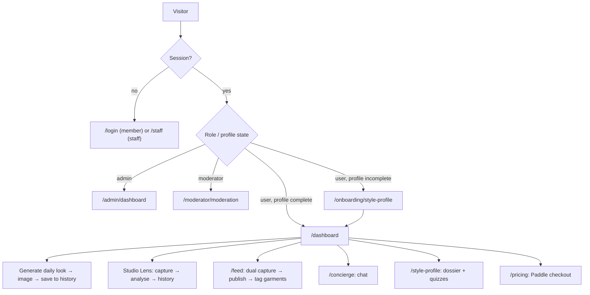
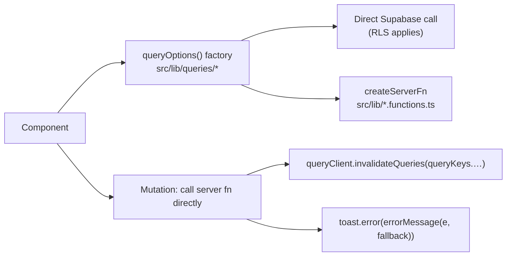
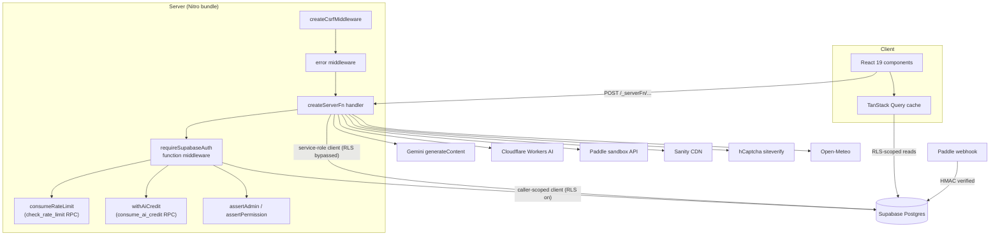
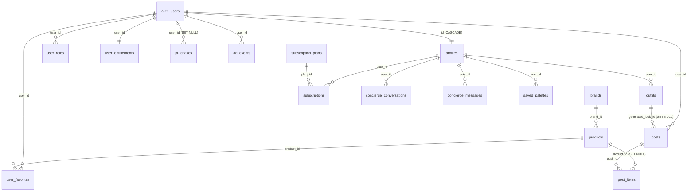
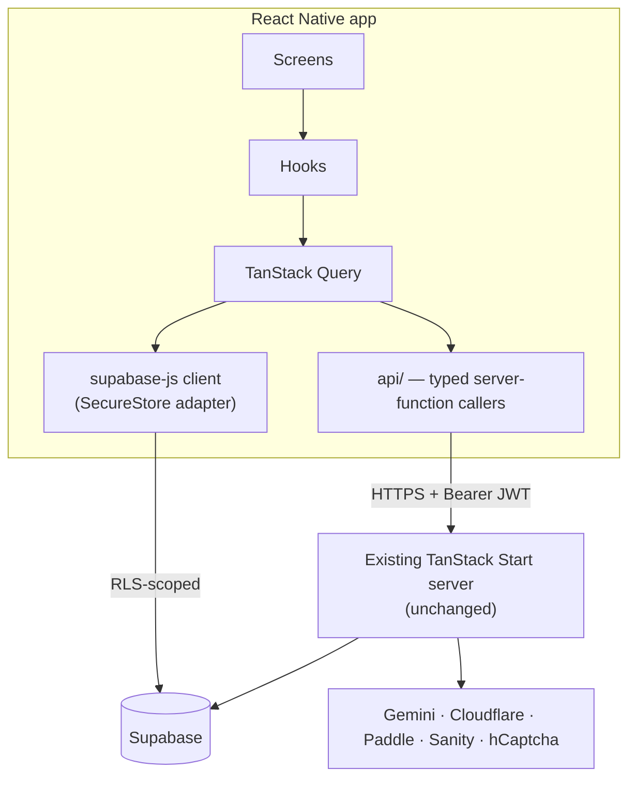

# Mila — Website Architecture Reference

**Purpose of this document.** A single source of truth describing the Mila web application
_as it exists in this repository_, detailed enough that a developer can rebuild the product as
a React Native mobile app reusing the same design system, brand, flows, business logic,
backend, database, API surface, auth, and security rules.

**Method.** Everything below was read out of the codebase at commit `764c2de` (branch `main`).
Nothing is inferred from product intent. Where the code does not answer a question, the entry
is marked **Needs Verification**.

**Scope note.** `README.md` in the repo root is an older description and has drifted in
several places (utility-class prefix, staff route paths, table inventory, dependency list).
Where the two disagree, _this_ document reflects the code.

---

## Table of Contents

1. [Website Overview](#1-website-overview)
2. [Technology Stack Analysis](#2-technology-stack-analysis)
3. [Complete UI Design System Extraction](#3-complete-ui-design-system-extraction)
4. [Page-by-Page UI Documentation](#4-page-by-page-ui-documentation)
5. [Responsive Design Rules](#5-responsive-design-rules)
6. [User Experience Flow Documentation](#6-user-experience-flow-documentation)
7. [Frontend Architecture](#7-frontend-architecture)
8. [Backend Architecture](#8-backend-architecture)
9. [Database Architecture](#9-database-architecture)
10. [Authentication Architecture](#10-authentication-architecture)
11. [API Documentation](#11-api-documentation)
12. [External Services Integration](#12-external-services-integration)
13. [Security Architecture](#13-security-architecture)
14. [Performance Analysis](#14-performance-analysis)
15. [Mobile App Conversion Guidelines](#15-mobile-app-conversion-guidelines)
16. [React Native Implementation Blueprint](#16-react-native-implementation-blueprint)

---

## 1. Website Overview

### Product purpose

Mila is an AI-assisted personal styling platform. It builds a durable **style dossier** for a
member — 16-season colour analysis, body silhouette, face shape, hair type, beauty preferences —
and then generates every recommendation against that dossier rather than against generic trend
content. The dossier is recomposed daily with live weather and a chosen occasion vibe into a
single outfit + hair + makeup recommendation.

Source: `docs/PRODUCT.md`, `src/lib/generate-outfit.functions.ts`.

### Main user problems solved

| Problem                                | How Mila addresses it                                                   | Code                                                           |
| -------------------------------------- | ----------------------------------------------------------------------- | -------------------------------------------------------------- |
| "I don't know what to wear today"      | One daily look, generated head-to-toe                                   | `generate-outfit.functions.ts`                                 |
| "I don't know what colours suit me"    | Deterministic 16-season colour engine + AI portrait read                | `src/lib/color-analysis/`, `analyzePersonalColor.functions.ts` |
| "Is this outfit right for me?"         | Photo → AI verdict scored against season + body type                    | `analyze-outfit.functions.ts`                                  |
| "I can't afford the designer piece"    | Photo → attribute extraction → ranked matches from an affiliate catalog | `dupe-hunter.functions.ts`                                     |
| "I want to ask a stylist a question"   | Conversational stylist grounded in the member's dossier                 | `concierge-chat.functions.ts`                                  |
| "I want to share and see real outfits" | Moderated community feed with per-garment tagging                       | `posts.functions.ts`, `outfit-items.functions.ts`              |

### Target users

From `docs/PRODUCT.md`: women roughly 25–45, style-curious but not stylists. **Primary context is
phone, morning, getting dressed** — short sessions, low patience, often one-handed. Secondary
contexts: evening wardrobe-photo uploads, dupe hunting while shopping, browsing the feed at
leisure.

Two non-primary user classes exist and matter: **moderators** (queue triage, support tickets)
and **admins/"Stewards"** (members, plans, moderation, support). Their surfaces optimise for
throughput, not warmth.

### Core features (status verified against code)

| Feature                                                       | Status                                   | Evidence                                                                      |
| ------------------------------------------------------------- | ---------------------------------------- | ----------------------------------------------------------------------------- |
| Email/password + Google OAuth sign-in                         | Implemented                              | `src/lib/auth.functions.ts`, `src/components/login/auth-card.tsx`             |
| Style-profile onboarding (9 steps)                            | Implemented                              | `src/constants/steps.ts`, `src/components/onboarding/`                        |
| 16-season colour analysis (deterministic engine)              | Implemented                              | `src/lib/color-analysis/`                                                     |
| AI portrait colour read                                       | Implemented                              | `src/lib/analyzePersonalColor.functions.ts`                                   |
| Daily look generation (outfit + hair + makeup)                | Implemented                              | `src/lib/generate-outfit.functions.ts`                                        |
| Generated look image (text→image)                             | Implemented                              | `src/lib/cloudflare-image.server.ts`                                          |
| Outfit history                                                | Implemented                              | `/history` route, `outfits` table                                             |
| Wardrobe/outfit photo analysis ("Studio Lens")                | Implemented                              | `src/lib/analyze-outfit.functions.ts`                                         |
| Per-garment detection + tagging on posts                      | Implemented                              | `src/lib/outfit-items.functions.ts`                                           |
| Dupe hunter                                                   | Implemented                              | `src/lib/dupe-hunter.functions.ts`                                            |
| Stylist chat ("Concierge")                                    | Implemented                              | `src/lib/concierge-chat.functions.ts`                                         |
| Daily palette generator + saved palettes                      | Implemented                              | `src/lib/color-analysis/paletteGenerator.ts`, `/palettes`                     |
| Community feed (dual capture, moderation-aware)               | Implemented                              | `src/lib/posts.functions.ts`                                                  |
| Member public profile                                         | Implemented                              | `/profile/$userId`                                                            |
| Credits (daily allowance + purchased balance)                 | Implemented                              | `consume_ai_credit` / `grant_ai_credits` RPCs                                 |
| Paddle subscriptions (checkout, webhook sync, cancel, resume) | Implemented — **sandbox endpoints only** | `src/lib/subscriptions.functions.ts`, `paddle-webhook.server.ts`              |
| Admin suite (dashboard, members, plans, moderation, support)  | Implemented                              | `src/routes/admin/`, `src/lib/admin.functions.ts`                             |
| Moderator suite (moderation, support)                         | Implemented                              | `src/routes/moderator/`                                                       |
| Account: email change, password change, data export, delete   | Implemented                              | `src/components/account/studio-membership-drawer.tsx`, `account.functions.ts` |
| Support/feedback form (public, captcha + rate limited)        | Implemented                              | `src/lib/support.functions.ts`                                                |
| Landing page content from Sanity CMS                          | Implemented                              | `src/lib/landing-content.functions.ts`                                        |
| **Password reset**                                            | **Not implemented**                      | no `resetPasswordForEmail` anywhere in `src/`                                 |
| **Credit packs** (one-off credit purchase)                    | **Not implemented**                      | no `credit_packs` table or code; specs exist under `docs/superpowers/` only   |
| **Ad rewards**                                                | **Schema only**                          | `ad_events` table exists; zero application references                         |
| **Purchase ledger**                                           | **Schema only**                          | `purchases` table exists; zero application references                         |
| **Favourites UI**                                             | **Read-only**                            | `user_favorites` is only read by the data-export function                     |

### User roles

Enum `public.app_role`: `admin`, `moderator`, `user` (`supabase/migrations/…_create_full_schema.sql:1`).
Permission mapping lives in exactly one place, `src/lib/authorization.ts`:

```ts
export const ROLE_PERMISSIONS = {
  admin: APP_PERMISSIONS, // all 11 permissions
  moderator: [
    "admin.access",
    "moderation.view",
    "moderation.manage",
    "support.view",
    "support.manage",
  ],
};
```

Full permission list: `admin.access`, `admin.dashboard.view`, `members.view`, `members.manage`,
`members.suspend`, `roles.manage`, `moderation.view`, `moderation.manage`, `support.view`,
`support.manage`, `subscriptionPlans.manage`.

Every new signup receives `user` automatically via the `handle_new_user()` database trigger.
Staff roles are granted by an admin through `/admin/members`.

### Main workflows



---

## 2. Technology Stack Analysis

### Frontend

| Technology                 | Version                    | Purpose                                            | Where used                             | Reason for usage                                                             |
| -------------------------- | -------------------------- | -------------------------------------------------- | -------------------------------------- | ---------------------------------------------------------------------------- |
| React                      | 19.2                       | UI rendering                                       | everywhere                             | Framework baseline                                                           |
| TypeScript (strict)        | 5.8                        | Static typing                                      | all of `src/`                          | `strict: true`, `noFallthroughCasesInSwitch` in `tsconfig.json`              |
| TanStack Start             | 1.167                      | SSR document rendering + `createServerFn` runtime  | `src/start.ts`, all `*.functions.ts`   | Gives typed RPC-style server functions co-located with client code           |
| TanStack Router            | 1.168                      | File-based routing, typed nav, `beforeLoad` guards | `src/routes/`, `src/routeTree.gen.ts`  | Route tree generated by `@tanstack/router-plugin`                            |
| TanStack Query             | 5.83                       | Server-state cache, mutations, invalidation        | `src/lib/queries/*`                    | Query keys centralised in `src/constants/query-keys.ts`                      |
| TanStack Table             | 8.21                       | Admin data tables (sort/filter/paginate)           | `src/components/ui/data-table.tsx`     | Only used in staff surfaces                                                  |
| Tailwind CSS               | v4.2 (`@tailwindcss/vite`) | Utility classes + CSS-first design tokens          | `src/styles.css`                       | Tokens declared with `@theme inline`                                         |
| Radix UI                   | various                    | Accessible unstyled primitives                     | `src/components/ui/`                   | accordion, dialog, dropdown-menu, label, popover, select, slot, switch, tabs |
| class-variance-authority   | 0.7                        | Typed variant/size APIs                            | `button.tsx`, others                   |                                                                              |
| clsx + tailwind-merge      | 2.1 / 3.5                  | `cn()` class merging                               | `src/lib/utils.ts`                     | The only class-merge utility in the codebase                                 |
| Lucide React               | 0.575                      | Icons                                              | everywhere                             | Named imports only, never dynamic                                            |
| Framer Motion              | 12.40                      | Page/section reveals, drawer transitions           | landing, dashboard, staff shell        | Always paired with `useReducedMotion`                                        |
| Sonner                     | 2.0                        | Toasts                                             | everywhere                             | `src/components/ui/sonner.tsx`                                               |
| React Hook Form            | 7.71                       | Form state                                         | login/signup, admin dialogs            |                                                                              |
| Zod                        | 3.24                       | Validation, client **and** server                  | forms + every `.validator()`           | Same shape re-parsed server-side                                             |
| `@hookform/resolvers`      | 5.2                        | Bridges Zod → RHF                                  | login/signup forms                     |                                                                              |
| `@hcaptcha/react-hcaptcha` | 2.0                        | Captcha widget                                     | `src/components/login/use-captcha.tsx` |                                                                              |
| `@paddle/paddle-js`        | 1.6                        | Checkout overlay                                   | `src/hooks/use-paddle-checkout.ts`     |                                                                              |
| `tw-animate-css`           | 1.3                        | Keyframe utilities for Radix open/close            | imported in `styles.css`               |                                                                              |

**Not present** (contrary to `README.md`): Embla Carousel, and there is no `src/components/ui/carousel.tsx`.

### Backend

| Technology                                                 | Purpose                                                           | Where used                                                           | Reason                                                                   |
| ---------------------------------------------------------- | ----------------------------------------------------------------- | -------------------------------------------------------------------- | ------------------------------------------------------------------------ |
| TanStack Start server functions                            | The entire application API                                        | `src/lib/*.functions.ts`                                             | Typed, colocated, no separate API service                                |
| Nitro 3 (beta)                                             | Production server bundle                                          | `vite.config.ts` (build only)                                        | Emits self-contained `.output/`, run with `bun .output/server/index.mjs` |
| Supabase Postgres                                          | Primary datastore                                                 | `src/integrations/supabase/`                                         | RLS-scoped                                                               |
| Supabase Auth (GoTrue)                                     | Identity, JWT sessions, OAuth                                     | `auth-handler.server.ts`, `client.ts`                                |                                                                          |
| Supabase Storage                                           | Image buckets `outfits` (public) and `posts` (private)            | `outfit-image-storage.server.ts`, `publish-ootd.ts`                  |                                                                          |
| Postgres RPC (`SECURITY DEFINER`)                          | Atomic credit accounting, rate limiting, role/suspension mutation | migration lines 324–691                                              | Race-safe under `FOR UPDATE` / table locks                               |
| Google Gemini (`generativelanguage.googleapis.com/v1beta`) | All text + vision AI                                              | `src/lib/ai.server.ts`                                               | Structured output via `responseJsonSchema`                               |
| Cloudflare Workers AI                                      | Text→image for generated looks                                    | `src/lib/cloudflare-image.server.ts`                                 | Default model `@cf/black-forest-labs/flux-1-schnell`                     |
| Paddle (sandbox)                                           | Subscriptions and billing                                         | `subscriptions.functions.ts`, `paddle-sync.server.ts`, webhook route | All API calls target `sandbox-api.paddle.com`                            |
| Sanity                                                     | Landing-page CMS                                                  | `src/lib/sanity.server.ts`                                           | Server-only reads, `useCdn: true`                                        |
| hCaptcha siteverify                                        | Bot protection on the support form                                | `src/lib/hcaptcha.server.ts`                                         |                                                                          |
| Open-Meteo                                                 | Live weather                                                      | `generate-outfit.functions.ts`, climate widget                       | No API key required                                                      |

### Infrastructure

| Concern                   | Status                                                                                                                 |
| ------------------------- | ---------------------------------------------------------------------------------------------------------------------- |
| Hosting                   | **Needs Verification** — no Dockerfile, no platform config, no deploy workflow in the repo                             |
| Deployment                | **Needs Verification** — `.github/workflows/ci.yml` runs lint/typecheck/test/audit/build only                          |
| CDN                       | **Needs Verification** — none configured in-repo. Sanity's own CDN is used for CMS reads (`useCdn: true`)              |
| DNS                       | **Needs Verification** — not in repo                                                                                   |
| Security headers          | Set at build time via Nitro `routeRules` in `vite.config.ts` (CSP, HSTS, nosniff, Referrer-Policy, Permissions-Policy) |
| Local HTTPS               | `vite-plugin-mkcert` — required so `getUserMedia` works in a secure context                                            |
| Package manager / runtime | Bun (`bunfig.toml` sets `minimumReleaseAge = 86400` as a supply-chain guard)                                           |
| CI                        | GitHub Actions: `bun install --frozen-lockfile` → lint → typecheck → `bun test` → `bun audit --prod` → build           |

---

## 3. Complete UI Design System Extraction

Canonical source: `src/styles.css` (tokens declared with Tailwind v4 `@theme inline`, values on
`:root` / `.dark`). `docs/DESIGN.md` carries the same palette as sRGB hex plus the normative
rules. Hex values below marked _(computed)_ were converted from the OKLCH originals — they match
`docs/DESIGN.md` exactly, so both files agree.

### Brand identity

The creative direction is **"The Atelier Dossier"**: a couturier's private client file. Ivory
paper stock, pencil-fine warm rules, a serif that knows what it's doing, and gold used exactly
once per page. Warmth comes from the cream canvas, the serif, and a 4%-opacity fractal-noise
paper grain on `body` — never from bright colour.

Four explicit anti-references (`docs/PRODUCT.md`, `docs/DESIGN.md`): generic SaaS dashboard,
fast-fashion e-commerce, beauty-app cliché, cold luxury minimalism.

### Colour tokens — light theme

| Token                  | CSS var                                | Value                                       | Usage                                                            |
| ---------------------- | -------------------------------------- | ------------------------------------------- | ---------------------------------------------------------------- |
| canvas                 | `--canvas` / `--background`            | `#f5f0e8`                                   | Page background ("Paper Cream")                                  |
| surface                | `--card` / `--color-surface`           | `#faf8f5`                                   | Cards, panels, inputs, popovers ("Porcelain")                    |
| ink                    | `--ink` / `--foreground` / `--primary` | `#2b2320` _(computed)_                      | Headings, primary button fill, dark controls                     |
| body text              | `--body-foreground`                    | `#6b6259`                                   | Default `body` colour ("Pencil")                                 |
| muted                  | `--muted-foreground`                   | `#6b6259` _(computed)_                      | Secondary text — same value as body by design                    |
| accent                 | `--accent` / `--ring`                  | `#c9a96e` _(computed)_                      | Champagne Gold: active states, focus ring, one emphasis per view |
| accent-soft            | `--accent-soft`                        | `#f5ecd9` _(computed)_                      | Hover/selected wash ("Champagne Veil")                           |
| rose                   | `--rose`                               | `#d2a4a0` _(computed)_                      | Contextual beauty/makeup warmth — **not** a second accent        |
| line / border          | `--border`                             | `#e8d5b0`                                   | Borders and dividers (warm tan, never grey)                      |
| input                  | `--input`                              | `#e8d5b0` _(computed)_                      | Input border colour token                                        |
| popover                | `--popover`                            | `#faf8f5` _(computed)_                      | Popover surface                                                  |
| secondary / muted bg   | `--secondary`, `--muted`               | `#f2eee9` _(computed)_                      | Subtle fills                                                     |
| success                | `--success`                            | `#35794b` _(computed)_                      | "Forest"                                                         |
| warning                | `--warning`                            | `#c56c21` _(computed)_                      | "Amber"                                                          |
| destructive            | `--destructive`                        | `#cc2827` _(computed)_                      | "Signal"                                                         |
| primary-foreground     | `--primary-foreground`                 | `#faf8f5` _(computed)_                      | Text on Ink fills                                                |
| destructive-foreground | `--destructive-foreground`             | `#faf8f5` _(computed)_                      |                                                                  |
| warning-foreground     | `--warning-foreground`                 | `#1d140d` _(computed)_                      |                                                                  |
| atelier-panel          | `--atelier-panel`                      | `oklch(1 0.003 80 / 78%)` ≈ `#ffffff` @ 78% | Translucent panel fill                                           |

### Colour tokens — dark theme (`.dark`)

| Token              | Value                                         | Notes                   |
| ------------------ | --------------------------------------------- | ----------------------- |
| canvas             | `#110c09` _(computed)_                        |                         |
| surface / card     | `#1b1612` _(computed)_                        |                         |
| popover            | `#1e1814` _(computed)_                        |                         |
| ink / foreground   | `#ebe7e2` _(computed)_                        |                         |
| body text          | `#b1a9a1` _(computed)_                        |                         |
| muted-foreground   | `#a59d95` _(computed)_                        |                         |
| accent             | `#c6ad8b` _(computed)_                        |                         |
| accent-soft        | `#3b3121` _(computed)_                        |                         |
| accent-foreground  | `#110c08` _(computed)_                        |                         |
| primary-foreground | `#1a1511` _(computed)_                        |                         |
| secondary / muted  | `#29231e` _(computed)_                        |                         |
| rose               | `#b88c87` _(computed)_                        |                         |
| success            | `#57a26d` _(computed)_                        |                         |
| warning            | `#df8f48` _(computed)_                        |                         |
| destructive        | `#e24942` _(computed)_                        |                         |
| border             | `oklch(0.95 0.01 70 / 12%)` ≈ `#f2eeea` @ 12% | Alpha-based, not opaque |
| input              | `oklch(0.95 0.01 70 / 16%)` ≈ `#f2eeea` @ 16% | Alpha-based             |
| ring               | `#c9a96e` _(computed)_                        | Same gold as light      |
| atelier-panel      | `oklch(0.2 0.012 55 / 78%)`                   |                         |

### Named colour rules (normative — carry these to mobile)

1. **The One Gold Rule** — Champagne Gold on at most ~10% of a screen, at most one emphatic job per view.
2. **The Gold-Is-Not-Ink Rule** — gold is _never_ a text colour on Paper Cream or Porcelain (1.97:1, fails AA). It may fill a surface behind Ink text, outline a focus ring, or wash a hover state.
3. **The Warm-Neutral Rule** — no pure grey, no pure black. Zero chroma is a bug.
4. **The Colour-Is-Content Rule** — season palettes, garment colours, swatches are _data_. Product state is never encoded in hue alone; every coloured status carries a label, icon, or shape.

### Typography system

Loaded from Google Fonts in `src/routes/__root.tsx`:
Playfair Display (500, 600, 700, 800) and Inter (300, 400, 500, 600, 700).

| Role                           | Family           | Size                        | Weight | Line-height | Tracking            | Usage                                                      |
| ------------------------------ | ---------------- | --------------------------- | ------ | ----------- | ------------------- | ---------------------------------------------------------- |
| Display (`.atelier-title`)     | Playfair Display | `clamp(2.25rem, 6vw, 3rem)` | 800    | 1           | `-0.02em`           | Hero/section openers on marketing                          |
| H1                             | Playfair Display | `3.25rem` (52px)            | 700    | 1           | `-0.02em`           | One per page                                               |
| H2                             | Playfair Display | `2rem` (32px)               | 600    | 1.25        | `-0.015em`          | Section headings                                           |
| H3                             | Playfair Display | inherits base sizing        | —      | —           | `-0.01em`           |                                                            |
| Subtitle (`.atelier-headline`) | Playfair Display | `1.5rem` (24px)             | —      | snug        | tight               | In-app card/panel headings                                 |
| Body                           | Inter            | `1rem`                      | 400    | 1.625       | `0`                 | `font-feature-settings: "ss01","cv11"`                     |
| Label (`atelier-label`)        | Inter            | `0.625rem` (`--text-micro`) | 600    | 1.4         | `0.25em`, uppercase | Metadata, table column headers                             |
| Section label                  | Inter            | `0.75rem`                   | 600    | —           | `0.2em`, uppercase  | `atelier-section-label`                                    |
| Kicker (`.atelier-kicker`)     | Inter            | `0.75rem`                   | 600    | —           | `0.15em`, uppercase | **Deprecated** — fails AA and is the "AI scaffold" pattern |

Custom size scale beyond Tailwind defaults:
`--text-pico: 0.5rem`, `--text-nano: 0.5625rem`, `--text-micro: 0.625rem`, `--text-label: 0.6875rem`.

Custom tracking scale:
`--tracking-label-tight: 0.15em`, `--tracking-label: 0.2em`, `--tracking-label-wide: 0.25em`,
`--tracking-label-xwide: 0.32em`, `--tracking-label-max: 0.42em`.

Typography rules: Playfair never sets body copy, UI labels, or button text; Inter never sets an
`h1`. Display tracking never goes below `-0.04em`. `text-wrap: balance` on `h1`–`h3`.
Body measure capped at 65–75ch via `--container-reading: 46rem`.

### Spacing system

Tailwind's default 4px scale is used throughout. The repo-specific values are:

| Token                      | Value                                   | Source                           |
| -------------------------- | --------------------------------------- | -------------------------------- |
| card padding               | `1.5rem` (`p-6`)                        | `card.tsx` header/content/footer |
| control horizontal padding | `1.25rem` (`px-5`)                      | `button.tsx` size `md`           |
| input horizontal padding   | `0.875rem` (`px-3.5`)                   | `input.tsx`                      |
| page padding X             | `1rem` → `1.5rem` (sm) → `3rem` (lg)    | `.atelier-page`                  |
| page padding Y             | `1.5rem` → `2rem` (sm) → `3.5rem` (lg)  | `.atelier-page`                  |
| container padding X        | `1.25rem` → `2rem` (sm) → `2.5rem` (lg) | `.atelier-container`             |
| section rhythm             | `3.5rem`                                | `docs/DESIGN.md`                 |
| container: reading         | `46rem`                                 | `--container-reading`            |
| container: content         | `72rem`                                 | `--container-content`            |

Suggested mobile token names (derived, for RN):
`xs: 4`, `sm: 8`, `md: 12`, `lg: 16`, `xl: 24`, `2xl: 32`, `3xl: 56`.

### Radius system — five steps, mapped to control _size_, never taste

| Token             | Value          | Applies to                                  |
| ----------------- | -------------- | ------------------------------------------- |
| `rounded-control` | `0.75rem` (12) | Buttons, inputs, small controls             |
| `rounded-panel`   | `1rem` (16)    | Panels, list containers                     |
| `rounded-card`    | `1.25rem` (20) | Cards                                       |
| `rounded-overlay` | `1.5rem` (24)  | Dialogs, sheets                             |
| `rounded-pill`    | `9999px`       | Badges, chips, pill buttons, mobile tab bar |

Base `--radius` is a tight `0.25rem`; the `sm/lg/xl/2xl/3xl` aliases derive from it.

### Elevation / shadows

Hybrid with a hard boundary: **in-app surfaces are separated by 1px warm rules and are flat at
rest; only things that genuinely float cast a shadow.**

| Token           | Light value                                                                      | Usage                                                                      |
| --------------- | -------------------------------------------------------------------------------- | -------------------------------------------------------------------------- |
| `shadow-paper`  | `0 1px 2px oklch(.264 .013 41.6 / .04), 0 10px 30px oklch(.264 .013 41.6 / .07)` | Resting sheet — marketing cards, `.atelier-card`                           |
| `shadow-raised` | `0 4px 10px …/.06, 0 20px 50px …/.10`                                            | Hover lift, popovers, dropdowns                                            |
| `shadow-nav`    | `0 12px 40px oklch(.1 .01 55 / .2)`                                              | Sticky nav, sheets, dialogs, toasts — the only one allowed to read as dark |

Dark mode uses the same three roles with black-based alphas at 0.30–0.50.

Rules: **Float-Only** (no overlap → no shadow), **No-Nesting** (a shadowed surface never contains
another), **The 2014 Test** (a shadow that reads as a hard edge is wrong).

### Motion

- Easing token `--ease-editorial: cubic-bezier(0.22, 1, 0.36, 1)`, ~200ms for state changes.
- Only `transform`, `opacity`, colour, and shadow are animated — never layout properties.
- `prefers-reduced-motion` is honoured globally in `@layer base` (durations → 0.01ms) _and_
  per-component via Framer Motion's `useReducedMotion` (e.g. `dashboard.tsx` sets stagger to 0
  and offset to 0).

### Cross-cutting component classes (`@layer components` / `@utility`)

| Class                   | Definition                                                                                       |
| ----------------------- | ------------------------------------------------------------------------------------------------ |
| `.atelier-container`    | `mx-auto w-full max-w-content px-5 sm:px-8 lg:px-10`                                             |
| `.atelier-page`         | `mx-auto w-full max-w-7xl px-4 py-6 sm:px-6 sm:py-8 lg:px-12 lg:py-14`                           |
| `.atelier-card`         | `rounded-card border border-line bg-surface shadow-paper`                                        |
| `.atelier-hero-card`    | 3-stop diagonal cream gradient `#f0e6d3 → #faf8f5 → #f5f0e8` (hand-tuned dark counterpart)       |
| `.atelier-title`        | Playfair 800, `clamp(2.25rem,6vw,3rem)`, lh 1, `-0.02em`                                         |
| `.atelier-focus-ring`   | `focus-visible:ring-2 ring-accent ring-offset-2 ring-offset-canvas`                              |
| `atelier-label`         | `text-micro uppercase tracking-label-wide text-stone`                                            |
| `atelier-glass`         | `border border-porcelain/60 bg-background/70 backdrop-blur-xl` — **image-overlay contexts only** |
| `atelier-media-frame`   | `aspect-square rounded-card border bg-card shadow-paper`                                         |
| `atelier-row-action`    | `flex w-full items-center justify-between px-5 py-4 hover:bg-porcelain/20`                       |
| `atelier-section-label` | `text-xs font-semibold uppercase tracking-label text-ink`                                        |
| `atelier-headline`      | `font-serif text-2xl leading-snug tracking-tight`                                                |
| `.atelier-kicker`       | **Deprecated** — `text-xs font-semibold uppercase tracking-label-tight text-muted-foreground`    |

> Note: `README.md` documents these as `mila-*`. The actual prefix in code is `atelier-*`.

### Component design system

All shared primitives live in `src/components/ui/` (26 files). Radix backs everything that needs
focus management, portals, or keyboard navigation.

#### Button — `src/components/ui/button.tsx`

**Purpose:** every action in the app. **Implementation:** `cva` variants + `@radix-ui/react-slot`
for `asChild`.

| Variant             | Styling                                                                                          |
| ------------------- | ------------------------------------------------------------------------------------------------ |
| `primary` (default) | `bg-ink text-surface`, hover lifts 1px (`-translate-y-px`) + `bg-ink/90`, `active:translate-y-0` |
| `secondary`         | `border-line bg-surface text-ink`, hover `bg-accent-soft/60`, active `/80`                       |
| `outline`           | `border-line bg-canvas text-ink`, hover `bg-accent-soft/40`                                      |
| `ghost`             | transparent, hover `bg-accent-soft/50`                                                           |
| `destructive`       | `bg-destructive text-destructive-foreground`, hover `/90`                                        |
| `glass`             | `atelier-glass text-ink`, hover `border-border` — image overlays only                            |

| Size           | Height               | Padding  | Notes                                      |
| -------------- | -------------------- | -------- | ------------------------------------------ |
| `sm`           | 36px (`h-9`)         | `px-3.5` | `text-xs`                                  |
| `md` (default) | 44px (`h-11`)        | `px-5`   | **Phone-first floor for daily flows**      |
| `lg`           | 48px (`h-12`)        | `px-7`   | `text-base`                                |
| `icon`         | 44×44 (`size-11`)    | `p-0`    |                                            |
| `pill`         | 44px, `rounded-full` | `px-5`   |                                            |
| `chip`         | 36px, `rounded-full` | `px-3`   | `text-micro uppercase tracking-label-wide` |

**Props:** all `button` HTML attributes + `variant`, `size`, `asChild`, `loading`.
**States:** `loading` swaps in a spinning `Loader2`, sets `disabled` and `aria-busy`, and **never
removes the label**. `disabled` → `opacity-50`, `pointer-events-none`, `cursor-not-allowed`.
Base transition: `transition-[color,background-color,border-color,box-shadow,transform] duration-200 ease-editorial`.
All child SVGs forced to `size-4` and `pointer-events-none`.

#### Input — `src/components/ui/input.tsx`

**Purpose:** text/password/email/search entry.
**Base:** `h-11` (44px), `rounded-control`, `border border-line`, `bg-surface`, `px-3.5 py-1`,
`text-base` → `md:text-sm`, `placeholder:text-muted`, `atelier-focus-ring`.
**Props:** all `input` props + `leadingIcon?: LucideIcon`, `trailingIcon?: LucideIcon`,
`trailingElement?: ReactNode`.
**Behaviour:** with a leading icon the input gets `pl-10` and the icon is absolutely positioned at
`left-3.5`, `size-4`, `strokeWidth 1.75`, `text-muted`, `aria-hidden`. With trailing content it
gets `pr-10`; `trailingElement` sits at `right-2` (used by `PasswordVisibilityButton`).
**Disabled:** `opacity-50`, `cursor-not-allowed`.
**Password input** is `Input` + `PasswordVisibilityButton` (see `login-form.tsx`), not a separate
component.

#### Card — `src/components/ui/card.tsx`

`Card` renders `.atelier-card` + `text-card-foreground`, supports `asChild`.
Slots: `CardHeader` (`flex flex-col space-y-1.5 p-6`), `CardTitle`
(`font-semibold leading-none tracking-tight`), `CardDescription` (`text-sm text-muted-foreground`),
`CardContent` (`p-6 pt-0`), `CardFooter` (`flex items-center p-6 pt-0`).

#### Badge — `src/components/ui/badge.tsx`

`rounded-pill border border-line px-2.5 py-0.5 text-xs font-semibold text-ink`, transparent fill.
No variants — colour is applied per-usage via `className`. **Rule:** a badge's colour is never its
only signal.

#### Full primitive inventory

| Component                    | Backed by          | Notes                                                                |
| ---------------------------- | ------------------ | -------------------------------------------------------------------- |
| `accordion`                  | Radix Accordion    |                                                                      |
| `avatar-initial`             | —                  | Initial-letter avatar, used in header + profile                      |
| `badge`                      | —                  |                                                                      |
| `button`                     | Radix Slot + cva   |                                                                      |
| `card`                       | Radix Slot         |                                                                      |
| `data-table`                 | TanStack Table     | search, sort, pagination, `isLoading`, `emptyMessage`, `action` slot |
| `data-table-column-header`   | TanStack Table     |                                                                      |
| `dialog`                     | Radix Dialog       | `rounded-overlay`, `shadow-nav`                                      |
| `dropdown-menu`              | Radix DropdownMenu |                                                                      |
| `empty-state`                | —                  | icon + title + description, `role="status"`                          |
| `error-state`                | —                  | also exports `LoadErrorPanel` with `onRetry`                         |
| `form-field`                 | —                  | label + control + error, used by admin dialogs                       |
| `icon-button`                | —                  | requires a `label` prop → `aria-label`                               |
| `image-with-fallback`        | —                  |                                                                      |
| `input`                      | —                  |                                                                      |
| `label`                      | Radix Label        |                                                                      |
| `loading-state`              | —                  |                                                                      |
| `option-tile`                | —                  | onboarding single-select tiles                                       |
| `page-header`                | —                  | `kicker`/`title`/`description`/`align`                               |
| `password-visibility-button` | —                  |                                                                      |
| `popover`                    | Radix Popover      |                                                                      |
| `select`                     | Radix Select       |                                                                      |
| `sheet`                      | Radix Dialog       | side drawers / bottom sheets                                         |
| `skeleton`                   | —                  |                                                                      |
| `sonner`                     | Sonner             | `<Toaster />` mounted in `__root.tsx`                                |
| `switch`                     | Radix Switch       |                                                                      |
| `table`                      | —                  | primitive `<table>` styling                                          |
| `tabs`                       | Radix Tabs         |                                                                      |
| `textarea`                   | —                  |                                                                      |
| `verified-badge`             | —                  | shown when the author has an in-force subscription                   |

#### Navigation components

| Component            | File                                                 | Behaviour                                                                                                                                                                                                                                                                                                                                         |
| -------------------- | ---------------------------------------------------- | ------------------------------------------------------------------------------------------------------------------------------------------------------------------------------------------------------------------------------------------------------------------------------------------------------------------------------------------------- |
| App header           | `layout/app-shell.tsx`                               | `sticky top-0 z-40`, `h-16`, `bg-background/80 backdrop-blur-xl`, bottom border. Left: wordmark + favicon. Centre (`md+` only): `DesktopNav`. Right: credits chip → `/pricing`, `ThemeToggle`, mobile-only "Lens" chip, avatar → membership drawer                                                                                                |
| Desktop nav          | `layout/desktop-nav.tsx`                             | `hidden md:flex`, absolutely centred, `gap-10`. Items: Dashboard, Feed, Lens (button), Studio, Concierge (button). Active = `text-accent`; inactive = `text-muted hover:text-ink`. `text-xs uppercase tracking-label`                                                                                                                             |
| Mobile tab bar       | `layout/mobile-tab-bar.tsx`                          | `md:hidden`, `fixed left-3 right-3`, `bottom: calc(0.75rem + env(safe-area-inset-bottom))`, `rounded-pill`, `bg-ink/90 text-surface shadow-nav backdrop-blur-xl`. 5 items: Dashboard, Feed, Lens, Studio, Concierge. Icons `size-4.5`, `strokeWidth 1.75`, labels at `9px`/`nano` uppercase. Active = `text-accent`, inactive = `text-surface/50` |
| Staff sidebar        | `staff/staff-sidebar.tsx`                            | Fixed on `lg+`; slide-over drawer below. Links filtered by `staffBase(roles)` + `hasPermission`. Icons `size-[18px]`                                                                                                                                                                                                                              |
| Staff header         | `staff/staff-header.tsx`                             | Drawer toggle below `lg`, role label ("Steward"/"Moderator")                                                                                                                                                                                                                                                                                      |
| Site header / footer | `landing/site-header.tsx`, `landing/site-footer.tsx` | Marketing only; header takes a `sections` array for in-page anchors                                                                                                                                                                                                                                                                               |

Navigation rules from `docs/DESIGN.md`: active state is Ink text plus a Champagne Veil wash —
**not** a coloured side-stripe. Sticky nav is the one chrome element permitted `shadow-nav`.
Mobile targets ≥ 44px, thumb-reachable.

#### Signature component: the Season Tag

`src/components/landing/season-tag.tsx` — the one place a saturated non-brand colour is required,
because it renders a member's 16-season colour identity. **Its swatch colour is data.** It must
always pair the swatch with the season's name.

---

## 4. Page-by-Page UI Documentation

Route tree source: `src/routes/` (file-based) → `src/routeTree.gen.ts` (generated).

### Route inventory

| Route                       | Layout chain                    | Access                             | File                                                 |
| --------------------------- | ------------------------------- | ---------------------------------- | ---------------------------------------------------- |
| `/`                         | root                            | Public (redirects signed-in)       | `routes/index.tsx`                                   |
| `/login`                    | root                            | Public                             | `routes/login.tsx`                                   |
| `/staff`                    | root                            | Public (staff login)               | `routes/staff.tsx`                                   |
| `/auth/callback`            | root                            | Public                             | `routes/auth/callback.tsx`                           |
| `/onboarding/style-profile` | `_authenticated` → `onboarding` | Authenticated                      | `routes/_authenticated/onboarding/style-profile.tsx` |
| `/dashboard`                | `_authenticated` → `_app`       | Authenticated member               | `routes/_authenticated/_app/dashboard.tsx`           |
| `/feed`                     | `_authenticated` → `_app`       | Authenticated member               | `.../feed.tsx`                                       |
| `/history`                  | `_authenticated` → `_app`       | Authenticated member               | `.../history.tsx`                                    |
| `/style-profile`            | `_authenticated` → `_app`       | Authenticated member               | `.../style-profile.tsx`                              |
| `/concierge`                | `_authenticated` → `_app`       | Authenticated member               | `.../concierge.tsx`                                  |
| `/palettes`                 | `_authenticated` → `_app`       | Authenticated member               | `.../palettes.tsx`                                   |
| `/pricing`                  | `_authenticated` → `_app`       | Authenticated member               | `.../pricing.tsx`                                    |
| `/profile/$userId`          | `_authenticated` → `_app`       | Authenticated (staff allowed)      | `.../profile.$userId.tsx`                            |
| `/admin`                    | —                               | redirect → `/admin/dashboard`      | `routes/admin/index.tsx`                             |
| `/admin/dashboard`          | `admin/_authed`                 | `admin.dashboard.view`             | `routes/admin/_authed/dashboard.tsx`                 |
| `/admin/members`            | `admin/_authed`                 | `members.view`                     | `.../members.tsx`                                    |
| `/admin/subscription-plans` | `admin/_authed`                 | `subscriptionPlans.manage`         | `.../subscription-plans.tsx`                         |
| `/admin/moderation`         | `admin/_authed`                 | `moderation.view`                  | `.../moderation.tsx`                                 |
| `/admin/support`            | `admin/_authed`                 | `support.view`                     | `.../support.tsx`                                    |
| `/moderator`                | —                               | redirect → `/moderator/moderation` | `routes/moderator/index.tsx`                         |
| `/moderator/moderation`     | `moderator/_authed`             | `moderation.view`                  | `.../moderation.tsx`                                 |
| `/moderator/support`        | `moderator/_authed`             | `support.view`                     | `.../support.tsx`                                    |
| `/api/webhooks/paddle`      | —                               | Signature-verified                 | `routes/api/webhooks/paddle.ts`                      |

> `README.md` places the staff trees under `_authenticated/`. They are **not**: `admin/_authed.tsx`
> and `moderator/_authed.tsx` are top-level and perform their own session check, redirecting a
> signed-out visitor to `/staff` (not `/login`).

---

### Landing page — `/`

**Purpose:** marketing site; the only page a signed-out visitor sees.
**Route:** `/` (`routes/index.tsx`)
**Data:** `loader: () => getLandingContent()` — a server function that queries Sanity.
`staleTime: 5 min`.
**Guard:** `beforeLoad` reads the session; if present, resolves viewer state and throws a redirect
to `viewer.destination`. The component repeats this client-side and shows `<AtelierSplash />`
meanwhile.

**Layout structure (top to bottom):**

- `SiteHeader` — takes `sections` derived from the CMS kickers (`how-it-works`, `dossier`, `dupe-hunter`, `community`)
- `main.overflow-x-clip`
  - `HeroSection` — headline (2 lines), subhead, CTA, and a preview card (season, weather, outfit title/body, hair, makeup)
  - `HowItWorksSection` — numbered steps
  - `DossierSection` — label/value rows + completion percent
  - `DupeHunterSection` — inspiration card vs. Mila-match card
  - `CommunitySection` — season chips, wraps `TestimonialsSection`
  - `FinalCtaSection` — heading, body, privacy note
- `SiteFooter` — wordmark, tagline

**Components used:** `Section`, `Reveal` (scroll reveal that enhances an already-visible default),
`CtaButton`, `SeasonTag`, `AtelierSplash`.
**User actions:** anchor-scroll to sections; CTA → `/login`.
**Responsive:** section internals stack below `sm`; `.atelier-container` caps width at `72rem`.

---

### Login — `/login`

**Purpose:** member sign-in and sign-up.
**Guard:** `useLoginRedirect("member")` — sends a signed-in member onward, and if a _staff_ account
signs in here it is signed straight back out with the notice
_"Stewards and moderators sign in through the staff login."_

**Layout:** full-screen, `bg-background`, two blurred decorative blobs
(`bg-atelier-champagne/25`, `bg-atelier-rose/20`, `blur-3xl`), centred column.

- Wordmark (favicon + "MILA", `font-serif text-2xl tracking-label-xwide`) + kicker
- `AuthCard` (`max-w-sm`)
  - "Continue with Google" (`variant="outline"`, `h-10`, Google SVG)
  - Divider: "Or continue with email"
  - `Tabs` → `LoginForm` / `SignupForm`
  - Footer line with `ShieldCheck` icon
- `SupportDialog`

**LoginForm fields:** email, password (with visibility toggle), hCaptcha widget, submit
("Enter Mila Studio"). Zod: email valid, password ≥ 8. Submit is disabled until a captcha token
exists.
**SignupForm** additionally collects a username and shows the `passwordChecks` strength list
(≥12 chars, lower, upper, digit, symbol — `src/constants/password.ts`).
**API:** `signInWithPassword` / `signUpWithPassword` server functions; on success the returned
session is installed with `supabase.auth.setSession(session)`.

---

### Staff login — `/staff`

Same `LoginForm`, no OAuth, no signup tab, no support dialog. Copy: "Atelier Staff Suite",
"Stewards and moderators only." `useLoginRedirect("staff")` signs a plain member back out with
_"The staff login is for stewards and moderators only."_

---

### Onboarding — `/onboarding/style-profile`

**Purpose:** build the style dossier; the gate that stands between signup and `/dashboard`.
**Layout:** `onboarding.tsx` provides a minimal chrome — `atelier-container` header with the MILA
wordmark and a sign-out `IconButton`, then `<Outlet />`. No app shell, no tab bar.
**Search param:** `?step=<OnboardingStepId>`, sanitised by `sanitizeOnboardingStep`.

**Steps** (`src/constants/steps.ts`) — 9 total, 8 counted (welcome excluded):

| #   | Step id              | Title                      | Optional | Component                           |
| --- | -------------------- | -------------------------- | -------- | ----------------------------------- |
| —   | `welcome`            | Welcome to Mila            | —        | `steps/welcome-step.tsx`            |
| 1   | `color-path`         | Your coloring              |          | `steps/color-path-step.tsx`         |
| 2   | `color-result`       | Confirm your color profile |          | `steps/color-result-step.tsx`       |
| 3   | `body-type`          | Body silhouette            |          | `steps/single-select-step.tsx`      |
| 4   | `face-shape`         | Face shape                 |          | `steps/single-select-step.tsx`      |
| 5   | `hair-type`          | Hair type                  |          | `steps/single-select-step.tsx`      |
| 6   | `beauty-preferences` | Beauty preferences         | ✔        | `steps/beauty-preferences-step.tsx` |
| 7   | `location`           | Location & weather         | ✔        | `steps/location-step.tsx`           |
| 8   | `review`             | Your Mila profile is ready |          | `steps/review-step.tsx`             |

**Components:** `StyleProfileOnboarding` (orchestrator), `ProgressBar`, `StepShell`, `SaveStatus`,
`OptionTile`, `VisualDiagnosticViewfinder` (live camera colour read).
**Reachability:** `isOnboardingStepReachable` blocks jumping past an incomplete non-optional step;
`getFirstIncompleteOnboardingStep` resumes where the member left off.
**API/data:** reads `profileQueryOptions`; writes via `useUpdateStyleProfile` (direct Supabase
`profiles` update); the camera path calls `analyzePersonalColor`.
**Exit condition:** `isStyleProfileComplete()` requires a valid `skin_undertone`, `color_season`,
`body_type`, `face_shape`, `hair_type`, **and** a non-empty `color_profile` JSON.

---

### Dashboard — `/dashboard`

**Purpose:** the daily look. The product's primary screen.
**Layout structure:**

1. **Hero card** — `Card asChild` + `.atelier-hero-card`, two blurred radial accents
   (`bg-accent/25`, `bg-rose/15`), padding `p-6 sm:p-8 md:p-10`. Contains the time-aware greeting
   (`Good morning` / `Good afternoon` / `Good evening` / `Still up` + first name),
   the `ClimateWidget`, the vibe `Select`, and the generate `Button`.
2. **Result region** — `OutfitResultSkeleton` while generating, then `OutfitVisual` (the generated
   image) + `GeneratedLookDetail` (outfit / hair / makeup sections with `ExpandableText`).
3. **`DailyPaletteGenerator`** — daily 3-swatch palette with save-to-`/palettes`.
4. **Dialogs:** `UpgradeSlotsDialog` (the out-of-credits paywall).

**Vibes** (`VIBES` const, 11 options): Everyday Casual, Work or School, Business Casual, Business
Attire, Brunch, Date Night, Dinner, Party, Formal Event, Travel, Active Day.

**User actions:** pick a vibe → Generate → (auto) fetch image → Retry image → Save to history →
Ask the Concierge about this look.

**API/data requirements:**

| Action         | Call                                                                             | Notes                                                                       |
| -------------- | -------------------------------------------------------------------------------- | --------------------------------------------------------------------------- |
| Load profile   | `profileQueryOptions(userId)`                                                    | direct Supabase `profiles` read                                             |
| Load credits   | inline query on `user_entitlements`                                              | `ai_credits + purchased_credits`                                            |
| Weather        | Open-Meteo via `ClimateWidget`; also server-side fallback in `generateDailyLook` |                                                                             |
| Generate look  | `generateDailyLook({data})`                                                      | **costs 1 credit**; marks `look_image_pending`                              |
| Generate image | `regenerateOutfitImage({data})`                                                  | first image per look is free (claims the pending flag), afterwards 1 credit |
| Save           | `saveOutfitToHistory({data})`                                                    | uploads the data-URI to the `outfits` bucket, inserts into `outfits`        |

**Blocked states:** "Complete your Style Profile first." (profile incomplete) and "Still finding
today's weather…" (no climate). Save is blocked with "Your look needs its visual before it can be
saved."
**Errors:** `isInsufficientCreditsError(e)` → opens the paywall dialog rather than a toast.
**Responsive:** `atelier-page max-w-5xl`; hero padding steps at `sm`/`md`; framer-motion stagger
0.08s / item offset 12px, both zeroed under reduced motion.

---

### Feed — `/feed`

**Purpose:** community OOTD feed.
**Data:** `getFeed()` server function, `queryKeys.feed(userId)`, `staleTime: 30s`.
Returns `{ has_posted_today, posts[] }` — up to 80 non-hidden posts, newest first, with 1-hour
signed URLs for both images, author name, `author_verified`, `is_self`, and detected `items[]`.
**Components:** `PostCanvas` (renders the dual images with garment hotspots), `PostItemDrawer`,
`OotdTaggingSheet`, `DualCapture`, `Sheet`, `Skeleton`, `EmptyState`, `LoadErrorPanel`.
**User actions:** open the capture sheet → 2-step capture (rear "The Fit", front "The Face & Hair")
→ optional caption → publish → tag garments. Tap a hotspot → drawer with attributes and
"find similar".
**Publish pipeline:** `publishOotd()` uploads `back-<ts>.jpg` and `front-<ts>.jpg` to
`posts/<userId>/`, calls `createPost`, then calls `analyzeOutfitItems` — which **never rethrows**,
so a vision failure or empty balance cannot cost the poster their OOTD.

---

### History — `/history`

**Purpose:** every saved look and Lens analysis.
**Search param:** `?look=<uuid>` — deep-links a look open (used by the Lens success toast).
**Data:** direct Supabase read of `outfits` for the signed-in user.
**Normalisation:** `analysis_result` is one of two shapes — `{type:"daily_look", …}` or a Lens
analysis (`color_match`, `silhouette`, `overall_score`, `verdict`) — normalised into
`daily_look | lens | unavailable`.
**Components:** `Card`, `ImageWithFallback`, `Dialog` + `GeneratedLookDetail`, `EmptyState`,
`LoadErrorPanel`, `Skeleton`, `PageHeader`.
**User actions:** open detail, delete, "Ask the Concierge about this look" (→ `/concierge` with the
look anchored).

---

### Style Profile / Studio — `/style-profile`

Thin route → `components/style-profile/style-profile-page.tsx`.
**Components:** `StudioPortfolioView` (the dossier), `ColorQuiz`, `BodyTypeQuiz`,
`VisualDiagnosticViewfinder`, shared pieces in `style-profile/shared.tsx`.
**Purpose:** view and re-take the dossier after onboarding.

---

### Concierge — `/concierge`

**Purpose:** conversational stylist.
**Layout:** two-pane on `lg+` (conversation list + chat), single pane with a `Sheet` drawer below.
**Data:** `concierge_conversations` (20 most recent, direct Supabase read);
`ConciergeChat` sends `conciergeChat({data})`.
**Anchoring:** `useConcierge()` context carries an optional `ConciergeLook`; when set,
`AnchoredLookCard` renders above the thread and the server attaches the look's image.
**Composer:** `pb-[max(1rem,env(safe-area-inset-bottom))]` — safe-area aware.
**Cost:** 1 credit per reply; rate limited at 20 / 5 min per user.

---

### Saved Palettes — `/palettes`

**Data:** `savedPalettesQueryOptions(userId)` → `saved_palettes`, newest first, rows validated by
`isDailyPalette()` before display.
**Layout:** `PaletteCard` grid — vibe chip, relative time, three 64px swatch blocks
(`aria-hidden`), then a `<dl>` naming each swatch (Base Layer / Statement / Accent Pop), then the
insight and a delete button.
**Note:** this is the Colour-Is-Content Rule in practice — swatches are decorative to a screen
reader; the names carry the meaning.

---

### Pricing — `/pricing`

**Data:** `publicSubscriptionPlansQueryOptions()` — `subscription_plans` where `is_active` and
`archived_at IS NULL`, ordered by `sort_order`, then `created_at`. `staleTime: 60s`.
**Layout:** centred `PageHeader` ("Membership" / "Choose Your Atelier Access") then a
`grid-cols-1 sm:grid-cols-2 lg:grid-cols-3` list of `PricingCard`s.
**States:** skeleton (3 × `h-100` cards), `LoadErrorPanel`, `EmptyState`
("Membership plans are being prepared.").
**Action:** `openCheckout(plan, {id, email})` from `usePaddleCheckout` — disabled until Paddle.js
reports ready.

---

### Member profile — `/profile/$userId`

**Data:** `getMemberProfile({data:{user_id}})`.
**Returns:** profile (name, username, colour season, face shape, hair type, joined date,
`verified`), posts with signed URLs and items, plus `can_view_hidden`.
**`can_view_hidden`** is true when viewing your own profile **or** you hold `moderation.view`.
**Layout:** `AvatarInitial` + name + `VerifiedBadge` + dossier chips + join date, then `Tabs`
(`feed` / `hidden`), then a `PostCanvas` grid.
**Owner actions:** edit caption (`Textarea` inline), delete post.
**Note:** this route is exempted from the `_app` staff redirect, so staff can open a member's
profile from the moderation queue.

---

### Admin dashboard — `/admin/dashboard`

**Data:** `adminDashboardQueryOptions()` → `adminDashboardStats()`.
**Layout:** `grid-cols-2 lg:grid-cols-3` of six `AdminStatCard`s — Total Members, Stewards,
AI Credits Available, Feed Posts, Hidden Posts, Open Support Messages — then a
`grid-cols-1 lg:grid-cols-2` pair of panels: "Recent Members" and "Recent Activity", each with an
`EmptyState` fallback and a footer link.

### Admin members — `/admin/members`

**Data:** `adminMembersQueryOptions()` → `adminListUsers()` (first 200 auth users joined with
profile, roles, credits).
**Layout:** two role-explainer panels, then a searchable `DataTable`
(search over name + username + email, `countLabel="members"`) with an "Add Member" action.
**Actions:** grant/revoke Steward or Moderator (via `RoleConfirmationDialog`), suspend/reinstate,
edit name/username, create a member (`MemberFormDialog`).

### Admin plans — `/admin/subscription-plans`

**Data:** `adminSubscriptionPlansQueryOptions()` → `adminListSubscriptionPlans()`.
**Actions:** create, edit, toggle active, toggle featured (exactly one featured plan is enforced by
a partial unique index), reorder (swap + `adminReorderSubscriptionPlans`), archive/restore, delete
(guarded by `window.confirm`, and by FK error handling that recommends archiving).

### Moderation — `/admin/moderation` and `/moderator/moderation`

One component, `components/staff/moderation-page.tsx`, mounted by both route files.
**Data:** `adminModerationQueryOptions()` → `adminListPosts()` (200 newest, signed URLs, author
name; author _email_ only for admins).
**Actions:** hide (with reason ≤ 280 chars), restore, permanently delete. Every action writes to
`staff_audit_log`.

### Support — `/admin/support` and `/moderator/support`

One component, `components/staff/support-page.tsx`.
**Data:** `adminSupportQueryOptions()` → `adminListSupportMessages()` (200 newest).
**Layout:** tabbed `DataTable`s for `help` vs `feedback`, with a resolved/unresolved toggle.

---

## 5. Responsive Design Rules

### Breakpoints

Tailwind v4 defaults, unmodified. Measured usage across `src/**/*.tsx`:
`sm:` 135 occurrences, `md:` 55, `lg:` 31, `xl:`/`2xl:` 0.

| Name   | Min width | Role in Mila                                                                 |
| ------ | --------- | ---------------------------------------------------------------------------- |
| (base) | 0         | **Phone — the primary design target**                                        |
| `sm`   | 640px     | Large phone / small tablet; most padding and grid steps happen here          |
| `md`   | 768px     | **The desktop/mobile chrome switch**: header nav appears, tab bar disappears |
| `lg`   | 1024px    | Staff sidebar becomes fixed; wide two-column layouts                         |

### Container widths

| Container                               | Value                               |
| --------------------------------------- | ----------------------------------- |
| `--container-content` (`max-w-content`) | `72rem` / 1152px                    |
| `--container-reading` (`max-w-reading`) | `46rem` / 736px                     |
| `.atelier-page`                         | `max-w-7xl` (1280px)                |
| Staff content                           | `max-w-6xl` (1152px)                |
| Dashboard                               | `max-w-5xl` (1024px)                |
| Pricing                                 | `max-w-6xl`, inner list `max-w-5xl` |
| Auth cards                              | `max-w-sm` (384px)                  |

### Grid system

No custom grid — CSS Grid and Flexbox utilities only. The recurring patterns are:

- `grid-cols-1 sm:grid-cols-2 lg:grid-cols-3` — pricing cards
- `grid-cols-2 lg:grid-cols-3` — admin stat cards
- `grid-cols-1 lg:grid-cols-2` — admin dashboard panels
- `sm:grid-cols-2` — admin role explainers

### Desktop → mobile transformation

| Element                     | Desktop (`md+`)                                       | Mobile (base)                                                                                                                  |
| --------------------------- | ----------------------------------------------------- | ------------------------------------------------------------------------------------------------------------------------------ |
| Primary navigation          | `DesktopNav`, centred text links in the sticky header | `MobileTabBar` — floating pill, bottom-anchored, icons + micro labels                                                          |
| "Lens" entry                | text link in `DesktopNav`                             | both a header chip **and** a tab-bar item                                                                                      |
| Header chips                | credits chip + theme toggle + avatar                  | same, plus the "Lens" chip (`md:hidden`)                                                                                       |
| Main padding                | `md:pb-0`                                             | `pb-[calc(5.5rem+env(safe-area-inset-bottom))]` to clear the tab bar                                                           |
| Staff sidebar               | fixed rail (`lg+`)                                    | slide-over drawer via `AnimatePresence`, width `min(22rem, 88vw)`, backdrop `bg-background/90 backdrop-blur-md`, Escape closes |
| Concierge conversation list | side pane                                             | `Sheet` drawer                                                                                                                 |
| Page padding                | `sm:px-6 sm:py-8` → `lg:px-12 lg:py-14`               | `px-4 py-6`                                                                                                                    |
| Camera drawer               | same sheet                                            | `max-h-[92dvh]`, `overscroll-contain`, `pb-[max(2.5rem, calc(1rem + env(safe-area-inset-bottom)))]`                            |

### Hidden / conditional elements

| Selector         | Effect                                                   |
| ---------------- | -------------------------------------------------------- |
| `hidden md:flex` | `DesktopNav` — invisible on phones                       |
| `md:hidden`      | `MobileTabBar`, header "Lens" chip                       |
| `hidden lg:flex` | Staff sidebar rail                                       |
| `lg:hidden`      | Staff mobile drawer container                            |
| `author_email`   | Only populated for admins in `adminListPosts`            |
| Hidden posts     | Only rendered to the owner or a `moderation.view` holder |

### Mobile-specific interactions already present on the web

- **Safe-area insets** — `env(safe-area-inset-bottom)` in the tab bar, main padding, concierge
  composer, and camera drawer. `viewport-fit=cover` is set in `__root.tsx`.
- **Camera capture** — `navigator.mediaDevices.getUserMedia` with `facingMode: {ideal:"environment"}`
  (fit shot, 1280×1280 for Lens, 1440×1920 for OOTD) and `{ideal:"user"}` (portrait shot).
  Frames are drawn to a canvas and exported as JPEG at quality 0.92.
- **Dynamic viewport units** — `h-dvh` in the staff shell, `max-h-[92dvh]` in drawers.
- **Bottom sheets** — `Sheet` is the default overlay on phones (membership, camera, tagging,
  concierge list).
- **44px touch targets** — enforced by the default `md` button size.
- **No horizontal scrolling** — `main` carries `overflow-x-clip` on the landing page; the design
  rules forbid horizontal scroll in the daily flow.

---

## 6. User Experience Flow Documentation

### 6.1 Authentication (member, email + password)

```
Visitor opens /
   ↓  beforeLoad: supabase.auth.getSession() → none
Landing page renders (Sanity content)
   ↓  CTA
/login  →  hCaptcha solved  →  submit
   ↓
POST server fn signInWithPassword  (Zod: email, password ≥8, captchaToken)
   ↓  server-side supabase.auth.signInWithPassword({captchaToken})
Session returned  →  client supabase.auth.setSession(session)
   ↓  onAuthStateChange fires → AuthProvider updates
useLoginRedirect("member") resolves viewer state
   ↓
destination = /admin/dashboard | /moderator/moderation | /onboarding/style-profile | /dashboard
```

**Screens:** `/`, `/login`, splash, destination.
**Backend actions:** GoTrue password grant with captcha token; `getStaffAuthorization()` and a
`profiles` read to resolve the destination.
**Database changes:** none on login. On **signup** the `on_auth_user_created` trigger fires
`handle_new_user()`, which inserts one row each into `profiles` (with a derived unique username),
`user_roles` (`'user'`), and `user_entitlements`.

### 6.2 Authentication (Google OAuth)

```
/login → "Continue with Google"
   ↓ supabase.auth.signInWithOAuth({provider:"google",
       redirectTo: origin + "/auth/callback?next=/dashboard"})
Google consent → Supabase → /auth/callback?next=…
   ↓ beforeLoad: sanitizeNext() forces a same-origin absolute path (default /dashboard)
   ↓ session present → loadAuthenticatedViewerState()
   ├─ staff account?  → rejectWrongTreeLogin() → signOut + queryClient.clear() → redirect /staff
   └─ member          → redirect to (destination === "/dashboard" ? next : destination)
```

### 6.3 Staff authentication

```
/staff → LoginForm (no OAuth, no signup)
   ↓ same signInWithPassword server fn
useLoginRedirect("staff")
   ├─ plain member → rejectWrongTreeLogin() → signOut → /login + error toast
   ├─ admin        → /admin/dashboard
   └─ moderator    → /moderator/moderation
```

Only a sign-in performed _on that form_ is rejected; someone arriving with a live session keeps it
and is merely sent home (`arrivedSignedIn` ref in `use-login-redirect.ts`).

### 6.4 Onboarding → first look

```
Signup → /dashboard requested
   ↓ _app beforeLoad: !viewer.isStyleProfileComplete
redirect /onboarding/style-profile
   ↓ welcome → color-path
   ├─ "I know my season"  → manual select
   └─ "Read it live"      → VisualDiagnosticViewfinder → analyzePersonalColor (1 credit)
   ↓ color-result → body-type → face-shape → hair-type
   ↓ beauty-preferences (optional) → location (optional) → review
   ↓ each step: useUpdateStyleProfile() → UPDATE public.profiles
isStyleProfileComplete() === true
   ↓
/dashboard
```

**Database changes:** `profiles.skin_undertone`, `color_season`, `color_profile` (JSONB),
`body_type`, `face_shape`, `hair_type`, `beauty_preferences` (JSONB), `default_location`,
`updated_at`.

### 6.5 Daily look generation

```
/dashboard  →  ClimateWidget resolves weather (Open-Meteo, hub from profiles.default_location)
   ↓  pick vibe  →  "Generate"
POST generateDailyLook { bodyType, colorSeason, skinUndertone, faceShape, hairType,
                         weather, tempF, tempC, condition, location, vibe }
   ↓ requireSupabaseAuth middleware (JWT + suspension re-check)
   ↓ withAiCredit(): RPC consume_ai_credit(user, dailyAllowance)
   │     dailyAllowance = active plan's credits_included, else DEFAULT_AI_CREDITS (0)
   │     spends daily first, then purchased; resets the daily bucket when the date rolls
   │     not allowed → InsufficientCreditsError → client opens UpgradeSlotsDialog
   ↓ read profiles.beauty_preferences
   ↓ (if temp/condition missing and lat/lon given) fetch Open-Meteo server-side
   ↓ Gemini generateContent, responseJsonSchema = report_daily_look
   ↓ DailyLookSchema.safeParse  (any failure → credit refunded by withAiCredit)
   ↓ markLookImagePending(userId)   ← the credit just spent also covers the first image
returns { outfit{headline,description,styling_notes}, hair{style,execution_tip},
          makeup{palette,details}, vibe_alignment_score }
   ↓ client immediately calls
POST regenerateOutfitImage (the look object)
   ↓ payForLookImage(): claim look_image_pending → free; otherwise consume 1 credit
   ↓ Cloudflare Workers AI (flux-1-schnell, steps: 4, 75s timeout)
   ↓ no image? → re-mark pending (if it was free) or refund the credit
returns { imageDataUri: "data:image/jpeg;base64,…" } | { imageDataUri: null, imageGenerationError }
   ↓ member clicks "Save"
POST saveOutfitToHistory { …look, imageDataUri, weather, vibe }
   ↓ upload to storage bucket `outfits` at `${userId}/${uuid}.jpg` (≤ 8 MB, jpeg|png|webp)
   ↓ INSERT public.outfits (user_id, image_url = public URL,
        analysis_result = {type:"daily_look", weather, vibe, vibe_alignment_score, outfit, hair, makeup})
   ↓ insert failed? → delete the uploaded object, then throw
```

**Credit ledger effects:** `user_entitlements.ai_credits` / `purchased_credits` decrement,
`credits_reset_at` set to today, `look_image_pending` toggled.

### 6.6 Studio Lens (wardrobe photo analysis)

```
Header/tab "Lens" → StudioCameraDrawer → camera or gallery
   ↓ client uploads to `outfits/${userId}/${uuid}.${ext}`  (Storage RLS: folder must equal auth.uid())
   ↓ getPublicUrl()
POST analyzeOutfit { imageUrl, bodyType, colorSeason }
   ↓ rate limit ai:analyzeOutfit:<uid> — 15 / hour
   ↓ withAiCredit (1 credit)
   ↓ assertTrustedStorageImageUrl() — must start with `${SUPABASE_URL}/storage/v1/object/public/`
   ↓ Gemini vision, schema report_outfit_analysis
returns { color_match, silhouette, overall_score 0-100, verdict }
   ↓ client INSERT public.outfits (image_url, analysis_result = result, match_score = overall_score)
   ↓ success toast with a "Go to History" action → /history?look=<id>
```

### 6.7 Publish an OOTD

```
/feed → DualCapture
   step "back":  rear camera, 1440×1920, "Mirror selfie, full body"
   step "front": front camera,             "Front camera portrait"
   step "review": caption (≤ 500) → submit
   ↓ parallel upload → posts/${userId}/back-<ts>.jpg and front-<ts>.jpg  (private bucket)
POST createPost { image_path_back, image_path_front, caption, generated_look_id? }
   ↓ server re-checks both paths start with `${userId}/`  ← storage RLS only guards uploads
   ↓ INSERT public.posts
POST analyzeOutfitItems { post_id }   (best-effort; never rethrows)
   ↓ verifies the caller owns the post, rate limit 10/hour
   ↓ 120s signed URL for the back image
   ↓ withAiCredit(1) with refundIf: items.length === 0
   ↓ Gemini vision, schema report_outfit_items (≤ MAX_DETECTED_ITEMS)
   ↓ DELETE then INSERT public.post_items (label, category, attributes, bbox)
   ↓ OotdTaggingSheet opens → member renames labels / adds https source links / removes items
POST updatePostItems { post_id, items[] }
   ↓ items missing from the list are DELETEd; non-https source links are refused, not dropped
```

### 6.8 Dupe hunt

```
Photo → uploaded to the `outfits` bucket → public URL
POST findDupes { imageUrl, maxResults ≤ 20 (default 6) }
   ↓ rate limit ai:findDupes:<uid> — 15 / hour ; withAiCredit(1)
   ↓ assertTrustedStorageImageUrl
   ↓ Gemini vision → report_clothing_attributes
        { name, category ∈ CLOTHING_CATEGORIES, primary_color,
          color_undertone ∈ Cool|Warm|Neutral, silhouette_tags[2..4] }
   ↓ rankDupes(): query public.products, score against the extracted attributes
returns { inspiration, dupes[{ id,title,brand_id,category,price,currency,image_url,
                               affiliate_link,description,match_score,match_reasons }] }
```

`findSimilarItems` takes an already-catalogued `ClothingAttributes` and skips the vision step — so
opening a feed hotspot drawer costs one query and **no credit**.

### 6.9 Concierge chat

```
/concierge (optionally anchored to a saved look)
POST conciergeChat { message ≤2000, history ≤12 msgs, lookId?, imageUrl? }
   ↓ rate limit ai:concierge:<uid> — 20 / 5 min
   ↓ withAiCredit(1)  ← wraps the profile/look loads too, so a deleted look costs nothing
   ↓ read profiles (body_type, color_season, undertone, face_shape, hair_type,
                    beauty_preferences, color_profile, default_location→HUB city)
   ↓ if lookId: read outfits WHERE id AND user_id — 404 → thrown, credit refunded
   ↓ history trimmed to a 6000-character budget, newest-first
   ↓ any attached image must pass assertTrustedStorageImageUrl
   ↓ Gemini, schema report_concierge_reply
returns { reply }
```

### 6.10 Payment / subscription

```
/pricing → PricingCard → openCheckout(plan, {id,email})
   ↓ Paddle.js overlay, one-page variant
     items: [{priceId: plan.paddle_price_id, quantity: 1}]
     customer: { email }
     customData: { user_id }            ← the attribution key everything downstream depends on
   ↓ event "checkout.completed" (data.transaction_id)
POST syncPaddlePurchase { transactionId }
   ↓ GET sandbox-api.paddle.com/transactions/{id}
   ↓ reject unless txn.custom_data.user_id === caller  ← prevents claiming someone else's payment
   ↓ GET /subscriptions/{txn.subscription_id}
   ↓ applyPaddleSubscriptionEvent(admin, {event_type:"subscription.created", data})
   ↓ invalidate credits + mySubscription queries; Paddle.Checkout.close()
```

Asynchronously and authoritatively:

```
Paddle → POST /api/webhooks/paddle
   ↓ verifyPaddleSignature(rawBody, "Paddle-Signature", PADDLE_SANDBOX_WEBHOOK_SECRET)
        HMAC-SHA256 over `${ts}:${rawBody}`, compared with timingSafeEqual  → 401 on mismatch
   ↓ event_type ∈ {subscription.created, subscription.updated, subscription.canceled}
   ↓ applyPaddleSubscriptionEvent:
        • custom_data.user_id missing → log + return 200 (unattributable, retries won't help)
        • look up subscription_plans by paddle_price_id → unknown price → log + return 200
        • detect renewal: new current_billing_period.ends_at > stored current_period_end
        • UPSERT public.subscriptions ON CONFLICT (paddle_subscription_id)
             { user_id, plan_id, paddle_subscription_id, paddle_customer_id, status,
               current_period_end, cancel_at_period_end = scheduled_change.action === "cancel" }
        • UPDATE public.profiles SET paddle_customer_id WHERE paddle_customer_id IS NULL
        • UPDATE public.user_entitlements SET ads_removed = inForce
             and, on a renewal while in force, ai_credits = plan.credits_included
        • any transient failure throws → route answers 500 → Paddle redelivers
```

**In-force statuses:** `active`, `trialing`, `past_due` (`src/constants/subscriptions.ts`).

### 6.11 Cancel / resume membership

```
Membership drawer → CancelMembershipDialog
POST cancelMySubscription
   ↓ find the newest in-force subscription for the caller
   ↓ POST sandbox-api.paddle.com/subscriptions/{id}/cancel { effective_from: "next_billing_period" }
   ↓ mirror cancel_at_period_end = true
returns { success: true, endsAt }

POST resumeMySubscription
   ↓ PATCH /subscriptions/{id} { scheduled_change: null }
   ↓ mirror cancel_at_period_end = false
returns { success: true, renewsAt }
```

### 6.12 Delete account

```
Membership drawer → Privacy & Data → type your email to confirm
POST deleteMyAccount { email }
   ↓ compare with the real address from auth.admin.getUserById (case-insensitive, trimmed)
   ↓ in-force subscription? cancel it via Paddle with effective_from "immediately"
        failure → abort with "we couldn't stop your billing, so nothing was deleted"
   ↓ purge storage: list and remove up to 1000 objects under `${userId}/` in `outfits` and `posts`
   ↓ auth.admin.deleteUser(userId)
        → ON DELETE CASCADE removes profiles, outfits, posts, post_items, user_roles,
          user_entitlements, subscriptions, concierge_*, saved_palettes, user_favorites, ad_events
```

**Data export** (same drawer) assembles `{account, profile, outfits, posts, favorites}` client-side
and downloads `mila-data-export.json`.

### 6.13 Moderation

```
/admin/moderation or /moderator/moderation
   ↓ adminListPosts()  → assertPermission("moderation.view")
Hide:    adminHidePost { post_id, hidden, reason ≤280 }
            → assertPermission("moderation.manage")
            → UPDATE posts SET hidden, hidden_reason, hidden_at
            → INSERT staff_audit_log ("post.hidden" | "post.restored")
Delete:  adminDeletePost { post_id } → DELETE posts → audit "post.deleted"
```

### 6.14 Support message (public, unauthenticated)

```
/login → SupportDialog → kind (help|feedback) + message (≤2000) + hCaptcha
POST submitSupportMessage
   ↓ NO auth middleware — this is the one public server function
   ↓ consumeRateLimit(`support-message:${ip}`, {limit: 3, windowSeconds: 900})
   ↓ verifyHcaptcha(token, ip) against https://hcaptcha.com/siteverify
   ↓ service-role INSERT public.support_messages
```

---

## 7. Frontend Architecture

### Folder structure

```
src/
├── components/
│   ├── account/          cancel-membership-dialog, credits-usage-meter, studio-membership-drawer
│   ├── admin/            admin-stat-card, member-form-dialog, members-columns,
│   │                     role-confirmation-dialog, subscription-plan-columns,
│   │                     subscription-plan-form-dialog, table-cells
│   ├── capture/          camera-capture (single), dual-capture (2-step OOTD)
│   ├── concierge/        concierge-chat
│   ├── dashboard/        climate-widget, expandable-text, generated-look-detail, look-section,
│   │                     outfit-result-skeleton, outfit-visual, studio-camera-drawer,
│   │                     upgrade-slots-dialog
│   ├── feed/             ootd-tagging-sheet, post-canvas, post-item-drawer
│   ├── landing/          community, cta-button, dossier, dupe-hunter, final-cta, hero,
│   │                     how-it-works, reveal, season-tag, section, site-footer, site-header,
│   │                     testimonials
│   ├── layout/           app-shell, atelier-splash, auth-provider, desktop-nav, mobile-tab-bar,
│   │                     suspended-gate, theme-provider, theme-toggle
│   ├── login/            auth-card, login-form, signup-form, support-dialog, use-captcha
│   ├── onboarding/       progress-bar, save-status, step-shell, style-profile-onboarding,
│   │                     steps/{welcome,color-path,color-result,single-select,
│   │                            beauty-preferences,location,review}
│   ├── pricing/          pricing-card
│   ├── staff/            moderation-page, staff-header, staff-shell, staff-sidebar,
│   │                     support-columns, support-page
│   ├── studio/           style-profile
│   ├── style-profile/    body-type-quiz, color-quiz, shared, studio-portfolio-view,
│   │                     style-profile-page, visual-diagnostic-viewfinder
│   ├── ui/               26 shared primitives (see §3)
│   └── wardrobe/         DailyPaletteGenerator
├── constants/            app, climate, password, query-keys, steps, subscriptions, wardrobe,
│                         style-profile/{data,defaults,index,palettes,questions,
│                                        recommendations,types}
├── hooks/                use-auth, use-concierge, use-login-redirect, use-paddle-checkout,
│                         use-sign-out, use-theme
├── integrations/supabase/ auth-attacher, auth-middleware, client, client.server, types
├── lib/
│   ├── *.functions.ts    server functions (the API surface)
│   ├── *.server.ts       server-only helpers (never imported from client code)
│   ├── queries/          queryOptions factories + profile mutations
│   ├── color-analysis/   paletteGenerator, schemaMigration, seasonsData, types
│   └── style-profile/    completion, studio-dossier
├── routes/               file-based routes
├── router.tsx            createRouter(...)
├── start.ts              createStart(...) — CSRF + error middleware, auth attacher
├── routeTree.gen.ts      GENERATED
└── styles.css            all design tokens
```

### Naming conventions (enforced by convention, one by lint)

| Suffix           | Meaning                            | Rule                                                                                                                                     |
| ---------------- | ---------------------------------- | ---------------------------------------------------------------------------------------------------------------------------------------- |
| `*.functions.ts` | Exports `createServerFn` endpoints | Safe to import from client code — the body is stripped from the client bundle                                                            |
| `*.server.ts`    | Server-only module                 | Must never be imported at module scope from client code; `eslint` blocks the Next.js `server-only` package and points at this convention |
| `*.test.ts`      | Bun tests, colocated               | Excluded from `tsconfig.json`                                                                                                            |

### State management — five distinct stores, deliberately separate

1. **Auth/session** — React context (`AuthProvider` + `useAuth`), backed by
   `supabase.auth.onAuthStateChange` + `getSession()`, persisted to `localStorage` by the Supabase
   client. Not in the Query cache.
2. **Server state** — TanStack Query, keyed through `src/constants/query-keys.ts`. Every read that
   happens more than once goes through a `queryOptions()` factory in `src/lib/queries/`.
3. **Theme** — React context + `localStorage["mila-theme"]`, with a blocking inline script
   (`public/theme-init.js`) in `<head>` to prevent a flash.
4. **Concierge look anchor** — `ConciergeContext` created in `AppShell`; ephemeral.
5. **Local UI** — plain `useState` for dialogs, drawers, form toggles, capture steps.

There is **no** Redux/Zustand/Jotai, no URL-based filter state, and no persisted client state
beyond the Supabase session, the theme, and `DEFAULT_HUB_STORAGE_KEY` (the weather hub, mirrored
to `profiles.default_location`).

### Data flow



**Which path is used when:**

| Path                             | Used for                                                                                                                                                                                                       |
| -------------------------------- | -------------------------------------------------------------------------------------------------------------------------------------------------------------------------------------------------------------- |
| Direct Supabase from the browser | `profiles` read/update, `user_entitlements` read, `subscriptions` read, `subscription_plans` public read, `saved_palettes` CRUD, `concierge_conversations` list, `outfits` list/insert/delete, storage uploads |
| Server function                  | Anything needing the service-role key, the AI providers, Paddle, Sanity, a rate limit, a credit charge, or a re-verified permission                                                                            |

### Reusable patterns worth carrying to mobile

| Pattern                                               | Where                         | Why it matters                                                                                                    |
| ----------------------------------------------------- | ----------------------------- | ----------------------------------------------------------------------------------------------------------------- |
| `withAiCredit(supabase, userId, produce, {refundIf})` | `credits.server.ts`           | Charge-then-refund wrapper: any thrown error or an explicit `refundIf` returns the credit. Every AI call uses it. |
| `payForLookImage` + `look_image_pending`              | `credits.server.ts`           | Lets one charge cover a two-call flow (text then image) without double-billing                                    |
| `assertTrustedStorageImageUrl(url)`                   | `trusted-image-url.server.ts` | The single choke point stopping SSRF via a client-supplied image URL                                              |
| `assertPermission(supabase, userId, permission)`      | `admin.functions.ts`          | Server-side re-check, independent of any client guard                                                             |
| `loadAuthenticatedViewerState(queryClient, userId)`   | `queries/auth.ts`             | One function computes roles + permissions + profile completeness + destination; used by every guard               |
| `rejectWrongTreeLogin`                                | `staff-route.ts`              | Undoes a sign-in on the wrong form rather than bouncing the user onward                                           |
| `errorMessage(e, fallback)`                           | `utils.ts`                    | Uniform error-to-string with a safe default                                                                       |
| `queryKeys` object                                    | `constants/query-keys.ts`     | Every cache key in one file — invalidation is never a guessed string                                              |
| One page component, two routes                        | `staff/moderation-page.tsx`   | The tree decides the URL, never the access                                                                        |

### Recommended improvements (observations, not defects)

1. `_authenticated.tsx` and the staff `_authed.tsx` guards are skipped during SSR
   (`typeof window === "undefined"`), so route guarding is effectively client-side. The real
   boundary is `requireSupabaseAuth` on every server function — which is correct, but it means a
   protected page can be server-rendered as a shell before the redirect fires.
2. `DEFAULT_AI_CREDITS = 0` — a member with no subscription has no daily allowance. Worth
   confirming this is intended before launch.
3. Paddle is hardwired to `sandbox-api.paddle.com` in `subscriptions.functions.ts` and
   `paddle-sync.server.ts`; the env var is likewise named `PADDLE_SANDBOX_API_KEY`. Going live
   needs a host/key switch, not just a dashboard change.
4. `purchases` and `ad_events` are schema-only. Either wire them up or drop them.
5. There is no password-reset flow. On mobile this is a more visible gap than on web.

---

## 8. Backend Architecture

### Shape

There is no separate backend service. The backend is **TanStack Start server functions** running
inside the same deployment as the SSR renderer, packaged by Nitro into `.output/`.



### Request middleware (`src/start.ts`)

```ts
const csrfMiddleware = createCsrfMiddleware({
  filter: (ctx) => ctx.handlerType === "serverFn",
});

export const startInstance = createStart(() => ({
  requestMiddleware: [csrfMiddleware, errorMiddleware],
  functionMiddleware: [attachSupabaseAuth],
}));
```

- **CSRF** — applied to every server-function call.
- **Error middleware** — rethrows anything carrying a `statusCode` (so redirects and 4xx pass
  through), otherwise logs and returns a rendered 500 HTML page (`src/lib/error-page.ts`). Internal
  error details never reach the client.
- **`attachSupabaseAuth`** — a _client-side_ function middleware that reads the current session and
  attaches `Authorization: Bearer <access_token>` to every server-function request.

### Function middleware — `requireSupabaseAuth`

`src/integrations/supabase/auth-middleware.ts`. Every authenticated server function starts here.

1. Require a request with headers, an `Authorization` header, and a `Bearer ` prefix.
2. Build a **request-scoped Supabase client authenticated as the caller** (anon key + the caller's
   bearer token) — so RLS applies to everything this client touches.
3. `supabase.auth.getClaims(token)` — invalid → `Unauthorized: Invalid token`.
4. Require `claims.sub`.
5. Re-read `profiles.suspended` for that user → suspended → `Forbidden: Account suspended`.
6. Pass `{ supabase, userId, claims }` into the handler context.

This means **suspension is enforced server-side on every single call**, not just by the client-side
`SuspendedGate`.

### Three Supabase clients, three trust levels

| Client                                | Key                          | RLS          | Where                                                                                                          |
| ------------------------------------- | ---------------------------- | ------------ | -------------------------------------------------------------------------------------------------------------- |
| `src/integrations/supabase/client.ts` | anon / publishable           | **on**       | Browser. Lazily constructed behind a `Proxy`; `persistSession: true`, `autoRefreshToken: true`, `localStorage` |
| `auth-middleware.ts` (per request)    | anon + caller's bearer token | **on**       | Inside server functions, as `context.supabase` — the default for anything that doesn't need to bypass RLS      |
| `client.server.ts` (`supabaseAdmin`)  | service role                 | **bypassed** | Imported lazily (`await import(...)`) _inside_ handlers so the key is never in the client bundle               |

### Business logic layers

| Layer            | Location                                            | Responsibility                                                                                       |
| ---------------- | --------------------------------------------------- | ---------------------------------------------------------------------------------------------------- |
| Input validation | `.validator()` on each server fn                    | Zod parse at the trust boundary; several functions swap `parse` for `safeParse` + a friendly message |
| Authentication   | `requireSupabaseAuth`                               | JWT + suspension                                                                                     |
| Authorization    | `assertAdmin` / `assertPermission`                  | Role re-check from `user_roles`, independent of the client                                           |
| Abuse control    | `consumeRateLimit`                                  | `check_rate_limit` RPC, keyed per policy + user or IP                                                |
| Metering         | `withAiCredit` / `payForLookImage`                  | `consume_ai_credit` / `grant_ai_credits` RPCs                                                        |
| Domain logic     | `*.functions.ts` bodies + `src/lib/color-analysis/` | Prompt construction, ranking, normalisation                                                          |
| Persistence      | Supabase JS + RPCs                                  | RLS or service-role depending on need                                                                |
| Audit            | `recordStaffAction`                                 | `staff_audit_log` insert on every staff mutation                                                     |

### Rate-limit policies (all of them)

| Key                              | Limit | Window | Where                         |
| -------------------------------- | ----- | ------ | ----------------------------- |
| `ai:concierge:<userId>`          | 20    | 300s   | `concierge-chat.functions.ts` |
| `ai:analyzeOutfit:<userId>`      | 15    | 3600s  | `analyze-outfit.functions.ts` |
| `ai:findDupes:<userId>`          | 15    | 3600s  | `dupe-hunter.functions.ts`    |
| `ai:analyzeOutfitItems:<userId>` | 10    | 3600s  | `outfit-items.functions.ts`   |
| `support-message:<ip>`           | 3     | 900s   | `support.functions.ts`        |

`consumeRateLimit` fails **closed**: if the store errors, it throws
`"Request protection is temporarily unavailable."` rather than allowing the call.
Exceeding a limit throws `RateLimitExceededError` (`statusCode = 429`, `retryAfterSeconds`).

### Credit accounting rules

```
dailyAllowance = credits_included of the newest subscription whose status ∈
                 {active, trialing, past_due}, else DEFAULT_AI_CREDITS (= 0)

consume_ai_credit(user, dailyAllowance):    -- SECURITY DEFINER, row locked FOR UPDATE
  if credits_reset_at <> CURRENT_DATE: ai_credits := dailyAllowance   -- lazy daily reset
  if ai_credits > 0        → ai_credits -= 1        → allowed
  elsif purchased_credits > 0 → purchased_credits -= 1 → allowed
  else                     → persist the reset, return (false, 0)
  always: credits_reset_at := CURRENT_DATE
  returns (allowed, remaining = ai_credits + purchased_credits)
```

- Daily allowance is spent before purchased balance.
- The reset is lazy — it happens on the next consume/grant after the date rolls, so no cron is
  needed.
- `grant_ai_credits` adds only to `purchased_credits` (refunds land there too).
- Both functions are `REVOKE`d from `PUBLIC`, `anon`, `authenticated` and granted only to
  `service_role`.

### AI provider abstraction (`src/lib/ai.server.ts`)

One function, `aiChatCompletion(messages, tool)`, wraps Google Gemini:

- Accepts OpenAI-style messages (`role` + string or `[{type:"text"}, {type:"image_url"}]` parts)
  and translates them into Gemini `contents` + `systemInstruction`.
- Consecutive same-role turns are merged (Gemini requires alternation).
- Images: `data:` URIs are inlined directly; `http(s)` URLs are fetched server-side, must have an
  `image/*` content-type, and are capped at **10 MB**.
- Structured output is requested with `responseMimeType: "application/json"` and
  `responseJsonSchema: tool.function.parameters`; the reply is stripped of markdown fences before
  `JSON.parse`.
- `store: false` is sent on every request.
- Returns `{ok:true, args}` or `{ok:false, status}`; `aiFailure(status, fallback)` maps 429 → "Rate
  limit reached", 402 → "AI credits exhausted", everything else → the caller's fallback string.
- `isAiConfigured()` gates on `AI_API_KEY` **and** `AI_MODEL`.

The five tool schemas in use: `report_daily_look`, `report_outfit_analysis`,
`report_clothing_attributes`, `report_outfit_items`, `report_concierge_reply`, plus the personal
colour schema in `analyzePersonalColor.functions.ts`.

---

## 9. Database Architecture

Single migration: `supabase/migrations/20260706102649_create_full_schema.sql` (1159 lines).
Generated types: `src/integrations/supabase/types.ts`.
Project ref: `umjltztnniycvnsbxrmv` (`supabase/config.toml`).

**Row Level Security is enabled on every table.** The permission model is deliberately layered:
`REVOKE ALL … FROM anon` on the whole schema, then explicit per-table (and in one case
per-_column_) grants to `authenticated`, then RLS policies on top. A missing grant is as much a
denial as a missing policy.

### Entity relationships



### `profiles`

**Purpose:** one row per member — identity, the style dossier, billing linkage, suspension.

| Column                      | Type                           | Notes                                                        |
| --------------------------- | ------------------------------ | ------------------------------------------------------------ |
| `id`                        | UUID PK                        | FK → `auth.users(id)` ON DELETE CASCADE                      |
| `full_name`                 | TEXT                           |                                                              |
| `username`                  | TEXT                           | unique on `lower(username)` (`profiles_username_lower_idx`)  |
| `skin_undertone`            | TEXT                           | CHECK ∈ Cool, Warm, Neutral                                  |
| `color_season`              | TEXT                           | CHECK ∈ Spring, Summer, Autumn, Winter (the _base_ family)   |
| `body_type`                 | TEXT                           | CHECK ∈ Hourglass, Rectangle, Pear, Inverted Triangle, Apple |
| `color_profile`             | JSONB                          | Full 16-season dossier; `subSeason` holds the precise season |
| `face_shape`                | TEXT                           |                                                              |
| `hair_type`                 | TEXT                           |                                                              |
| `beauty_preferences`        | JSONB NOT NULL DEFAULT `'[]'`  |                                                              |
| `default_location`          | TEXT                           | CHECK length ≤ 64; a `HUBS` id                               |
| `paddle_customer_id`        | TEXT UNIQUE                    | Set once by the webhook                                      |
| `suspended`                 | BOOLEAN NOT NULL DEFAULT false | **Not grantable to `authenticated`**                         |
| `created_at` / `updated_at` | TIMESTAMPTZ                    | `updated_at` maintained by trigger                           |

**Grants — the important detail:**

```sql
REVOKE ALL ON public.profiles FROM authenticated;
GRANT SELECT ON public.profiles TO authenticated;
GRANT INSERT (id, full_name, username, skin_undertone, color_season, body_type,
              color_profile, face_shape, hair_type, beauty_preferences,
              default_location, updated_at),
      UPDATE (…same list…)
  ON public.profiles TO authenticated;
```

`suspended` and `paddle_customer_id` are absent from the column grant, so a member **cannot clear
their own suspension** even though the RLS `WITH CHECK` only validates row ownership. This is
column-level Postgres security doing work RLS alone would not.

**Policies:** users select/insert/update their own row (insert additionally requires a 3–30 char
`^[a-zA-Z0-9_-]+$` username; update allows NULL or a valid username); admins select all rows.

### `outfits`

**Purpose:** every saved look — generated daily looks _and_ Lens analyses.
Columns: `id` UUID PK, `user_id` → `profiles(id)` CASCADE, `image_url` TEXT NOT NULL,
`analysis_result` JSONB, `match_score` INTEGER, `created_at`.
Index: `outfits_user_created_idx (user_id, created_at DESC)`.
Policies: full CRUD, own rows only. Grants: SELECT/INSERT/UPDATE/DELETE to `authenticated`.

`analysis_result` is polymorphic — either `{type:"daily_look", weather, vibe,
vibe_alignment_score, outfit, hair, makeup}` or `{color_match, silhouette, overall_score,
verdict}`. `match_score` is populated only for Lens analyses.

### `user_entitlements`

**Purpose:** the credit ledger. **Service-role write only.**

| Column                      | Type                                 | Notes                                 |
| --------------------------- | ------------------------------------ | ------------------------------------- |
| `user_id`                   | UUID PK                              | FK → `auth.users` CASCADE             |
| `ads_removed`               | BOOLEAN NOT NULL DEFAULT false       | true while a subscription is in force |
| `ai_credits`                | INTEGER NOT NULL DEFAULT 0 CHECK ≥ 0 | the daily bucket                      |
| `purchased_credits`         | INTEGER NOT NULL DEFAULT 0 CHECK ≥ 0 | carries over                          |
| `credits_reset_at`          | DATE                                 | last daily reset                      |
| `look_image_pending`        | BOOLEAN NOT NULL DEFAULT false       | one free image owed                   |
| `created_at` / `updated_at` | TIMESTAMPTZ                          |                                       |

Policy: SELECT own row only. `REVOKE ALL … FROM authenticated` then `GRANT SELECT` — **no client
INSERT or UPDATE policy exists at all.**

### `posts`

`id`, `user_id` → `auth.users` CASCADE, `image_url_front` TEXT NOT NULL,
`image_url_back` TEXT NOT NULL (both are **storage paths**, not URLs — signed at read time),
`caption` TEXT, `generated_look_id` → `outfits(id)` SET NULL, `hidden` BOOLEAN NOT NULL DEFAULT
false, `hidden_reason` TEXT, `hidden_at` TIMESTAMPTZ, `created_at`.
Indexes: `idx_posts_user_id`, `idx_posts_created_at (created_at DESC)`.

Policies: everyone authenticated may SELECT where `hidden = false OR user_id = auth.uid()`;
owners have `FOR ALL` on their own rows; admins and moderators have `FOR ALL` on everything via
`has_role`.

### `post_items`

**Purpose:** garments Mila detected in a post's back capture, with clickable hotspots.

| Column       | Notes                                                               |
| ------------ | ------------------------------------------------------------------- |
| `post_id`    | → `posts(id)` CASCADE                                               |
| `label`      | TEXT, CHECK trimmed length 1–100                                    |
| `category`   | TEXT (one of `CLOTHING_CATEGORIES`)                                 |
| `attributes` | JSONB NOT NULL                                                      |
| `bbox`       | JSONB NOT NULL, **CHECK that `x`,`y`,`w`,`h` are all JSON numbers** |
| `source_url` | TEXT, CHECK `~ '^https://'` or NULL                                 |
| `product_id` | → `products(id)` SET NULL                                           |

Index `post_items_post_idx (post_id)`.
Policies: visible with their post; owners manage them.

### `user_roles`

`id`, `user_id` → `auth.users` CASCADE, `role public.app_role`, `created_at`,
`UNIQUE (user_id, role)`.
Policy: SELECT own rows, or all rows if admin. **No INSERT/UPDATE/DELETE policy** — role changes
happen only through the `manage_user_role` SECURITY DEFINER function, which is granted to
`service_role` alone.

### `support_messages`

`id`, `kind` CHECK ∈ (help, feedback), `message` CHECK trimmed 1–2000, `resolved` BOOLEAN,
`created_at`. Index on `created_at DESC`.
Grant: `GRANT SELECT, UPDATE (resolved) ON public.support_messages TO authenticated` — staff can
flip `resolved` and nothing else. Policies restrict SELECT/UPDATE to admins and moderators.
**Deliberately anonymous** — no `user_id` column.

### `staff_audit_log`

`id`, `actor_user_id` → `auth.users` (no cascade — the trail outlives the actor),
`action` TEXT, `target_user_id` → `auth.users`, `target_type` TEXT, `target_id` TEXT,
`metadata` JSONB NOT NULL DEFAULT `'{}'`, `created_at`.
Index `staff_audit_log_actor_created_idx (actor_user_id, created_at DESC)`.
`REVOKE ALL … FROM PUBLIC, anon, authenticated` and **no policies** — service-role only, unreadable
from any client.

Recorded actions: `role.granted`, `role.revoked`, `member.suspended`, `member.reinstated`,
`post.hidden`, `post.restored`, `post.deleted`, `support.resolved`, `support.reopened`.

### `subscription_plans`

| Column                                 | Constraint                                      |
| -------------------------------------- | ----------------------------------------------- |
| `slug`                                 | UNIQUE, `^[a-z0-9]+(-[a-z0-9]+)*$`, length 2–60 |
| `title`                                | trimmed 1–80                                    |
| `description`                          | ≤ 280                                           |
| `price_amount`                         | INTEGER ≥ 0 (minor units)                       |
| `currency`                             | `^[a-z]{3}$`, default `usd`                     |
| `billing_interval`                     | ∈ monthly, yearly, one_time                     |
| `credits_included`                     | INTEGER ≥ 0 — **the daily allowance**           |
| `features`                             | TEXT[]                                          |
| `is_active`, `is_featured`             | BOOLEAN                                         |
| `sort_order`                           | INTEGER ≥ 0                                     |
| `paddle_product_id`, `paddle_price_id` | TEXT                                            |
| `archived_at`                          | TIMESTAMPTZ                                     |

Indexes:

- `idx_subscription_plans_active_sort (is_active, sort_order)`
- `subscription_plans_single_featured_idx ON ((true)) WHERE is_featured AND archived_at IS NULL`
  — a partial unique index on a constant, which enforces **at most one featured plan globally**
- `subscription_plans_paddle_price_id_idx (paddle_price_id) WHERE NOT NULL`

Policies: authenticated see active, non-archived plans; admins see all.

**Seeded plans:**

| slug            | title         | price             | interval | credits/day | featured |
| --------------- | ------------- | ----------------- | -------- | ----------- | -------- |
| `starter`       | Starter       | 999 (`$9.99`)     | monthly  | 10          |          |
| `style-pro`     | Style Pro     | 1999 (`$19.99`)   | monthly  | 30          | ✔        |
| `atelier-elite` | Atelier Elite | 14999 (`$149.99`) | yearly   | 100         |          |

All three carry sandbox `paddle_product_id` / `paddle_price_id` values and the same feature list.

### `subscriptions`

`id`, `user_id` → `profiles(id)` CASCADE, `plan_id` → `subscription_plans(id)`,
`paddle_subscription_id` TEXT NOT NULL **UNIQUE** (the upsert conflict target),
`paddle_customer_id` TEXT NOT NULL, `status` TEXT, `current_period_end` TIMESTAMPTZ,
`cancel_at_period_end` BOOLEAN, `created_at`/`updated_at`.
Index `idx_subscriptions_user (user_id, updated_at DESC)`.
Policy: SELECT own rows. No client write policy.

### `concierge_conversations` / `concierge_messages`

Conversations: `user_id` → `profiles` CASCADE, `title` trimmed 1–120, timestamps.
Messages: `conversation_id` CASCADE, `user_id` CASCADE, `role` ∈ (user, assistant),
`content` length 1–8000, `image_url` TEXT, `created_at`.
Indexes: `(user_id, updated_at DESC)` and `(conversation_id, created_at)`.
Policies: own rows only. Grants: full CRUD on conversations; SELECT/INSERT/DELETE on messages
(no UPDATE — messages are immutable).

### `saved_palettes`

`user_id` → `profiles` CASCADE, `palette` JSONB NOT NULL, `style_vibe` TEXT NOT NULL, `created_at`.
Indexes: `(user_id, created_at DESC)` and a **unique index on
`(user_id, palette->>'baseHex', palette->>'statementHex', palette->>'accentHex')`** — which makes
saving idempotent. The client relies on this: `savePalette()` swallows Postgres error `23505`.
Grants: SELECT/INSERT/DELETE (no UPDATE).

### `rate_limit_buckets`

`key` TEXT PK, `window_start` TIMESTAMPTZ, `count` INTEGER, `expires_at` TIMESTAMPTZ.
Index on `window_start`. `REVOKE ALL … FROM PUBLIC, anon, authenticated`, no policies.
**Needs Verification:** nothing in the repo prunes expired rows — no cron, no `pg_cron` migration.

### `brands` / `products` / `user_favorites`

`brands`: `name`, `logo_url`, `website_url`, `affiliate_network`, `commission_rate NUMERIC(5,2)`,
`status` ∈ (active, pending). Seeded with Aritzia, COS, Reformation, Everlane, Ganni,
Net-a-Porter.
`products`: `brand_id` CASCADE, `title`, `description`, `image_url`,
`affiliate_link` NOT NULL, `price NUMERIC(10,2)`, `currency`, `seasonal_palettes TEXT[]`,
`body_shapes TEXT[]`, `category`, `date_added`. Indexes on `brand_id`, `category`, and **GIN
indexes on both array columns**.
`user_favorites`: `UNIQUE (user_id, product_id)`, index on `product_id`.
Policies: authenticated read active brands and all products; favourites are own-row CRUD.

### `purchases` / `ad_events` — schema only

`purchases`: `user_id` SET NULL, `product_id`, `amount_cents`, `currency`, `status`, `metadata`.
`ad_events`: `ad_type` ∈ (banner, rewarded, interstitial), `event` ∈ (impression, click,
completed, reward_granted, dismissed), `placement`, `reward_type`, `reward_amount`, `metadata`.
Both have a SELECT-own policy and **zero application references**. Both are `REVOKE ALL` +
`GRANT SELECT` for `authenticated`.

### Database functions

| Function                                         | Security        | Granted to                      | Purpose                                                                                                                                                                                                                                                                                           |
| ------------------------------------------------ | --------------- | ------------------------------- | ------------------------------------------------------------------------------------------------------------------------------------------------------------------------------------------------------------------------------------------------------------------------------------------------- |
| `has_role(uuid, app_role)`                       | INVOKER, STABLE | `authenticated`, `service_role` | The single authorization predicate used by every policy. Guards with `auth.uid() = _user_id OR auth.uid() IS NULL` so it cannot be used to probe other users' roles                                                                                                                               |
| `derive_username(text, text)`                    | DEFINER         | _nobody_                        | Validates a desired username, else derives one from the email local-part, else `member`, then appends `1,2,3…` until unique                                                                                                                                                                       |
| `handle_new_user()`                              | DEFINER         | _nobody_                        | `AFTER INSERT ON auth.users` trigger: inserts `profiles` (falling back to no username on unique violation), `user_roles('user')`, `user_entitlements`                                                                                                                                             |
| `manage_user_role(actor, target, role, grant)`   | DEFINER         | `service_role`                  | Rejects non-staff roles; requires the actor be a **non-suspended admin**; refuses to grant to a suspended target; `LOCK TABLE user_roles IN SHARE ROW EXCLUSIVE MODE`; refuses to revoke the **last active admin**; writes the audit row. Returns `changed` / `already_assigned` / `not_assigned` |
| `set_user_suspended(actor, target, bool)`        | DEFINER         | `service_role`                  | Same admin check; `SELECT … FOR UPDATE` on the target; refuses to suspend the last active admin; writes the audit row                                                                                                                                                                             |
| `check_rate_limit(key, limit, window, cost)`     | DEFINER         | `service_role`                  | Atomic sliding-window bucket via `INSERT … ON CONFLICT DO UPDATE … RETURNING`. Rejects keys > 512 chars or non-positive parameters                                                                                                                                                                |
| `consume_ai_credit(user, dailyAllowance)`        | DEFINER         | `service_role`                  | See §8                                                                                                                                                                                                                                                                                            |
| `grant_ai_credits(user, dailyAllowance, amount)` | DEFINER         | `service_role`                  | Adds to `purchased_credits`                                                                                                                                                                                                                                                                       |
| `update_updated_at_column()`                     | —               | trigger                         | `NEW.updated_at = now()`                                                                                                                                                                                                                                                                          |

`updated_at` triggers exist on `profiles`, `user_entitlements`, `brands`, `subscription_plans`,
`subscriptions`.

### Storage buckets

| Bucket    | Public    | Size limit | MIME allow-list                   |
| --------- | --------- | ---------- | --------------------------------- |
| `outfits` | **true**  | 10 MB      | image/jpeg, image/png, image/webp |
| `posts`   | **false** | 10 MB      | image/jpeg, image/png, image/webp |

Object policies (both buckets): a user may INSERT/SELECT/DELETE only where
`(storage.foldername(name))[1] = auth.uid()::text` — i.e. inside their own `userId/` prefix.
The one exception: **any authenticated user may SELECT from `posts`**, which is why the feed reads
go through server-generated signed URLs rather than exposing paths.

- `outfits` is public because Gemini fetches the image URL directly; privacy rests on an
  unguessable `userId/uuid` path. Server code additionally refuses any URL that is not
  `${SUPABASE_URL}/storage/v1/object/public/…`.
- `posts` is private; the feed, member profile, and moderation queue all mint **1-hour signed
  URLs** server-side (`SIGNED_URL_TTL = 3600`). Item detection uses a **120-second** signed URL.

### Seeded accounts

| Email                     | Roles               |
| ------------------------- | ------------------- |
| `milaadmin@gmail.com`     | `admin`, `user`     |
| `milamoderator@gmail.com` | `moderator`, `user` |
| `milauser@gmail.com`      | `user`              |

The migration inserts into `auth.users` and `auth.identities` with bcrypt hashes and only adds
accounts/roles that are missing. `STEWARD_EMAIL` in `src/constants/app.ts` points the "Contact
Steward" mailto at `milaadmin@gmail.com`.

---

## 10. Authentication Architecture

### Provider

**Supabase Auth (GoTrue).** Two methods are implemented — email/password and Google OAuth. No
other provider appears in the codebase.

### Registration

```
/login → Sign Up tab
fields: email, username (3–30, ^[a-zA-Z0-9_-]+$), password
client Zod + passwordChecks UI hints (≥12 chars, lower, upper, digit, symbol)
hCaptcha token required before the submit button enables
   ↓
POST signUpWithPassword  (server fn, Signup schema, .strict())
   ↓ server-side supabase.auth.signUp({ email, password,
        options: { data: { username }, captchaToken } })
   ↓ error → "Unable to create the account. Please try again later."  (never echoes the provider)
   ↓ trigger handle_new_user() creates profiles + user_roles('user') + user_entitlements
returns { session }
```

Note the asymmetry: the **server** schema enforces `password.min(8)`; the 12-character rule in
`src/constants/password.ts` is a UI affordance only. Whether Supabase requires email confirmation
is a project setting, not repo config — **Needs Verification**.

### Login

Email/password goes through the `signInWithPassword` **server function**, not directly from the
browser. That is deliberate: it keeps the failure message uniform
(`"Email, password, or verification challenge is invalid."`), logs a structured
`{"event":"authentication_failure","method":"password"}` line without the address, and gives the
captcha token a server-side path. The returned session is then installed client-side with
`supabase.auth.setSession(session)`.

Google OAuth runs client-side (`signInWithOAuth`) because the redirect must originate in the
browser.

### Logout

`AuthProvider.signOut()` sets `signingOut`, calls `supabase.auth.signOut()`, then
**hard-navigates** to `/` (`window.location.href = "/"`), which discards all in-memory state
including the Query cache. `useSignOut()` wraps it with a toast on failure.

`rejectWrongTreeLogin()` is the harsher variant: `signOut()` **plus** `queryClient.clear()` plus an
error toast, used when someone signs in on the wrong login form.

### Password reset

**Not implemented.** No `resetPasswordForEmail` call, no reset route, no reset form anywhere in
`src/`. Members can change a password only while signed in, from the membership drawer, which
re-authenticates first:

```ts
// studio-membership-drawer.tsx
await supabase.auth.signInWithPassword({ email, password: currentPassword }); // reauth
await supabase.auth.updateUser({ password: newPassword });
```

Email change is `supabase.auth.updateUser({ email })` from the same drawer.

### Session management

| Aspect                  | Implementation                                                                                                   |
| ----------------------- | ---------------------------------------------------------------------------------------------------------------- |
| Storage                 | `localStorage` via the Supabase client (`storage: localStorage` when `window` exists)                            |
| Persistence             | `persistSession: true`                                                                                           |
| Refresh                 | `autoRefreshToken: true`                                                                                         |
| React state             | `AuthProvider` subscribes to `onAuthStateChange` and seeds from `getSession()`                                   |
| Transport to the server | `attachSupabaseAuth` client middleware sets `Authorization: Bearer <access_token>` on every server-function call |
| Server verification     | `supabase.auth.getClaims(token)` inside `requireSupabaseAuth`                                                    |

### Protected routes — four layers

| Layer                   | Where                                                                                                                         | What it does                                                                |
| ----------------------- | ----------------------------------------------------------------------------------------------------------------------------- | --------------------------------------------------------------------------- |
| 1. Route `beforeLoad`   | `_authenticated.tsx`                                                                                                          | `getSession()`; no session → `redirect({to:"/login"})`. Skipped during SSR  |
| 2. Component effect     | same file                                                                                                                     | Redirects on mount as a fallback; renders `<AtelierSplash />` while loading |
| 3. Sub-layout guards    | `_authenticated/_app.tsx`, `admin/_authed.tsx`, `moderator/_authed.tsx`                                                       | Resolve viewer state; enforce tree membership and profile completeness      |
| 4. Per-route permission | `requireStaffRoutePermission(queryClient, permission)` in each staff route's `beforeLoad`, plus `StaffShell`'s own path check | Redirects inside the viewer's own tree, never across to the other one       |

Layers 1–4 are all client-side. **The layer that actually secures data is
`requireSupabaseAuth` + `assertAdmin`/`assertPermission` on the server**, which run regardless of
what the client believes.

### Redirect matrix

`resolveAuthenticatedDestination()` (`src/lib/queries/auth.ts`) is the single decision point:

| Condition                        | Destination                                |
| -------------------------------- | ------------------------------------------ |
| `isAdmin`                        | `/admin/dashboard`                         |
| `canAccessStaffArea` (moderator) | `/moderator/moderation` (`MODERATOR_HOME`) |
| `!isStyleProfileComplete`        | `/onboarding/style-profile`                |
| otherwise                        | `/dashboard`                               |

Additional rules:

- `_app` redirects any staff viewer out of the member app — **except** on `/profile/*`, so staff
  can open a member's profile from the moderation queue.
- `/auth/callback` sanitises `?next` to a same-origin absolute path
  (`/^\/(?!\/|\\)/`, default `/dashboard`) — an open-redirect guard.
- A staff account arriving at `/auth/callback` is signed out and sent to `/staff`, because OAuth
  exists only on the member login.

### Suspension

Three independent enforcement points:

1. **Server** — `requireSupabaseAuth` re-reads `profiles.suspended` on every server-function call
   and throws `Forbidden: Account suspended`.
2. **Client** — `SuspendedGate` wraps `_authenticated`, `admin/_authed`, and `moderator/_authed`;
   renders a full-screen "Membership Suspended" notice with a mailto to the steward and a sign-out
   button.
3. **Database** — `manage_user_role` and `set_user_suspended` both require a **non-suspended**
   admin actor, and both refuse to leave the system with zero active admins
   (`last_active_steward`).

Because `suspended` is outside the `authenticated` column grant, a member cannot clear it even with
a valid session.

### User permissions

Resolved server-side by `getStaffAuthorization()`, which returns
`{roles, permissions, is_admin, is_moderator, can_access_staff_area}` and — notably — returns an
**empty, all-false object on error** rather than throwing. Failing closed here means a transient
`user_roles` read failure degrades a staff member to a plain member instead of breaking the app.

---

## 11. API Documentation

Every entry below is a TanStack Start server function unless noted. They are invoked from the
client as `fn({ data })` (or `fn()` for GET with no input) and transported as HTTP POST/GET to
`/_serverFn/...` with the CSRF middleware and `Authorization: Bearer` header applied.

**Global preconditions for everything marked "Auth: yes":** valid Supabase JWT, account not
suspended, CSRF token present.

### Authentication

#### `signInWithPassword`

- **Method:** POST · **Auth:** no · **File:** `src/lib/auth.functions.ts`
- **Request:** `{ email: string (≤254, email), password: string (8–128), captchaToken: string (1–4000) }` — `.strict()`
- **Response:** `{ session: Session | null }`
- **Errors:** `"Email, password, or verification challenge is invalid."` for every failure mode
- **Used by:** `login-form.tsx` (both `/login` and `/staff`)

#### `signUpWithPassword`

- **Method:** POST · **Auth:** no
- **Request:** Credentials + `{ username: string (3–30, ^[a-zA-Z0-9_-]+$) }` — `.strict()`
- **Response:** `{ session: Session | null }`
- **Errors:** `"Unable to create the account. Please try again later."`
- **Used by:** `signup-form.tsx`

#### `getStaffAuthorization`

- **Method:** GET · **Auth:** yes
- **Response:** `{ roles: AppRole[], permissions: AppPermission[], is_admin, is_moderator, can_access_staff_area }`
- **Notes:** never throws — returns all-false on error
- **Used by:** `staffGateQueryOptions()` → every route guard

### Style profile & colour

#### `analyzePersonalColor`

- **Method:** POST · **Auth:** yes · **File:** `src/lib/analyzePersonalColor.functions.ts`
- **Purpose:** read a portrait and produce the 16-season colour dossier
- **Cost:** 1 credit
- **Used by:** `visual-diagnostic-viewfinder.tsx`, onboarding `color-path` step

### Daily look

#### `generateDailyLook`

- **Method:** POST · **Auth:** yes · **Cost:** 1 credit (also pre-pays the first image)
- **Request:**
  ```ts
  { bodyType: string(1..64), colorSeason: string(1..64),
    skinUndertone?: string|null, faceShape?: string|null, hairType?: string|null,
    weather: string(1..120), tempF?: number(-60..140), tempC?: number(-50..60),
    condition?: "Sunny"|"Cloudy"|"Overcast"|"Rain"|"Snow"|"Windy",
    location?: string(1..120), lat?: number(-90..90), lon?: number(-180..180),
    vibe: string(1..64) }
  ```
- **Response:**
  ```ts
  { outfit: { headline, description, styling_notes },
    hair:   { style, execution_tip },
    makeup: { palette, details },
    vibe_alignment_score: int 1..10 }
  ```
- **Side effects:** decrements credits; sets `user_entitlements.look_image_pending = true`
- **Errors:** `InsufficientCreditsError` → the client opens `UpgradeSlotsDialog`
- **Used by:** `/dashboard`

#### `regenerateOutfitImage`

- **Method:** POST · **Auth:** yes · **Cost:** free if `look_image_pending`, else 1 credit
- **Request:** a `DailyLookSchema` object
- **Response:** `{ imageDataUri: string|null, imageGenerationError?: string }`
- **Notes:** a null image re-marks the pending flag (if it was the free one) or refunds the credit
- **Used by:** `/dashboard`

#### `saveOutfitToHistory`

- **Method:** POST · **Auth:** yes · **Cost:** none
- **Request:** `DailyLookSchema` + `{ imageDataUri: string, weather: string(1..160), vibe: string(1..64) }`
- **Response:** `{ id, image_url, created_at }`
- **Side effects:** uploads to `outfits/${userId}/${uuid}.{jpg|png|webp}` (≤ 8 MB), inserts into `outfits`; on insert failure the object is deleted
- **Used by:** `/dashboard`

### Analysis

#### `analyzeOutfit`

- **Method:** POST · **Auth:** yes · **Rate limit:** 15/hour · **Cost:** 1 credit
- **Request:** `{ imageUrl: url, bodyType: string(1..64), colorSeason: string(1..64) }`
- **Response:** `{ color_match, silhouette, overall_score: int 0..100, verdict }`
- **Security:** `imageUrl` must be a Mila public-storage URL
- **Used by:** `AppShell.runLensCapture` (Studio Lens)

#### `analyzeOutfitItems`

- **Method:** POST · **Auth:** yes · **Rate limit:** 10/hour · **Cost:** 1 credit, refunded if nothing is detected
- **Request:** `{ post_id: uuid }`
- **Response:** `PostItem[]`
- **Security:** caller must own the post; the image path is read from the DB so no client URL reaches the provider; a 120s signed URL is minted
- **Side effects:** replaces all `post_items` for that post
- **Used by:** `publishOotd()`

#### `updatePostItems`

- **Method:** POST · **Auth:** yes · **Cost:** none
- **Request:** `{ post_id: uuid, items: [{ id: uuid, label: string(1..100), source_url: string(≤2048)|null }] (≤ MAX_DETECTED_ITEMS) }`
- **Response:** `PostItem[]`
- **Notes:** items absent from the array are deleted; a non-https `source_url` is **refused with an error**, not silently dropped
- **Used by:** `OotdTaggingSheet`

#### `findDupes`

- **Method:** POST · **Auth:** yes · **Rate limit:** 15/hour · **Cost:** 1 credit
- **Request:** `{ imageUrl: url, maxResults?: int 1..20 (default 6) }`
- **Response:** `{ inspiration: ClothingAttributes, dupes: DupeMatch[] }`
- **Used by:** dupe-hunter surfaces

#### `findSimilarItems`

- **Method:** POST · **Auth:** yes · **Cost:** none (no AI call)
- **Request:** `{ attributes: ClothingAttributes, maxResults?: int 1..20 (default 6) }`
- **Response:** `DupeMatch[]`
- **Used by:** `PostItemDrawer` (feed hotspots), `queryKeys.similarItems(postItemId)`

### Concierge

#### `conciergeChat`

- **Method:** POST · **Auth:** yes · **Rate limit:** 20 / 5 min · **Cost:** 1 credit
- **Request:** `{ message: string(1..2000), history: [{role:"user"|"assistant", content:string(1..4000)}] (≤12), lookId?: uuid|null, imageUrl?: url(≤2048)|null }`
- **Response:** `{ reply: string }`
- **Security:** any attached image must pass `assertTrustedStorageImageUrl`; an anchored look must belong to the caller
- **Used by:** `/concierge`

### Feed & profiles

#### `createPost`

- **Method:** POST · **Auth:** yes
- **Request:** `{ image_path_back: string, image_path_front: string, caption?: string(≤500)|null, generated_look_id?: uuid|null }`
- **Response:** `{ id: uuid }`
- **Security:** both paths must start with `${userId}/`

#### `updatePostCaption`

- **Method:** POST · **Auth:** yes
- **Request:** `{ post_id: uuid, caption: string(≤500)|null }` · **Response:** `{ id }`

#### `deletePost`

- **Method:** POST · **Auth:** yes
- **Request:** `{ post_id: uuid }` · **Response:** `{ id }`
- **Side effects:** deletes the row (owner-scoped), then removes both storage objects; a failed purge is logged, not thrown

#### `getFeed`

- **Method:** GET · **Auth:** yes
- **Response:** `{ has_posted_today: boolean, posts: FeedPost[] }` — up to 80 non-hidden posts
- **`FeedPost`:** `{ id, user_id, caption, created_at, generated_look_id, image_url_back, image_url_front (1h signed), author_name, author_verified, is_self, items: PostItem[] }`

#### `getMemberProfile`

- **Method:** GET · **Auth:** yes
- **Request:** `{ user_id: uuid }`
- **Response:** `{ profile: {…, verified}, posts: FeedPost[], can_view_hidden: boolean }`
- **Authorization:** hidden posts included only for the owner or a `moderation.view` holder

### Billing

#### `syncPaddlePurchase`

- **Method:** POST · **Auth:** yes
- **Request:** `{ transactionId: string(1..128) }` · **Response:** `{ synced: boolean }`
- **Security:** the transaction's `custom_data.user_id` must equal the caller

#### `cancelMySubscription`

- **Method:** POST · **Auth:** yes · **Request:** none
- **Response:** `{ success: true, endsAt: string } | { error: string }`
- **Behaviour:** Paddle cancel with `effective_from: "next_billing_period"`; mirrors `cancel_at_period_end = true`

#### `resumeMySubscription`

- **Method:** POST · **Auth:** yes · **Request:** none
- **Response:** `{ success: true, renewsAt: string } | { error: string }`

#### `POST /api/webhooks/paddle` (HTTP route, not a server function)

- **Auth:** HMAC-SHA256 over `${ts}:${rawBody}` compared with `timingSafeEqual` → 401 on mismatch
- **Handles:** `subscription.created`, `subscription.updated`, `subscription.canceled`
- **Response:** `{ ok: true }` (200) · **500 on transient failure so Paddle redelivers**

### Account

#### `deleteMyAccount`

- **Method:** POST · **Auth:** yes
- **Request:** `{ email: string(1..320) }` — must match the account's real address
- **Response:** `{ success: true } | { error: string }`
- **Order of operations:** verify email → cancel billing immediately (abort if it fails) → purge storage → delete the auth user

### Support

#### `submitSupportMessage`

- **Method:** POST · **Auth:** **no** — the only public server function
- **Rate limit:** 3 / 15 min per IP · **Captcha:** verified server-side against hCaptcha
- **Request:** `{ kind: "help"|"feedback", message: string(1..2000), captchaToken: string(1..4000) }`
- **Response:** `{ ok: true }`

### Landing

#### `getLandingContent`

- **Method:** GET · **Auth:** no
- **Response:** `LandingContent` (hero, testimonials, howItWorks, dossier, dupeHunter, community, finalCta, footer)
- **Errors:** throws if the Sanity document is missing — the landing page has no hardcoded fallback

### Admin / staff

| Function                           | Method | Permission          | Request                                                       | Response                                                      |
| ---------------------------------- | ------ | ------------------- | ------------------------------------------------------------- | ------------------------------------------------------------- |
| `adminListUsers`                   | GET    | `admin`             | —                                                             | `AdminUserRow[]` (first 200)                                  |
| `adminSetUserRole`                 | POST   | `admin`             | `{user_id: uuid, role: "admin"\|"moderator", grant: boolean}` | `{ok, status: "changed"\|"already_assigned"\|"not_assigned"}` |
| `adminSetSuspended`                | POST   | `admin`             | `{user_id: uuid, suspended: boolean}`                         | `{ok:true}`                                                   |
| `adminCreateMember`                | POST   | `admin`             | `{email, password ≥8, full_name?≤100, username?}`             | `{ok:true}` — `email_confirm: true`, no invite email          |
| `adminUpdateMember`                | POST   | `admin`             | `{user_id: uuid, full_name?≤100, username?}`                  | `{ok:true}`                                                   |
| `adminListPosts`                   | GET    | `moderation.view`   | —                                                             | `AdminPostRow[]` (200; `author_email` only for admins)        |
| `adminHidePost`                    | POST   | `moderation.manage` | `{post_id: uuid, hidden: boolean, reason?≤280}`               | `{ok:true}` + audit                                           |
| `adminDeletePost`                  | POST   | `moderation.manage` | `{post_id: uuid}`                                             | `{ok:true}` + audit                                           |
| `adminListSupportMessages`         | GET    | `support.view`      | —                                                             | `AdminSupportMessageRow[]` (200)                              |
| `adminResolveSupportMessage`       | POST   | `support.manage`    | `{message_id: uuid, resolved: boolean}`                       | `{ok:true}` + audit                                           |
| `adminDashboardStats`              | GET    | `admin`             | —                                                             | `AdminDashboardStats`                                         |
| `adminListSubscriptionPlans`       | GET    | `admin`             | —                                                             | `SubscriptionPlan[]`                                          |
| `adminCreateSubscriptionPlan`      | POST   | `admin`             | `createPlanInputSchema`                                       | plan                                                          |
| `adminUpdateSubscriptionPlan`      | POST   | `admin`             | `updatePlanInputSchema` (partial + `id`)                      | plan                                                          |
| `adminSetSubscriptionPlanArchived` | POST   | `admin`             | `{id: uuid, archived: boolean}`                               | `{ok:true}`                                                   |
| `adminDeleteSubscriptionPlan`      | POST   | `admin`             | `{id: uuid}`                                                  | `{ok:true}`                                                   |
| `adminReorderSubscriptionPlans`    | POST   | `admin`             | `{plan_ids: uuid[]}`                                          | `{ok:true}`                                                   |

Plan-mutation errors are mapped from Postgres codes: `23505` → duplicate slug **or** "Another plan
is already featured"; `23514` → "A field value is invalid."; `23503` → "This plan is referenced by
other records — archive it instead."

`AdminDashboardStats` shape:

```ts
{ totalMembers, totalStewards, aiCreditsAvailable, totalPosts, hiddenPosts,
  openSupportMessages,
  recentMembers: { id, full_name, username, created_at }[],   // 5
  recentPosts:   { id, author_name, caption, hidden, created_at }[] }  // 5
```

### Direct Supabase reads/writes from the client (not server functions)

| Operation                    | Table / bucket                                   | Guarded by                              |
| ---------------------------- | ------------------------------------------------ | --------------------------------------- |
| Read profile                 | `profiles`                                       | RLS own-row                             |
| Update style profile         | `profiles`                                       | RLS + column grants                     |
| Read credits                 | `user_entitlements`                              | RLS own-row                             |
| Read suspension              | `profiles.suspended`                             | RLS own-row                             |
| List/insert/delete looks     | `outfits`                                        | RLS own-row                             |
| Read active plans            | `subscription_plans`                             | RLS `is_active AND archived_at IS NULL` |
| Read own subscription        | `subscriptions`                                  | RLS own-row                             |
| List/save/delete palettes    | `saved_palettes`                                 | RLS own-row + unique index              |
| List concierge conversations | `concierge_conversations`                        | RLS own-row                             |
| Upload Lens/OOTD images      | storage `outfits`, `posts`                       | storage RLS folder = `auth.uid()`       |
| Data export                  | `profiles`, `outfits`, `posts`, `user_favorites` | RLS own-row                             |
| Change email / password      | Supabase Auth                                    | session                                 |

---

## 12. External Services Integration

### Supabase

- **Purpose:** Postgres, Auth, Storage, and RPC.
- **Integration location:** `src/integrations/supabase/{client,client.server,auth-middleware,auth-attacher,types}.ts`; every `*.functions.ts`.
- **Authentication method:** three keys — publishable/anon (browser + request-scoped server client), service role (server only, lazily imported), and the caller's JWT forwarded as a bearer token.
- **Data flow:** browser → RLS-scoped reads/writes directly; browser → server function → either the caller-scoped client (RLS on) or `supabaseAdmin` (RLS off) depending on need.
- **Env:** `VITE_SUPABASE_URL`, `VITE_SUPABASE_PUBLISHABLE_KEY`, `SUPABASE_URL`, `SUPABASE_PUBLISHABLE_KEY`, `SUPABASE_SERVICE_ROLE_KEY`.

### Google Gemini

- **Purpose:** all text and vision AI — daily look, outfit analysis, garment detection, dupe attribute extraction, concierge replies, personal colour analysis.
- **Integration location:** `src/lib/ai.server.ts` (the only module that talks to it).
- **Endpoint:** `POST https://generativelanguage.googleapis.com/v1beta/models/{AI_MODEL}:generateContent`
- **Authentication method:** `x-goog-api-key: ${AI_API_KEY}` header.
- **Data flow:** server function builds a system prompt from the member's profile → `aiChatCompletion(messages, tool)` → structured JSON validated by Zod → persisted or returned. Images are inlined as base64 (`data:` URIs) or fetched server-side from Mila storage. `store: false` on every request.
- **Env:** `AI_API_KEY` (secret), `AI_MODEL`.
- **Failure handling:** non-2xx returns `{ok:false,status}`; `aiFailure()` maps it to a member-facing message and `withAiCredit` refunds the credit.

### Cloudflare Workers AI

- **Purpose:** text→image generation for the daily look visual.
- **Integration location:** `src/lib/cloudflare-image.server.ts`.
- **Endpoint:** `POST https://api.cloudflare.com/client/v4/accounts/{CLOUDFLARE_ACCOUNT_ID}/ai/run/{IMAGE_MODEL}`
- **Model:** `IMAGE_MODEL` or default `@cf/black-forest-labs/flux-1-schnell`, `steps: 4`.
- **Authentication method:** `Authorization: Bearer ${CLOUDFLARE_API_TOKEN}`.
- **Data flow:** `DailyLook` → a fixed editorial prompt (capped at 2048 chars) → base64 image → returned as `data:image/jpeg;base64,…` → uploaded to Supabase Storage only if the member saves.
- **Timeout:** 75s via `AbortSignal.timeout`.
- **Failure handling:** 429 → `CloudflareRateLimitError` ("The visual service is temporarily busy. Your written outfit is still available."); other failures produce a null image and a refund/re-pend.

### Paddle (sandbox)

- **Purpose:** subscription checkout, billing state, cancellation, resumption.
- **Integration locations:**
  - Client checkout — `src/hooks/use-paddle-checkout.ts` (`@paddle/paddle-js`)
  - Outbound API — `src/lib/subscriptions.functions.ts`, `src/lib/paddle-sync.server.ts`
  - Inbound webhook — `src/routes/api/webhooks/paddle.ts` + `src/lib/paddle-webhook.server.ts`
- **Authentication method:** outbound `Authorization: Bearer ${PADDLE_SANDBOX_API_KEY}`; inbound HMAC-SHA256 over `${ts}:${rawBody}` against `PADDLE_SANDBOX_WEBHOOK_SECRET`, compared with `timingSafeEqual`; client-side `VITE_PADDLE_CLIENT_TOKEN` + `VITE_PADDLE_ENV`.
- **Base URL:** `https://sandbox-api.paddle.com` — **hardcoded in two files**.
- **Data flow:** checkout carries `customData.user_id`, which is the attribution key for both the immediate sync path and the webhook path. Both converge on `applyPaddleSubscriptionEvent`, so there is one write path into `subscriptions` / `user_entitlements`.
- **Idempotency:** `subscriptions` upserts on the unique `paddle_subscription_id`; credit top-ups only fire when `current_billing_period.ends_at` advances past the stored `current_period_end`.

### Sanity

- **Purpose:** landing-page CMS.
- **Integration location:** `src/lib/sanity.server.ts` (client), `src/lib/landing-content.functions.ts` (GROQ query for `_id == "landingPage"`).
- **Authentication method:** none — public dataset read, `useCdn: true`, `apiVersion: "2026-08-01"`.
- **Env:** `SANITY_PROJECT_ID` (`8bkzi9bn` in `.env.example`), `SANITY_DATASET` (`production`). **Server-only, deliberately un-prefixed.**
- **Data flow:** route loader → server function → Sanity CDN → typed `LandingContent`. Cached by the router with `staleTime: 5 min`.
- **Failure handling:** throws — there is no hardcoded fallback copy.

### hCaptcha

- **Purpose:** bot protection.
- **Integration locations:** widget in `src/components/login/use-captcha.tsx`; server verification in `src/lib/hcaptcha.server.ts`.
- **Authentication method:** `VITE_HCAPTCHA_SITEKEY` client-side; `HCAPTCHA_SECRET` server-side.
- **Data flow — two distinct paths:**
  1. **Login/signup:** the token is forwarded to Supabase Auth as `options.captchaToken`. Whether it is actually verified depends on the Supabase project's Auth → Attack Protection setting — **Needs Verification**, it is not configured in this repo.
  2. **Support form:** the token is verified _by Mila_ against `https://hcaptcha.com/siteverify` (8s timeout, `remoteip` included) before the message is stored.

### Open-Meteo

- **Purpose:** live weather for the daily look.
- **Integration locations:** `src/components/dashboard/climate-widget.tsx` (client), `src/lib/generate-outfit.functions.ts` (server fallback).
- **Endpoint:** `https://api.open-meteo.com/v1/forecast?latitude=…&longitude=…&current=temperature_2m,weather_code,wind_speed_10m`
- **Authentication method:** none.
- **Data flow:** weather code → `climateForWeatherCode(code, windKph)` → one of six `ClimateCondition` values (a cloudy reading with wind ≥ 25 becomes `Windy`). The condition feeds the prompt's hard climate rules.
- **Failure handling:** server-side failure logs a warning and falls back to the verbal weather label.

### Google Fonts

- **Purpose:** Playfair Display + Inter.
- **Integration location:** `links` in `src/routes/__root.tsx`, with `preconnect` to both `fonts.googleapis.com` and `fonts.gstatic.com`.
- **CSP:** allowed by `style-src` and `font-src`.

### Analytics / email providers

**None.** There is no analytics SDK, no error-reporting service, and no transactional email
provider in the codebase. All email (confirmation, OAuth) is handled by Supabase Auth's own
delivery. **Needs Verification** if any are configured outside the repo.

### Environment variable inventory

| Variable                                   | Scope  | Secret  | Required for                                                         |
| ------------------------------------------ | ------ | ------- | -------------------------------------------------------------------- |
| `VITE_SUPABASE_URL`                        | client | no      | everything                                                           |
| `VITE_SUPABASE_PUBLISHABLE_KEY`            | client | no      | everything                                                           |
| `SUPABASE_URL`                             | server | no      | everything                                                           |
| `SUPABASE_PUBLISHABLE_KEY`                 | server | no      | the request-scoped RLS client                                        |
| `SUPABASE_SERVICE_ROLE_KEY`                | server | **yes** | admin ops, RPCs, signed URLs                                         |
| `AI_API_KEY`                               | server | **yes** | all AI features                                                      |
| `AI_MODEL`                                 | server | no      | all AI features                                                      |
| `CLOUDFLARE_ACCOUNT_ID`                    | server | no      | look images                                                          |
| `CLOUDFLARE_API_TOKEN`                     | server | **yes** | look images                                                          |
| `IMAGE_MODEL`                              | server | no      | optional model override                                              |
| `VITE_HCAPTCHA_SITEKEY`                    | client | no      | login/signup/support widget                                          |
| `HCAPTCHA_SECRET`                          | server | **yes** | support-form verification                                            |
| `SANITY_PROJECT_ID`                        | server | no      | landing page                                                         |
| `SANITY_DATASET`                           | server | no      | landing page                                                         |
| `VITE_PADDLE_CLIENT_TOKEN`                 | client | no      | checkout                                                             |
| `VITE_PADDLE_ENV`                          | client | no      | `sandbox` \| `production`                                            |
| `PADDLE_SANDBOX_API_KEY`                   | server | **yes** | subscription API calls                                               |
| `PADDLE_SANDBOX_WEBHOOK_SECRET`            | server | **yes** | webhook verification                                                 |
| `ADMIN_/USER_/MODERATOR_EMAIL`+`_PASSWORD` | —      | —       | documentation of the seeded local accounts; **not read by any code** |

`requireEnv()` (`src/lib/env.ts`) throws a message naming every missing key rather than failing
with an opaque runtime error.

---

## 13. Security Architecture

### Authentication security

| Control                             | Implementation                                                                                                                      |
| ----------------------------------- | ----------------------------------------------------------------------------------------------------------------------------------- |
| Password grant runs server-side     | `signInWithPassword` server function, not a browser call                                                                            |
| Uniform failure message             | `"Email, password, or verification challenge is invalid."` for bad email, bad password, and bad captcha alike — no user enumeration |
| Structured auth logging without PII | `{"event":"authentication_failure","method":"password"}`                                                                            |
| Captcha required before submit      | Button disabled until a token exists; token re-required after every attempt (`captcha.reset()` in `finally`)                        |
| Strict input schemas                | `.strict()` on `Credentials` and `Signup` — unknown keys are rejected, not ignored                                                  |
| Token verification                  | `supabase.auth.getClaims(token)` on every server-function call                                                                      |
| Bearer-only                         | The middleware explicitly rejects any non-`Bearer ` authorization scheme                                                            |
| Session storage                     | `localStorage` with auto-refresh (a deliberate XSS trade-off; see gaps)                                                             |
| Wrong-tree sign-in is undone        | `rejectWrongTreeLogin()` signs out **and** clears the Query cache                                                                   |
| Open-redirect guard                 | `sanitizeNext()` accepts only a same-origin absolute path (see §10)                                                                 |

### Authorization

Three concentric layers, only the innermost of which is load-bearing:

1. **Route guards** (client) — `beforeLoad` + component effects.
2. **Shell checks** (client) — `StaffShell` re-checks `STAFF_ROUTE_PERMISSIONS[path]` and renders a
   "Restricted" screen.
3. **Server re-check** (authoritative) — every staff server function independently calls
   `assertAdmin` or `assertPermission`, reading `user_roles` fresh. A bypassed client guard yields
   nothing.

Plus a **database** layer: RLS policies use one `SECURITY DEFINER` predicate, `has_role()`, rather
than repeating the join; role and suspension mutations are only possible through
`SECURITY DEFINER` functions granted to `service_role`.

Object-level ownership checks that go beyond RLS:

| Check                                                                          | Why RLS is not enough                                                                                                                     |
| ------------------------------------------------------------------------------ | ----------------------------------------------------------------------------------------------------------------------------------------- |
| `createPost` verifies both image paths start with `${userId}/`                 | Storage RLS constrains _uploads_, not what a row may reference — otherwise a member could publish a post pointing at someone else's image |
| `analyzeOutfitItems` reads the image path from the DB                          | No client-supplied URL ever reaches the vision provider                                                                                   |
| `syncPaddlePurchase` compares `custom_data.user_id` to the caller              | Otherwise anyone could claim another member's transaction                                                                                 |
| `updatePostItems` / `analyzeOutfitItems` re-query the post scoped to `user_id` | Only the poster may spend a credit on their own post                                                                                      |
| `conciergeChat` scopes the look read to `user_id`                              | Prevents anchoring a chat to another member's look                                                                                        |
| `getMemberProfile` computes `can_view_hidden` server-side                      | Hidden posts leak otherwise, because the query uses the admin client                                                                      |

### Database security

- RLS enabled on **every** table.
- `REVOKE ALL ON ALL TABLES IN SCHEMA public FROM anon` — anonymous has no table access at all.
- Per-table explicit grants to `authenticated`; the "grant nothing by default" pattern.
- **Column-level grants** on `profiles` keep `suspended` and `paddle_customer_id` out of reach.
- `user_roles`, `user_entitlements`, `purchases`, `ad_events` have **no client write policy**.
- `staff_audit_log` and `rate_limit_buckets` are fully revoked from `authenticated` and have no
  policies — service-role only.
- `SECURITY DEFINER` functions all pin `SET search_path` (`public` or `pg_catalog, public`) — the
  standard defence against search-path hijacking.
- `has_role` is `SECURITY INVOKER` and self-scoped, so it cannot be used to enumerate other users'
  roles.
- Concurrency: `manage_user_role` and `set_user_suspended` take
  `LOCK TABLE user_roles IN SHARE ROW EXCLUSIVE MODE`; `consume_ai_credit`/`grant_ai_credits` use
  `SELECT … FOR UPDATE`; `check_rate_limit` is a single atomic upsert. None of the "last active
  admin" or credit checks can be raced.
- CHECK constraints do real validation: username shape, message lengths, `bbox` numeric types,
  `source_url ~ '^https://'`, plan slug/currency shape, non-negative credits.

### API protection

| Control             | Detail                                                                                                                                                                            |
| ------------------- | --------------------------------------------------------------------------------------------------------------------------------------------------------------------------------- |
| CSRF                | `createCsrfMiddleware` on every server function                                                                                                                                   |
| Auth middleware     | On every server function except `submitSupportMessage` and `getLandingContent`                                                                                                    |
| Suspension re-check | Every authenticated call                                                                                                                                                          |
| Zod at the boundary | Every `.validator()`; client validation is UX only                                                                                                                                |
| Rate limits         | 5 policies (see §8), fail-closed                                                                                                                                                  |
| SSRF prevention     | `assertTrustedStorageImageUrl` — any analysed image URL must start with `${SUPABASE_URL}/storage/v1/object/public/`. Applied in `analyzeOutfit`, `findDupes`, and `conciergeChat` |
| Image size cap      | 10 MB in `ai.server.ts`, 8 MB in `outfit-image-storage.server.ts`, 10 MB at the bucket                                                                                            |
| Data-URI allow-list | `/^data:image\/(jpeg\|png\|webp);base64,([A-Za-z0-9+/=]+)$/` before any upload                                                                                                    |
| Error opacity       | `errorMiddleware` returns a generic 500 page; provider errors are logged, not echoed                                                                                              |
| Signed URLs         | Private `posts` objects are only ever exposed as 1-hour (feed/profile/moderation) or 120-second (detection) signed URLs                                                           |

### Content Security Policy

Built by `buildCsp()` in `vite.config.ts` and applied to `/**` via Nitro `routeRules`:

```
default-src   'self'
script-src    'self' 'unsafe-inline' https://hcaptcha.com https://*.hcaptcha.com https://cdn.paddle.com
style-src     'self' 'unsafe-inline' https://fonts.googleapis.com
font-src      'self' https://fonts.gstatic.com data:
img-src       'self' data: blob: https:
connect-src   'self' <SUPABASE_ORIGIN> https://api.open-meteo.com https://hcaptcha.com https://*.hcaptcha.com
frame-src     https://hcaptcha.com https://*.hcaptcha.com https://buy.paddle.com https://sandbox-buy.paddle.com
object-src    'none'
base-uri      'self'
form-action   'self'
frame-ancestors 'none'
```

The Supabase origin is parsed from the env URL inside a `try/catch`, so a malformed value degrades
to omitting the origin rather than emitting a broken directive. A `http://localhost:8400`
allowance for the design tool is added **only** when `NODE_ENV === "development"`.

Other headers on `/**`:
`X-Content-Type-Options: nosniff`, `Referrer-Policy: strict-origin-when-cross-origin`,
`Permissions-Policy: camera=(self), microphone=(), geolocation=(self), payment=()`,
`Cache-Control: no-store`, and in production
`Strict-Transport-Security: max-age=63072000; includeSubDomains; preload`.
`/assets/**` gets `Cache-Control: public, max-age=31536000, immutable`.

### Input validation summary

| Boundary         | Mechanism                                                                         |
| ---------------- | --------------------------------------------------------------------------------- |
| Forms            | Zod + `@hookform/resolvers`                                                       |
| Server functions | Zod `.validator()`, re-parsing the same shape                                     |
| Database         | CHECK constraints + RLS `WITH CHECK`                                              |
| Storage          | bucket MIME allow-list + size limit + a server-side data-URI regex                |
| URLs             | `assertTrustedStorageImageUrl`, `normalizeSourceUrl` (https only), `sanitizeNext` |
| Search params    | `validateSearch` on `/auth/callback`, `/history`, `/onboarding/style-profile`     |

### Secret management

- All secrets are read from `process.env` on the server only.
- The service-role client and every `*.server.ts` module are imported with
  `await import(...)` **inside** handlers, so nothing server-only is reachable from the client
  graph.
- No secret is behind a `VITE_` name. `.env` is gitignored; `.env.example` is the documented
  template.
- `src/lib/security-boundaries.test.ts` is a regression test over exactly this: it asserts that
  client-reachable modules never pull in server-only ones.

### Supply chain

- `bunfig.toml`: `minimumReleaseAge = 86400` — a package version published in the last 24 hours is
  skipped, which blunts the typical compromised-release window.
- CI runs `bun install --frozen-lockfile` and `bun audit --prod`.
- `overrides: { postcss: "^8.5.23" }` in `package.json` pins a transitive dependency.

### Testing coverage of security-sensitive logic

`bun test` → **99 tests across 18 files, all passing** (verified). The suites cover:

| File                                                                                      | What it protects                                            |
| ----------------------------------------------------------------------------------------- | ----------------------------------------------------------- |
| `security-boundaries.test.ts`                                                             | Client bundle never reaches server-only modules             |
| `rate-limit.server.test.ts`                                                               | Fail-closed behaviour, policy arithmetic                    |
| `hcaptcha.server.test.ts`                                                                 | Missing secret, bad token, non-2xx, `success !== true`      |
| `credits.server.test.ts`, `credits.test.ts`                                               | Consume/refund/grant, the pending-image path                |
| `paddle-webhook.server.test.ts`                                                           | Signature verification, renewal detection, upsert behaviour |
| `paddle-sync.server.test.ts`                                                              | Rejects transactions belonging to another user              |
| `auth.functions.test.ts`                                                                  | Uniform failure message, no provider leakage                |
| `account.functions.test.ts`                                                               | Email mismatch, billing-cancel-before-delete ordering       |
| `subscriptions.functions.test.ts`                                                         | Cancel/resume result shapes                                 |
| `outfit-items.test.ts`                                                                    | Detected-item parsing, https-only source URLs               |
| `utils.test.ts`, `climate.test.ts`, `credits-countdown.test.ts`, `saved-palettes.test.ts` | Pure helpers                                                |

Two in-memory fakes live in `tests/helpers/` (`memory-credit-store.ts`,
`memory-rate-limit-store.ts`) — the store-injection seams in `credits.server.ts` and
`rate-limit.server.ts` exist precisely so these paths are testable without a database.

### Identified gaps and potential improvements

1. **Session in `localStorage`** — readable by any successful XSS. The CSP includes
   `'unsafe-inline'` for scripts (needed by the SSR hydration payload and `theme-init.js`), which
   weakens the mitigation. Moving to httpOnly cookies would be the structural fix; a nonce-based
   CSP would be the incremental one. _On React Native this concern changes shape entirely — see §15._
2. **No password reset** — a member who forgets their password has no self-serve recovery.
3. **hCaptcha on auth is not verified by Mila** — it is forwarded to Supabase and depends on a
   dashboard setting. The support form, by contrast, verifies properly. **Needs Verification**.
4. **`img-src https:`** is broad; it permits loading images from any HTTPS origin.
5. **`rate_limit_buckets` has no pruning job** — the table grows unbounded.
6. **Paddle sandbox is hardcoded** in two modules; going live is a code change, not a config change.
7. **Route guards are client-only** (`typeof window === "undefined"` early-returns). Data is safe,
   but a protected route can server-render a shell before redirecting.
8. **No audit trail for member-initiated destructive actions** — `deleteMyAccount` and `deletePost`
   write nothing to `staff_audit_log` (which is staff-scoped by design), and the account row is
   gone afterwards.
9. **Storage `posts` SELECT policy is bucket-wide for authenticated users.** The app never exposes
   raw paths, but the policy itself does not scope by owner the way the `outfits` bucket does.

---

## 14. Performance Analysis

### Frontend

| Technique                  | Implementation                                                                                                                                                 |
| -------------------------- | -------------------------------------------------------------------------------------------------------------------------------------------------------------- |
| Route-level code splitting | TanStack Router file-based routes are split by the plugin; the built output shows one chunk per route (`.output/server/_ssr/dashboard-*.mjs`, `feed-*.mjs`, …) |
| Lazy server-only imports   | `await import("@/integrations/supabase/client.server")` inside handlers keeps the service-role client and its dependencies out of the client graph entirely    |
| Lazy client construction   | Both Supabase clients sit behind a `Proxy` that constructs on first property access, so importing the module costs nothing                                     |
| Route preloading           | `defaultPreload: "intent"` — hovering/focusing a link preloads the route                                                                                       |
| SSR                        | TanStack Start renders the document server-side; the landing page's Sanity content is fetched in the route `loader`                                            |
| Scroll restoration         | `scrollRestoration: true` on the router                                                                                                                        |
| React dedupe               | `resolve.dedupe` for react, react-dom, jsx-runtime, and both TanStack Query packages — prevents duplicate copies from breaking hooks                           |
| CSS pipeline               | Lightning CSS as the Tailwind v4 transformer in dev and build                                                                                                  |
| Font loading               | `preconnect` to both Google Fonts origins; `display=swap`; only the weights actually used                                                                      |
| Asset caching              | `/assets/**` → `public, max-age=31536000, immutable`; HTML → `no-store`                                                                                        |
| Skeletons                  | `OutfitResultSkeleton`, `Skeleton` in feed/pricing/palettes/history — perceived-performance work rather than spinners                                          |
| Reduced motion             | Framer Motion stagger/offset zeroed via `useReducedMotion`, plus the global CSS rule                                                                           |
| Paper-grain overlay        | An inline SVG data-URI — no network request; disabled under `prefers-reduced-transparency` / `prefers-contrast: more`                                          |

**Query cache tuning:**

| Query                                 | `staleTime`                          |
| ------------------------------------- | ------------------------------------ |
| `profileQueryOptions`                 | 5 min                                |
| landing content (route loader)        | 5 min                                |
| `publicSubscriptionPlansQueryOptions` | 60 s                                 |
| feed                                  | 30 s                                 |
| everything else                       | default (0 — refetch on mount/focus) |

Mutations invalidate explicitly by `queryKeys.*`; there is no blanket `invalidateQueries()`.

**Image handling:** captures are resized by the camera constraints (`1280×1280` for Lens,
`1440×1920` for OOTD) and encoded as JPEG at quality 0.92 client-side before upload. There is **no
responsive image pipeline, no `srcset`, and no thumbnail generation** — the feed loads full-size
originals through signed URLs. This is the clearest optimisation target.

### Backend

| Technique                          | Implementation                                                                                                                                                                                                                                                                                                                                       |
| ---------------------------------- | ---------------------------------------------------------------------------------------------------------------------------------------------------------------------------------------------------------------------------------------------------------------------------------------------------------------------------------------------------- |
| Parallel fan-out                   | `Promise.all` throughout — `adminDashboardStats` runs 8 queries concurrently; `adminListUsers` runs 3; `getFeed` runs author lookup and item lookup together; `publishOotd` uploads both images at once                                                                                                                                              |
| Head-only counts                   | `select("*", { count: "exact", head: true })` for the six dashboard tiles — counts without rows                                                                                                                                                                                                                                                      |
| Batched signed URLs                | `createSignedUrls(paths, ttl)` — one call for up to 160 objects in a feed page                                                                                                                                                                                                                                                                       |
| Batched item loading               | `loadPostItems(supabase, postIds)` — one query for all posts on the page, then grouped into a `Map`                                                                                                                                                                                                                                                  |
| One vision call per post           | `analyzeOutfitItems` catalogues every garment in a single request rather than one per item — explicitly commented as an N-times-latency-and-cost decision                                                                                                                                                                                            |
| Query limits                       | feed 80, member profile 80, admin posts 200, admin support 200, admin users 200, concierge conversations 20, recent members/posts 5                                                                                                                                                                                                                  |
| Purpose-built indexes              | `(user_id, created_at DESC)` on `outfits`, `saved_palettes`; `(created_at DESC)` on `posts`, `support_messages`; `(user_id, updated_at DESC)` on `subscriptions`; `(conversation_id, created_at)` on concierge messages; GIN on `products.seasonal_palettes` and `products.body_shapes`; partial unique indexes on featured plan and paddle price id |
| Atomic single-statement operations | `check_rate_limit` is one upsert; credit consumption is one locked read + one update                                                                                                                                                                                                                                                                 |
| History budget                     | Concierge history is capped at 12 messages **and** 6000 characters, newest-first — bounding token spend per turn                                                                                                                                                                                                                                     |
| Prompt cap                         | The image prompt is `slice(0, 2048)`                                                                                                                                                                                                                                                                                                                 |
| Timeouts                           | 75s Cloudflare, 8s hCaptcha                                                                                                                                                                                                                                                                                                                          |
| Sanity CDN                         | `useCdn: true`                                                                                                                                                                                                                                                                                                                                       |

**Known inefficiencies:**

1. `adminListUsers` and `adminListPosts` call `auth.admin.listUsers({perPage: 200})` — a full page
   scan on every load, and hard-capped at 200 users. This will not scale past a few hundred
   members.
2. `updatePostItems` issues one `UPDATE` per item (bounded by `MAX_DETECTED_ITEMS`) rather than a
   bulk upsert — an explicit, commented trade-off to avoid resending every NOT NULL column.
3. `getFeed` signs up to 160 URLs and loads all items for 80 posts on every fetch, with a 30s
   `staleTime` and no pagination.
4. No caching layer in front of the AI providers — an identical request costs a full call and a
   credit.
5. `rate_limit_buckets` accumulates rows indefinitely.
6. Generated images travel as base64 `data:` URIs through two round trips before being uploaded —
   roughly 33% overhead versus a direct binary upload.

---

## 15. Mobile App Conversion Guidelines

### What must remain identical

| Area                   | Rule                                                                                                                                                                                                    |
| ---------------------- | ------------------------------------------------------------------------------------------------------------------------------------------------------------------------------------------------------- |
| **Colours**            | Every token in §3, both themes. These are the brand. Convert OKLCH → hex once (values supplied in §3) since React Native has no `oklch()`.                                                              |
| **Typography**         | Playfair Display for headings, Inter for everything else; the same size/weight/tracking scale. The Serif-Is-Structure Rule holds.                                                                       |
| **Radius hierarchy**   | The same five steps mapped to control size: 12 / 16 / 20 / 24 / pill.                                                                                                                                   |
| **Shadow vocabulary**  | The same three roles (paper / raised / nav) and the Float-Only and No-Nesting rules.                                                                                                                    |
| **Motion**             | `cubic-bezier(0.22, 1, 0.36, 1)` at ~200ms; animate transform/opacity/colour only; honour reduced motion.                                                                                               |
| **Named colour rules** | One Gold, Gold-Is-Not-Ink, Warm-Neutral, Colour-Is-Content. All four.                                                                                                                                   |
| **Anti-references**    | The four things Mila must never resemble.                                                                                                                                                               |
| **User flows**         | Every flow in §6, step for step, including which step charges a credit.                                                                                                                                 |
| **Backend**            | The same TanStack Start server functions. Do not build a parallel API.                                                                                                                                  |
| **Database**           | The same Supabase project, schema, RLS policies, and RPCs. Zero schema changes are required for mobile.                                                                                                 |
| **Authentication**     | The same Supabase Auth project, the same server-side password grant, the same role/permission map in `src/lib/authorization.ts`.                                                                        |
| **Business rules**     | Credit costs and refund conditions, rate-limit policies, `IN_FORCE_SUBSCRIPTION_STATUSES`, the single-featured-plan rule, `isStyleProfileComplete()`, the onboarding step order and reachability rules. |
| **Copy**               | Error strings, toasts, empty states, and the confident declarative voice.                                                                                                                               |
| **Validation**         | The Zod schemas — reuse the literal files.                                                                                                                                                              |
| **Security posture**   | Server functions remain the trust boundary; the mobile client is no more trusted than the browser.                                                                                                      |

### What must change

#### Navigation

| Web                                                | Mobile                                                                                                                              |
| -------------------------------------------------- | ----------------------------------------------------------------------------------------------------------------------------------- |
| TanStack Router file routes + URL                  | React Navigation (or Expo Router) — native stack + bottom tabs                                                                      |
| `MobileTabBar` (a floating pill drawn in CSS)      | A real bottom tab navigator; keep the same five destinations: Dashboard, Feed, Lens, Studio, Concierge                              |
| `DesktopNav`                                       | Delete. There is no desktop.                                                                                                        |
| `beforeLoad` redirect guards                       | A root navigator that switches between `Auth`, `Onboarding`, `Member`, and `Staff` stacks based on `loadAuthenticatedViewerState()` |
| `/staff` as a separate URL                         | A hidden entry point (long-press the wordmark, or a separate build) — or omit staff surfaces from the mobile app entirely           |
| `Sheet` / `Dialog`                                 | Native modal presentations and bottom sheets                                                                                        |
| Browser back                                       | Hardware back (Android) + swipe-back gesture (iOS)                                                                                  |
| Deep links (`/history?look=…`, `/profile/$userId`) | Universal Links / App Links mapped to the same paths                                                                                |

#### Gestures and native affordances

- Pull-to-refresh on Feed, History, and Palettes (currently a manual refetch).
- Swipe-to-dismiss on sheets and the look detail.
- Haptics on look generation completion, save, and publish — but **no gamification**; the brand
  forbids streaks and confetti.
- Long-press on a feed post for a context menu (edit caption / delete) instead of inline controls.
- Native share sheet for a generated look.

#### Screen layout

- Every `sm:`/`md:`/`lg:` breakpoint collapses to the **base** (phone) layout. Multi-column grids
  become single-column lists; the pricing `lg:grid-cols-3` becomes a vertical list or a
  horizontally paged carousel.
- The staff shell's sidebar/drawer split disappears — use a drawer navigator or drop staff
  surfaces.
- `env(safe-area-inset-*)` becomes `useSafeAreaInsets()`.
- `h-dvh` / `100vh` become `Dimensions` / flex layout.
- Sticky header → a native header, or a collapsing header on scroll.

#### Native features to adopt

| Web implementation                                           | Native replacement                                                                                                                                                                                                                                                       |
| ------------------------------------------------------------ | ------------------------------------------------------------------------------------------------------------------------------------------------------------------------------------------------------------------------------------------------------------------------ |
| `navigator.mediaDevices.getUserMedia` + canvas frame capture | `expo-camera` / `react-native-vision-camera`, with the same facing modes: `back` for the fit shot, `front` for the portrait                                                                                                                                              |
| `<input type="file">` gallery picker                         | `expo-image-picker`                                                                                                                                                                                                                                                      |
| Canvas JPEG re-encode at q0.92                               | `expo-image-manipulator` — and **resize before upload** to fix the perf gap noted in §14                                                                                                                                                                                 |
| Paddle.js overlay                                            | Paddle has no React Native SDK. Options: (a) in-app browser (`expo-web-browser`) to a Paddle-hosted checkout; (b) StoreKit / Google Play Billing, which changes the billing model entirely. **This is the single biggest conversion decision and needs a product call.** |
| hCaptcha web widget                                          | `@hcaptcha/react-native-hcaptcha` or a WebView fallback                                                                                                                                                                                                                  |
| Google OAuth via `signInWithOAuth` redirect                  | `expo-auth-session` / native Google Sign-In, then `supabase.auth.setSession()`                                                                                                                                                                                           |
| `localStorage` session storage                               | `expo-secure-store` or Keychain/Keystore — **a security upgrade over the web**                                                                                                                                                                                           |
| `localStorage["mila-theme"]`                                 | `AsyncStorage` + `useColorScheme()`                                                                                                                                                                                                                                      |
| CSS `prefers-reduced-motion`                                 | `AccessibilityInfo.isReduceMotionEnabled()`                                                                                                                                                                                                                              |
| Toasts (Sonner)                                              | `react-native-toast-message` or a custom component matching the design                                                                                                                                                                                                   |
| `window.confirm` (plan delete)                               | `Alert.alert`                                                                                                                                                                                                                                                            |
| Blob download (data export)                                  | `expo-file-system` + `expo-sharing`                                                                                                                                                                                                                                      |
| `mailto:` (contact steward)                                  | `Linking.openURL`                                                                                                                                                                                                                                                        |
| Base64 `data:` image round trip                              | Consider returning a storage URL from the server instead — the mobile bandwidth cost of base64 is worse than on desktop                                                                                                                                                  |

#### Things to add that the web does not have

- Push notifications for the daily look reminder (fits "morning, getting dressed" better than any
  web surface can).
- Offline read cache for the dossier and recent history.
- App-lifecycle handling: refresh credits and feed on foreground.
- Network-state awareness — AI calls are expensive and slow; fail gracefully offline.

#### Things to deliberately leave behind

- The marketing landing page (`/`) and its Sanity integration — the App Store listing is the
  landing page. Sanity stays useful only if in-app editorial content is wanted later.
- `DesktopNav`, the staff sidebar rail, and every `lg:` layout.
- The `/staff` web login, unless staff genuinely need mobile access.
- SSR, CSP, and CSRF middleware concerns — replaced by native transport security and certificate
  handling.

---

## 16. React Native Implementation Blueprint

### Recommended architecture

Keep the existing web app deployed as-is. The mobile app is a **second client against the same
server functions and the same Supabase project** — not a fork of the backend.



**The one piece of new code on the server side:** server functions are invoked over an
RPC protocol TanStack Start owns. Pick one:

- **Option A (recommended):** publish thin HTTP route handlers (like the existing
  `src/routes/api/webhooks/paddle.ts`) that wrap each server function, giving the mobile client a
  stable JSON API. `requireSupabaseAuth` moves into the route handler. Costs a small adapter layer;
  buys a versionable contract and no coupling to Start's internals.
- **Option B:** call the server-function endpoints directly with the correct headers. Zero new
  server code, but the transport format is an implementation detail that can change.

Either way, **the handler bodies, Zod schemas, and business logic are reused verbatim.**

### Recommended folder structure

```
mobile/
├── app/                        # expo-router, or src/navigation/ for React Navigation
│   ├── (auth)/                 login, staff-login
│   ├── (onboarding)/           style-profile/[step]
│   ├── (tabs)/                 dashboard, feed, lens, studio, concierge
│   ├── history/                index, [lookId]
│   ├── palettes/
│   ├── pricing/
│   ├── profile/[userId]/
│   └── settings/               membership, preferences, location, privacy, security
├── src/
│   ├── api/                    one module per server function group, mirroring src/lib/*.functions.ts
│   ├── components/
│   │   ├── ui/                 Button, Input, Card, Badge, Sheet, Dialog, EmptyState,
│   │   │                       ErrorState, LoadingState, Skeleton, OptionTile, PageHeader,
│   │   │                       AvatarInitial, VerifiedBadge, IconButton
│   │   ├── dashboard/          ClimateWidget, OutfitVisual, GeneratedLookDetail, LookSection,
│   │   │                       UpgradeSlotsSheet, DailyPaletteGenerator
│   │   ├── feed/               PostCanvas, PostItemSheet, OotdTaggingSheet
│   │   ├── capture/            CameraCapture, DualCapture
│   │   ├── concierge/          ConciergeChat, AnchoredLookCard
│   │   ├── onboarding/         ProgressBar, StepShell, SaveStatus, steps/*
│   │   └── style-profile/      StudioPortfolioView, ColorQuiz, BodyTypeQuiz, Viewfinder
│   ├── constants/              ← COPY VERBATIM from web
│   │   ├── app.ts, climate.ts, password.ts, query-keys.ts, steps.ts,
│   │   ├── subscriptions.ts, wardrobe.ts
│   │   └── style-profile/      data, defaults, palettes, questions, recommendations, types
│   ├── lib/                    ← COPY VERBATIM (client-safe modules only)
│   │   ├── authorization.ts, credits.ts, credits-countdown.ts, outfit-items.ts,
│   │   ├── subscription-plans.ts, beauty-preferences.ts, profile-color.ts, utils.ts
│   │   ├── auth-input.ts, landing-content.ts
│   │   ├── color-analysis/     paletteGenerator, schemaMigration, seasonsData, types
│   │   └── style-profile/      completion, studio-dossier
│   ├── queries/                ← PORT from src/lib/queries/ (swap the transport, keep the shapes)
│   ├── hooks/                  useAuth, useTheme, useConcierge, useSignOut, useLoginRedirect
│   ├── theme/                  tokens.ts, typography.ts, spacing.ts, radii.ts, shadows.ts
│   └── supabase/               client.ts (SecureStore adapter), types.ts (copy verbatim)
```

**Verbatim-copy list** — these are pure, platform-free TypeScript and must not be rewritten:
`src/lib/authorization.ts`, `credits.ts`, `credits-countdown.ts`, `outfit-items.ts`,
`subscription-plans.ts`, `beauty-preferences.ts`, `profile-color.ts`, `auth-input.ts`,
`style-profile/completion.ts`, `style-profile/studio-dossier.ts`, all of `lib/color-analysis/`,
all of `constants/` (including `constants/style-profile/`), and
`integrations/supabase/types.ts`. Copying them keeps the 16-season engine, the credit semantics,
the permission map, and the onboarding state machine identical by construction. Consider extracting
them into a shared workspace package rather than duplicating.

### Recommended libraries

| Need             | Library                                                                         | Why                                                                                                            |
| ---------------- | ------------------------------------------------------------------------------- | -------------------------------------------------------------------------------------------------------------- |
| Runtime          | Expo (SDK 54+)                                                                  | Camera, secure storage, image picker, auth session, file system all first-party                                |
| Navigation       | Expo Router or React Navigation (native stack + bottom tabs)                    | Matches the five-tab IA                                                                                        |
| Server state     | `@tanstack/react-query` v5                                                      | **Same library, same query keys** — port `src/lib/queries/` almost unchanged                                   |
| Backend SDK      | `@supabase/supabase-js` v2                                                      | Same client; supply a SecureStore storage adapter                                                              |
| Secure storage   | `expo-secure-store`                                                             | Session tokens in Keychain/Keystore, not `localStorage`                                                        |
| Forms            | `react-hook-form` + `@hookform/resolvers`                                       | Same API on native                                                                                             |
| Validation       | `zod` v3                                                                        | Reuse the schema files verbatim                                                                                |
| Styling          | NativeWind v4/v5, or a `theme/tokens.ts` + `StyleSheet`                         | NativeWind lets the Tailwind token names survive; plain StyleSheet is lighter. Either way, tokens come from §3 |
| Icons            | `lucide-react-native`                                                           | Same icon set, same names, same `strokeWidth={1.75}`                                                           |
| Animation        | `react-native-reanimated` (+ `moti` for a Framer-like API)                      | Port the stagger/reveal patterns                                                                               |
| Camera           | `expo-camera` or `react-native-vision-camera`                                   | Front/back facing modes for the dual capture                                                                   |
| Image processing | `expo-image-manipulator`                                                        | Resize + compress before upload                                                                                |
| Image display    | `expo-image`                                                                    | Caching, blurhash placeholders, signed-URL friendly                                                            |
| Gallery          | `expo-image-picker`                                                             |                                                                                                                |
| Safe area        | `react-native-safe-area-context`                                                | Replaces `env(safe-area-inset-*)`                                                                              |
| Bottom sheets    | `@gorhom/bottom-sheet`                                                          | Replaces the `Sheet` primitive                                                                                 |
| Toasts           | `react-native-toast-message`                                                    | Replaces Sonner                                                                                                |
| Fonts            | `expo-font` + `@expo-google-fonts/playfair-display`, `@expo-google-fonts/inter` | Bundled, no network                                                                                            |
| OAuth            | `expo-auth-session` or `@react-native-google-signin/google-signin`              | Then `supabase.auth.setSession()`                                                                              |
| Captcha          | `@hcaptcha/react-native-hcaptcha` or a WebView                                  |                                                                                                                |
| In-app browser   | `expo-web-browser`                                                              | Paddle checkout (Option A)                                                                                     |
| Files/share      | `expo-file-system`, `expo-sharing`                                              | Data export                                                                                                    |
| Push             | `expo-notifications`                                                            | Morning look reminder                                                                                          |
| Haptics          | `expo-haptics`                                                                  | Restrained feedback only                                                                                       |
| Build/deploy     | EAS Build + EAS Submit                                                          |                                                                                                                |

### Required services (all already provisioned — no new accounts)

| Service                           | Change needed for mobile                                                                                                   |
| --------------------------------- | -------------------------------------------------------------------------------------------------------------------------- |
| Supabase                          | Add the mobile redirect URL (custom scheme / Universal Link) to Auth → Redirect URLs                                       |
| Google OAuth                      | Register iOS and Android client IDs                                                                                        |
| hCaptcha                          | Add the mobile app to the site key's allowed domains, or use a WebView                                                     |
| Paddle                            | **Decide the billing model** — hosted checkout in a browser vs. native IAP. Store policies may force IAP for digital goods |
| Gemini                            | None — server-side only                                                                                                    |
| Cloudflare Workers AI             | None — server-side only                                                                                                    |
| Sanity                            | None (landing page is not shipped to mobile)                                                                               |
| Open-Meteo                        | None; swap browser geolocation for `expo-location`                                                                         |
| Apple / Google developer accounts | New — required for distribution                                                                                            |

### Screens needed

**Auth (2)**

1. Login — email/password + Google + captcha; tabs for Log In / Sign Up
2. Staff Login — optional; hidden entry point

**Onboarding (9 steps, 1 screen with a step machine)** 3. Style Profile Onboarding — `welcome`, `color-path`, `color-result`, `body-type`, `face-shape`, `hair-type`, `beauty-preferences`, `location`, `review`

**Member tabs (5)** 4. Dashboard — greeting, climate, vibe picker, generate, result, daily palette 5. Feed — post list, dual-capture flow, tagging sheet 6. Lens — camera/gallery capture → analysis (a tab on mobile; a drawer on web) 7. Studio (Style Profile) — dossier, colour quiz, body quiz, viewfinder 8. Concierge — conversation list + chat

**Member stack (6)** 9. History — list + detail modal (deep-linkable by look id) 10. Saved Palettes 11. Pricing / Membership 12. Member Profile (`/profile/:userId`) — feed and hidden tabs 13. Settings / Membership drawer — membership, preferences, default location, privacy & data, email & security 14. Suspended screen — full-screen block, contact steward, sign out

**Staff (5, optional)** 15. Admin Dashboard · 16. Members · 17. Subscription Plans · 18. Moderation · 19. Support

**System (3)** 20. Splash (`AtelierSplash` equivalent) · 21. Not Found · 22. Error boundary

### Components needed

**Primitives (16):** Button (6 variants × 6 sizes), Input (with icon slots), Textarea, Label,
Card (+ Header/Title/Description/Content/Footer), Badge, Switch, Select, Tabs, Accordion, Sheet,
Dialog, Skeleton, EmptyState, ErrorState/LoadErrorPanel, LoadingState.

**Composites (14):** PageHeader, AvatarInitial, VerifiedBadge, IconButton, OptionTile, FormField,
PasswordVisibilityButton, ImageWithFallback, ProgressBar, SaveStatus, StepShell, SeasonTag,
ExpandableText, CreditsUsageMeter.

**Feature (16):** ClimateWidget + ClimateGlyph, OutfitVisual, OutfitResultSkeleton,
GeneratedLookDetail, LookSection, UpgradeSlotsSheet, DailyPaletteGenerator, CameraCapture,
DualCapture, PostCanvas (with garment hotspots), PostItemSheet, OotdTaggingSheet, ConciergeChat,
AnchoredLookCard, PricingCard, StudioPortfolioView.

**Quizzes (3):** ColorQuiz, BodyTypeQuiz, VisualDiagnosticViewfinder.

**Staff (7, optional):** StaffShell, StaffSidebar/Drawer, StaffHeader, AdminStatCard, DataTable
(a `FlatList` with search/sort on mobile), MemberFormSheet, RoleConfirmationDialog,
SubscriptionPlanFormSheet.

### API integrations to build

Group the 40 server functions into API modules mirroring the web's `src/lib/*.functions.ts`:

| Module             | Functions                                                                      |
| ------------------ | ------------------------------------------------------------------------------ |
| `api/auth.ts`      | `signInWithPassword`, `signUpWithPassword`, `getStaffAuthorization`            |
| `api/look.ts`      | `generateDailyLook`, `regenerateOutfitImage`, `saveOutfitToHistory`            |
| `api/analysis.ts`  | `analyzeOutfit`, `analyzePersonalColor`                                        |
| `api/items.ts`     | `analyzeOutfitItems`, `updatePostItems`, `findDupes`, `findSimilarItems`       |
| `api/concierge.ts` | `conciergeChat`                                                                |
| `api/posts.ts`     | `createPost`, `updatePostCaption`, `deletePost`, `getFeed`, `getMemberProfile` |
| `api/billing.ts`   | `syncPaddlePurchase`, `cancelMySubscription`, `resumeMySubscription`           |
| `api/account.ts`   | `deleteMyAccount`                                                              |
| `api/support.ts`   | `submitSupportMessage`                                                         |
| `api/admin.ts`     | the 12 `admin*` functions                                                      |
| `api/plans.ts`     | the 6 `adminSubscriptionPlan*` functions                                       |

Every caller must: attach `Authorization: Bearer <access_token>` from the Supabase session, send
JSON, and surface errors through `errorMessage(e, fallback)` — including recognising
`isInsufficientCreditsError(e)` to open the paywall instead of a toast.

Direct-Supabase reads stay direct (RLS protects them): profile, credits, subscriptions, plans,
outfits, saved palettes, concierge conversations, storage uploads.

### Database dependencies

**No schema changes are required.** The mobile app reads and writes the same tables under the same
policies:

| Table                                           | Mobile usage                                         |
| ----------------------------------------------- | ---------------------------------------------------- |
| `profiles`                                      | read + own-row update (onboarding, studio, settings) |
| `user_entitlements`                             | read only (credits badge, usage meter)               |
| `outfits`                                       | full CRUD (history, look save, Lens save)            |
| `posts`, `post_items`                           | via server functions                                 |
| `saved_palettes`                                | insert / read / delete                               |
| `subscriptions`, `subscription_plans`           | read                                                 |
| `concierge_conversations`, `concierge_messages` | read + insert + delete                               |
| `user_roles`                                    | read own (via `getStaffAuthorization`)               |
| `support_messages`                              | insert via the public server function                |
| `staff_audit_log`, `rate_limit_buckets`         | never touched by any client                          |
| `brands`, `products`, `user_favorites`          | read (dupe results, data export)                     |
| `purchases`, `ad_events`                        | unused, as on web                                    |

Storage: same two buckets, same `${userId}/` path convention, same MIME allow-list and 10 MB cap.
Server-minted signed URLs work identically from a native client.

### Suggested build order

| Phase | Deliverable                                                                           | Depends on |
| ----- | ------------------------------------------------------------------------------------- | ---------- |
| 0     | Shared package: constants, `lib/` pure modules, `supabase/types.ts`, theme tokens     | —          |
| 1     | Supabase client with SecureStore, `AuthProvider`, Login screen, Google OAuth, captcha | 0          |
| 2     | UI primitives + theme (light/dark), fonts, safe-area shell, tab navigator             | 0          |
| 3     | Onboarding step machine, colour engine screens, viewfinder                            | 1, 2       |
| 4     | Dashboard: climate, vibe, generate, image, save; credits + paywall                    | 3          |
| 5     | History, Studio dossier, Saved Palettes                                               | 4          |
| 6     | Lens capture + analysis                                                               | 2, 4       |
| 7     | Feed: dual capture, publish, tagging, hotspots, member profile                        | 6          |
| 8     | Concierge chat with look anchoring                                                    | 4          |
| 9     | Pricing + billing (after the Paddle-vs-IAP decision)                                  | 4          |
| 10    | Settings: membership, email/password, data export, delete account                     | 9          |
| 11    | Push notifications, offline cache, deep links                                         | 4–10       |
| 12    | Staff surfaces (optional)                                                             | 2          |

### Open decisions requiring a product call

1. **Billing.** Paddle hosted checkout in an in-app browser, or native StoreKit / Play Billing?
   App Store rules generally require IAP for digital content consumed in-app, which would mean a
   second billing integration and a second entitlement sync path. This blocks Phase 9.
2. **Staff surfaces on mobile** — ship them, or keep staff on the web?
3. **`DEFAULT_AI_CREDITS = 0`** — a member with no subscription currently has no free daily
   allowance. Confirm before launch; on mobile a zero-value first run is more damaging.
4. **Password reset** — the web has none. Mobile should almost certainly ship one.
5. **Image pipeline** — resize/compress before upload and return storage URLs instead of base64
   `data:` URIs? Recommended; it is the largest single performance win available.

---

## Appendix A — Known drift in `README.md`

Recorded so the next reader does not have to rediscover it.

| `README.md` says                                                                                                                          | Reality                                                                                     |
| ----------------------------------------------------------------------------------------------------------------------------------------- | ------------------------------------------------------------------------------------------- |
| Utility classes are `mila-*`                                                                                                              | They are `atelier-*` (`src/styles.css`)                                                     |
| Embla Carousel + `components/ui/carousel.tsx`                                                                                             | Neither exists                                                                              |
| Staff routes live at `src/routes/_authenticated/admin.tsx`                                                                                | They are `src/routes/admin/_authed.tsx` and `src/routes/moderator/_authed.tsx`              |
| `credit_packs` and `credit_pack_purchases` tables                                                                                         | Do not exist; only design docs under `docs/superpowers/`                                    |
| "Migrations live in `supabase/migrations/` (2 files)"                                                                                     | One file                                                                                    |
| "No server-side hCaptcha secret or verification call exists"                                                                              | `src/lib/hcaptcha.server.ts` verifies the support-form token; `HCAPTCHA_SECRET` is required |
| Route list omits `/staff`, `/pricing`, `/palettes`, `/concierge`, `/profile/$userId`, `/onboarding/style-profile`, `/api/webhooks/paddle` | All exist                                                                                   |
| "AI provider: OpenAI-compatible chat-completions"                                                                                         | Google Gemini `generateContent` with `responseJsonSchema`                                   |
| "Add a CI workflow" listed as a potential improvement                                                                                     | `.github/workflows/ci.yml` exists and runs lint, typecheck, test, audit, build              |

## Appendix B — Verification status

| Claim                                   | How it was verified                                                                                                 |
| --------------------------------------- | ------------------------------------------------------------------------------------------------------------------- |
| Design tokens                           | Read from `src/styles.css`; OKLCH→sRGB conversions cross-checked against `docs/DESIGN.md` frontmatter — all matched |
| Route inventory                         | `src/routes/` tree + `src/routeTree.gen.ts`                                                                         |
| Server-function inventory               | `grep` for `createServerFn` across `src/`, then each file read                                                      |
| Middleware coverage                     | `grep` for `.middleware([requireSupabaseAuth])` — present on all but `submitSupportMessage` and `getLandingContent` |
| Schema, policies, grants, functions     | Full read of the migration (1159 lines)                                                                             |
| Table usage                             | `grep` per table name across `src/`, excluding tests and generated types                                            |
| Tests                                   | `bun test` executed: **99 pass, 0 fail, 247 assertions, 18 files**                                                  |
| Breakpoint usage                        | `grep -oh` counts across `src/**/*.tsx`: `sm:` 135, `md:` 55, `lg:` 31, `xl:`/`2xl:` 0                              |
| Hosting / CDN / DNS / analytics / email | Searched; nothing in the repo — marked **Needs Verification**                                                       |
| hCaptcha on Supabase Auth               | Not configurable from this repo — marked **Needs Verification**                                                     |
| `rate_limit_buckets` pruning            | No cron or `pg_cron` migration found — marked **Needs Verification**                                                |
